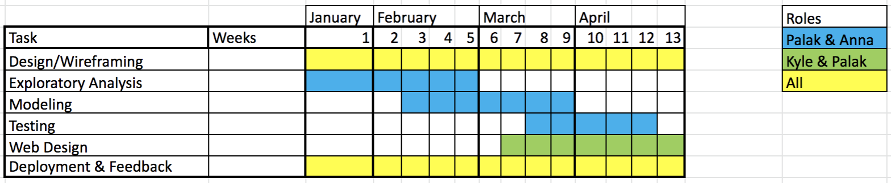

[Return to MUSA 801 Projects Page](https://pennmusa.github.io/MUSA_801.io/)  
This project was completed as part of the Master in Urban Spatial Analytics Spring 2021 Practicum instructed by Ken Steif, Michael Fichman, and Matt Harris. We thank our instructors as well as Dexter Locke and Lara Roman from the United States Forest Service for their feedback and help navigating the data. 

This document is intended to help other researchers replicate a study of tree canopy loss linked to spatial risk factors. We first introduce our motivation, followed by data exploration and analysis, and finally predictive modeling. We include hyperlinks thorough our document and in the appendix for reproducibility. Our hope is that this document and our policy tool can help tree planting agencies, tree advocates, and the interested public understand the forces contributing to tree canopy loss in Philadelphia and imagine different scenarios for our tree canopy based on construction.  

## Introduction   

**Between 2008 and 2018, Philadelphia lost more than 1000 football fields’ worth of tree canopy.**  

Most of this loss occurred in historically disenfranchised communities. In response, the City of Philadelphia has set important milestones for conserving and increasing the current tree canopy in the city. In this analysis, we model tree canopy loss in Philadelphia and identify risk factors. We additionally assess the city’s progress on the goals and how this varies across neighborhoods.  

### The Planning Tool: Canopy View  

Using this information, we created a predictive scenario policy tool which displays future tree canopy loss under three construction scenarios. The general population and tree advocates can use our tool to understand the potential impact of construction on the tree canopy.

### Why does the tree canopy matter?   

Tree canopy is defined as the area of land which, viewed from a bird's eye view, is covered by trees. Trees offer important benefits to cities including mitigating the urban heat island effect, absorbing stormwater runoff, a habitat for wildlife, and aesthetic and recreational benefits. In addition, trees are a preventative public health measure that improves mental health, increases social interactions and activity, and reduce crime, violence, and stress. A 2020 study published in The Lancet found that if Philadelphia reaches 30% tree canopy in all of its neighborhoods, the city would see [403 fewer premature deaths](https://www.fs.fed.us/nrs/pubs/jrnl/2020/nrs_2020_kondo_001.pdf) per year. However, despite the importance of trees to the city's health, appearance, and ecology, trees are regularly removed for reasons ranging from construction to homeowners' personal preference.

### Philadelphia's Tree Canopy Goals    

**30% Tree Canopy in each neighborhood by 2025**    

Philadelphia (under a previous mayoral administration) set the goal of achieving 30% tree canopy coverage in all neighborhoods by 2025. Currently, the citywide average is 20%, although this is highly uneven. More affluent neighborhoods in the northwest that have many parks and large lawns have much higher tree canopy than industrial neighborhoods in south and north Philadelphia which are full of impervious surfaces. The neighborhoods which have lower canopy coverage tend to be historically disenfranchised, lower income, and predominantly communities of color. This is an environmental justice problem. Neighborhoods like Philadelphia’s Hunting Park have a much lower ratio of tree canopy to impervious surfaces than the citywide average, resulting in higher temperatures during summertime heat waves and poorer air quality.  

**1 acre of tree canopy within a 10 minute walk for all residents**  

13% of Philadelphia's residents are considered under-served by green space, meaning that they live more than a 10 minute walk away from at least 1 acre of green space. The city has therefore set a goal of ensuring that all residents are no more than 10 minutes away from at least 1 acre of green space by 2035. To this end, the city is prioritizing adding green space in historically disenfranchised neighborhoods and making efforts to green spaces in schools and recreation centers.     

## Data and Methods
Our analysis is guided by the following questions:   

1. How does tree canopy loss vary across neighborhoods and sociodemographic contexts?
2. Which neighborhood do not meet the 30% tree canopy coverage?   
3. What are the risk factors for tree canopy loss?   
4. How do current patterns of tree canopy coverage and loss reflect disinvestment as a result of redlining and older planning practices?   
5. Where and how should Parks and Recreation and other tree planting organizations intervene?


We use the following data:

**Independent variable**: Tree Canopy LiDAR data consisting of canopy polygons marked as loss, gain, or no change from 2008-2018   [OpenDataPhilly](https://www.opendataphilly.org/dataset/ppr-tree-canopy)    

**Neighborhood sociodemographic attributes**: 2018 [American Community Survey data](https://api.census.gov/data/2018/acs/acs5/variables.html) from the U.S. Census Bureau  

**Neighborhoood level risk factors**:
* Construction  
* Parcels  
* Streets  
* Tree-related 311 requests  
* Normalized difference vegetation index (NDVI)  
* Hydrology   
* Zoning  
* Health outcomes   


## Exploratory Analysis  

#### Set up
```{r setup, message=FALSE, warning=FALSE, include=TRUE, results='hide', cache=TRUE}
#Reload
knitr::opts_chunk$set(message = FALSE, warning = FALSE)
options(scipen=10000000)
library(knitr)
library(tidyverse)
library(tidycensus)
library(sf)
library(kableExtra)
library(dplyr)
library(viridis)
library(mapview)
library(lubridate)
library(grid)
library(ggplot2)
library(ggmap)
library(jsonlite)
library(entropy)
library(tidyr)
library(lubridate)
library(FNN) 
library(gridExtra) 
library(caret) 
library(pROC)
library(plotROC)
library(RANN)


root.dir = "https://raw.githubusercontent.com/urbanSpatial/Public-Policy-Analytics-Landing/master/DATA/"
source("https://raw.githubusercontent.com/urbanSpatial/Public-Policy-Analytics-Landing/master/functions.r")

paletteGray <- c("gray90", "gray70", "gray50", "gray30", "gray10")

palette1 <- c("#d2f2d4","#7be382","#26cc00","#22b600","#009c1a")

palette2 <- c("#ffffff","#c7ffd5","#81d4ac","#329D9C","#205072", "#0B0138")

palette3 <- c("#2C5F2D","#97BC62FF")

palette4 <- c("#007F5F", '#EEEF20', '#AACC00')

paletteHolc <- c("light green", "light blue", "yellow", "pink")

palette5 <- c("#205072", "#329D9C", "#56C596", "#7BE495", "#CFF4D2", "#05001c")

palette6 <- c("#D8F3DC", "#B7E4C7", "#95D5B2", "#74C69D", "#52B788", "#40916C", "#2D6A4F", "#1B4332", "#123024", "#081C15")

GoalPalette <- c("light blue", "#D8F3DC",  "#95D5B2",  "#52B788",  "#2D6A4F", "#1B4332")
GainPalette <- c("#D8F3DC",  "#95D5B2",  "#52B788",  "#2D6A4F","light blue")

palette7 <- c("#D8F3DC", "#95D5B2", "#52B788", "#2D6A4F", "#1B4332", "#123024")

GoalPalette2 <- c("#95D5B2", "#52B788", "#2D6A4F", "#1B4332", "#123024", "blue")

palette8 <- c("#2D6A4F", "#52B788", "#B7E4C7", "#ADE8F4", "#00B4D8", "#023E8A")

paletteJ <- c("green", "red", "yellow")

paletteLG <- c("#1B4332","#2D6A4F", "#52B788","#D8F3DC", "blue")

landusepal <- c("green", "dark green" )

paletteDiverge <- c("red", "orange", "yellow", "blue", "green")

mapTheme <- function(base_size = 12) {
  theme(
    text = element_text( color = "black"),
    plot.title = element_text(size = 14,colour = "black"),
    plot.subtitle=element_text(face="italic"),
    plot.caption=element_text(hjust=0),
    axis.ticks = element_blank(),
    panel.background = element_blank(), axis.title = element_blank(),
    axis.text = element_blank(),
    axis.title.x = element_blank(),
    axis.title.y = element_blank(),
    panel.grid.minor = element_blank(),
    panel.border = element_rect(colour = "white", fill=NA, size=2)
  )
}


plotTheme <- function(base_size = 12) {
  theme(
    text = element_text( color = "black"),
    plot.title = element_text(size = 14,colour = "black"),
    plot.subtitle = element_text(face="italic"),
    plot.caption = element_text(hjust=0),
    axis.ticks = element_blank(),
    panel.background = element_blank(),
    panel.grid.major = element_line("grey80", size = 0.1),
    panel.grid.minor = element_blank(),
    panel.border = element_rect(colour = "white", fill=NA, size=2),
    strip.background = element_rect(fill = "grey80", color = "white"),
    strip.text = element_text(size=12),
    axis.title = element_text(size=12),
    axis.text = element_text(size=10),
    plot.background = element_blank(),
    legend.background = element_blank(),
    legend.title = element_text(colour = "black", face = "italic"),
    legend.text = element_text(colour = "black", face = "italic"),
    strip.text.x = element_text(size = 14)
  )
}

```

```{r Data Wrangling, cache=TRUE, message=FALSE, warning=FALSE, include=TRUE, results='hide'}

# Tree Canopy
TreeCanopy <-
 #st_read("C:/Users/Kyle McCarthy/Documents/Practicum/Data/TreeUse/TreeCanopyChange_2008_2018.shp")%>%
  #st_read("/Users/annaduan/Desktop/Y3S2/Practicum/Data/TreeCanopyChange_2008_2018-shp/TreeCanopyChange_2008_2018.shp") %>%
 st_read("C:/Users/agarw/Documents/MUSA 801/Data/TreeCanopyChange_2008_2018.shp") %>%
#st_read("C:/Users/Prince/Desktop/Tree Canopy Data/TreeCanopyChange_2008_2018.shp") %>%
  st_transform('ESRI:102728') 

TreeCanopy$SHAPE_Area <- as.numeric(st_area(TreeCanopy))

Loss <- TreeCanopy %>%
  filter(CLASS_NAME == "Loss")

# Philadelphia Base Map
Philadelphia <- st_read("http://data.phl.opendata.arcgis.com/datasets/405ec3da942d4e20869d4e1449a2be48_0.geojson")%>%
  st_transform('ESRI:102728') %>%
  st_make_valid()

# Neighborhoods
Neighborhood <-
 #st_read("C:/Users/Kyle McCarthy/Documents/Practicum/Data/Neighborhoods/Neighborhoods_Philadelphia.shp") %>%
 #st_read("/Users/annaduan/Desktop/Y3S2/Practicum/Data/Neighborhoods_Philadelphia/Neighborhoods_Philadelphia.shp")%>%
  st_read("C:/Users/agarw/Documents/MUSA 801/Data/Neighborhoods_Philadelphia.shp") %>%
#st_read("C:/Users/Prince/Desktop/Tree Canopy Data/Neighborhoods_Philadelphia/Neighborhoods_Philadelphia.shp") %>%
  st_transform('ESRI:102728')

Neighborhood <-
  Neighborhood%>%
  mutate(NArea = st_area(Neighborhood))%>%
  mutate(NArea = as.numeric(NArea))

# Tree inventory
#tree_inventory <-
 # st_read("http://data.phl.opendata.arcgis.com/datasets/957f032f9c874327a1ad800abd887d17_0.geojson") %>%
 # st_transform('ESRI:102728')

HOLC <- 
  #st_read("/Users/annaduan/Desktop/Y3S2/Practicum/Data/PAPhiladelphia1937.geojson") %>%
# st_read("C:/Users/Prince/Desktop/Tree Canopy Data/PAPhiladelphia1937.geojson") %>%
  #st_read("C:/Users/Kyle McCarthy/Documents/Practicum/Data/PAPhiladelphia1937.geojson")%>%
 st_read("C:/Users/agarw/Documents/MUSA 801/Data/PAPhiladelphia1937.geojson")%>%
  st_transform('ESRI:102728')

HOLC <-
  HOLC%>%
  mutate(HOLCArea = st_area(HOLC))%>%
  mutate(HOLCArea = as.numeric(HOLCArea)) %>%
  dplyr::select(holc_grade)


# ACS


census_api_key("d9ebfd04caa0138647fbacd94c657cdecbf705e9", install = FALSE, overwrite = TRUE)

# Variables: Median Rent, Median HH Income, Population, Bachelor's, No Vehicle (home owner, renter), Households (owner, renter-occupied), total housing units, white

ACS <-  

  get_acs(geography = "tract", variables = c("B25058_001E", "B19013_001E", "B01003_001E", "B06009_005E", "B25044_003E", "B25044_010E", "B07013_002E", "B07013_003E", "B25001_001E", "B01001A_001E", "B04004_051E"), 
          year=2018, state=42, county=101, geometry=T) %>% 
  st_transform('ESRI:102728')


#Change to wide form
ACS <- 
  ACS %>%
  dplyr::select( -NAME, -moe) %>%
  spread(variable, estimate) %>%
  dplyr::select(-geometry) %>%
  rename(Rent = B25058_001, 
         medHHInc = B19013_001,
         population = B01003_001, 
         bachelor = B06009_005,
         noVehicle_hmow = B25044_003, 
         noVehicle_hmre = B25044_010,
         Households_hmow = B07013_002,
         Households_hmre = B07013_003,
         housing_units = B25001_001,
         white = B01001A_001, 
         italian = B04004_051)
st_drop_geometry(ACS)[1:3,]


ACS <- 
  ACS %>%
  mutate(pctBach = ifelse(population > 0, bachelor / population, 0),
         pctWhite = ifelse(population > 0, white / population, 0),
         pctNoVehicle = ifelse(Households_hmow + Households_hmre > 0, 
                               (noVehicle_hmow + noVehicle_hmre) / 
                                  (Households_hmow + Households_hmre),0),
         year = "2018") %>%
  dplyr::select(-Households_hmow,-Households_hmre,-noVehicle_hmow,-noVehicle_hmre,-bachelor, -white)


parcels <- st_read("http://data-phl.opendata.arcgis.com/datasets/1c57dd1b3ff84449a4b0e3fb29d3cafd_0.geojson")%>%
 st_transform('ESRI:102728')

const_permits <- 
   st_read("C:/Users/agarw/Documents/MUSA 801/Data/const_permit.csv") %>%
 # st_read("C:/Users/Prince/Desktop/Tree Canopy Data/const_permit.csv") %>%
#  st_read("C:/Users/Kyle McCarthy/Documents/Practicum/permits.csv")%>%
 # st_read("/Users/annaduan/Desktop/Y3S2/Practicum/Data/const_permit.csv")%>%
  mutate(X = geocode_x,
         Y = geocode_y) 
const_permits[const_permits==""]<-NA
const <- const_permits %>% drop_na(X,Y)
const_spatial <- st_as_sf(const, coords = c("X","Y"), crs = 6565, agr = "constant")
const_spatial <- const_spatial %>% st_transform('ESRI:102728')
# const <- const_spatial %>%
#   filter(permitissuedate <= '30/06/2017 00:00')

const_spatial$permit_issue <- mdy_hm(const$permitissuedate)
const_spatial$year <- year(const_spatial$permit_issue)

const <- const_spatial %>%
   filter(year <= "2017")


LandUseFishnet <- 
  #st_read("C:/Users/Kyle McCarthy/Documents/Practicum/Data/Fishnet_LU_Intersect/fishnet_LUS_Intersect_dissolve.shp")  %>%
   st_read("C:/Users/agarw/Documents/MUSA 801/Data/fishnet_LUS_Intersect_dissolve.geojson") %>%
 #st_read("/Users/annaduan/Desktop/Y3S2/Practicum/Data/fishnet_LUS_Intersect_dissolve.geojson") %>%
#  st_read("C:/Users/Prince/Desktop/Tree Canopy Data/fishnet_LUS_Intersect_dissolve.geojson") %>%
   st_transform('ESRI:102728')


Hydrology <-
  st_read("https://opendata.arcgis.com/datasets/a31f7d7469404e919517e038fc133a8e_0.geojson")%>%
    st_transform('ESRI:102728')
  
Hydrology <-
  st_intersection(st_make_valid(Philadelphia), st_make_valid(Hydrology))

 
 Parks <- 
   #st_read("/Users/annaduan/Desktop/Y3S2/Practicum/Data/Parks") %>%
   #st_read("C:/Users/Kyle McCarthy/Documents/Practicum/Data/Parks/Philadelphia_PPR_Park_Boundaries2016.shp ")%>%
   st_read("C:/Users/agarw/Documents/MUSA 801/Data/Philadelphia_PPR_Park_Boundaries2016.shp") %>%
   #st_read("C:/Users/Prince/Desktop/Tree Canopy Data/Philadelphia_PPR_Park_Boundaries2016.shp") %>%
     st_transform('ESRI:102728') %>%
   st_make_valid() %>%
   select(geometry)

Conservation <- 
  #st_read("/Users/annaduan/Desktop/Y3S2/Practicum/Data/Conservation/ConservationEasements202103.shp") %>%
  #st_read("C:/Users/Kyle McCarthy/Documents/Practicum/Data/Conservation/ConservationEasements202103.shp")%>%
   st_read("C:/Users/agarw/Documents/MUSA 801/Data/ConservationEasements202103.shp") %>%
   #  st_read("C:/Users/Prince/Desktop/Tree Canopy Data/ConservationEasements202103.shp") %>%
   st_transform('ESRI:102728') %>%
  st_intersection(st_make_valid(Philadelphia), st_make_valid(Conservation)) %>%
  st_make_valid() %>%
   select(geometry)

ConservationNParks <- rbind(Parks, Conservation)


# philadelphia_revised <- st_read("C:/Users/Kyle McCarthy/Documents/Practicum/Data/Conservation/philly_revised.shp")

```


#### Creating a fishnet
We use fishnet grid cells as our unit of analysis to take advantage of high resolution spatial data such as 311 service requests. Below, we create a fishnet cells of 1615 feet, or around the size of a city block. We then subtract fishnet cells that are more than 20% [conservation easement](https://www.conservationeasement.us/what-is-a-conservation-easement/) and/or park space to isolate land that may be protected and experience different tree canopy loss processes. All in all, we have 1411 fishnet cells representing Philadelphia.  
```{r Fishnet, cache=TRUE, message=FALSE, warning=FALSE, include=TRUE, results='hide'}

fishnet2 <- 
  st_make_grid(Philadelphia,
               cellsize = 1615) %>%
  st_sf() %>%
  mutate(uniqueID = rownames(.))%>%
  st_transform('ESRI:102728')

FishnetIntersect <- st_intersection(fishnet2, ConservationNParks )%>% 
  mutate(Area = as.numeric(st_area(.)))%>%
  st_drop_geometry()%>%
  group_by(uniqueID)%>%
  summarise(ConservationArea = sum(Area))%>% 
  left_join(fishnet2, .)%>%
  mutate_all(funs(replace_na(.,0)))%>% 
  mutate(ConservationPct = ConservationArea /2608225 * 100) %>%
  filter(ConservationPct <= 20)

ggplot() +
  geom_sf(data = FishnetIntersect, fill = "yellow", colour = "white") +
  labs(title = "Philadelphia Fishnet Grid", 
       subtitle = "1 cell = 1615 ft ^2, 1411 cells total") +
  mapTheme()

fishnet <- FishnetIntersect
  


```

We then aggregate our tree canopy data to the fishnet.  
```{r Fishnet Aggregation, cache=TRUE, message=FALSE, warning=FALSE, include=TRUE, results='hide'}

# Make canopy loss layers
TreeCanopyAll<- 
  TreeCanopy%>%
  st_make_valid()%>%
  st_intersection(fishnet)

TreeCanopyAll<- 
  TreeCanopyAll%>%
  mutate(TreeArea = st_area(TreeCanopyAll))%>%
  mutate(TreeArea = as.numeric(TreeArea))

# Tree Canopy Loss

TreeCanopyLoss <- 
  TreeCanopyAll%>%
  filter(CLASS_NAME == "Loss") %>%
  group_by(uniqueID)%>%
  summarise(AreaLoss = sum(TreeArea))%>%
  mutate(pctLoss = AreaLoss / 2608225)%>%
  st_drop_geometry()
  
TreeCanopyLoss<- 
  fishnet%>%
  left_join(TreeCanopyLoss, by = 'uniqueID')%>%
  dplyr::select('uniqueID', 'AreaLoss')%>%
  st_drop_geometry()


# Tree Canopy Gain 

TreeCanopyGain <- 
  TreeCanopyAll%>%
  filter(CLASS_NAME == "Gain")%>%
  group_by(uniqueID)%>%
  summarise(AreaGain = sum(TreeArea))%>%
  mutate(pctGain = AreaGain / 2608225)%>%
  st_drop_geometry()%>%
  dplyr::select(uniqueID, pctGain, AreaGain)

TreeCanopyGain<- 
  fishnet%>%
  left_join(TreeCanopyGain, by = 'uniqueID')%>%
  dplyr::select('uniqueID', 'AreaGain')%>%
  st_drop_geometry()

# Tree Canopy Coverage

TreeCanopyCoverage18 <- 
  TreeCanopyAll%>%
  filter(CLASS_NAME != "Loss")%>%
  group_by(uniqueID)%>%
  summarise(AreaCoverage18 = sum(TreeArea))%>%
  mutate(pctCoverage18 = (AreaCoverage18 / 2608225) * 100) %>%
  st_drop_geometry()

TreeCanopyCoverage18<- 
  fishnet%>%
  left_join(TreeCanopyCoverage18)%>%
  dplyr::select('uniqueID', 'AreaCoverage18', 'pctCoverage18')%>%
  st_drop_geometry()

TreeCanopyCoverage08 <- 
  TreeCanopyAll%>%
  filter(CLASS_NAME != "Gain")%>%
  group_by(uniqueID)%>%
  summarise(AreaCoverage08 = sum(TreeArea))%>%
  mutate(pctCoverage08 = (AreaCoverage08 / 2608225) * 100)%>%
  st_drop_geometry()

TreeCanopyCoverage08<- 
  fishnet%>%
  left_join(TreeCanopyCoverage08)%>% 
  dplyr::select('uniqueID', 'AreaCoverage08', 'pctCoverage08')%>%
  st_drop_geometry()


FinalFishnet <- 
  left_join(TreeCanopyLoss, TreeCanopyGain)%>%
  left_join(TreeCanopyCoverage18)%>%
  left_join(TreeCanopyCoverage08)%>%
  mutate_all(~replace(., is.na(.), 0))%>%
  mutate(pctLoss = round(AreaLoss/AreaCoverage08 * 100, 2), 
         pctGain = round(AreaGain/AreaCoverage18 * 100, 2))%>%
  mutate(pctChange = ifelse(AreaCoverage08 > 0, ((AreaCoverage18 - AreaCoverage08) / (AreaCoverage08) * 100), 0)) %>%
  mutate(netChange = AreaGain - AreaLoss)%>%
  dplyr::select(pctLoss, pctGain, pctChange,
                AreaGain, AreaLoss, AreaCoverage08, AreaCoverage18, pctCoverage08, pctCoverage18, uniqueID, pctChange, netChange)

FinalFishnet<- 
  fishnet%>%
  left_join(FinalFishnet)

FinalFishnet<- 
  FinalFishnet%>% 
  mutate(pctChange = (AreaCoverage18 - AreaCoverage08) / (AreaCoverage08) * 100)%>%
  mutate(netChange = AreaGain - AreaLoss, 
         LogPctLoss = log10(pctLoss), 
         LogPctGain = log10(pctGain))
  


FinalFishnet$pctCoverage08Cat <- cut(FinalFishnet$pctCoverage08, 
                      breaks = c(-Inf,  10,  20, 30, 50, Inf), 
                       labels = c("Very Little Tree Canopy", "Some Tree Canopy", "Moderate Tree Canopy", "Significant Tree Canopy (Met Goal)", "Extremely High Tree Canopy (Met Goal)"), 
                       right = FALSE)

FinalFishnet$pctCoverage18Cat <- cut(FinalFishnet$pctCoverage18, 
                      breaks = c(-Inf,  10,  20, 30, 50, Inf), 
                       labels = c("Very Little Tree Canopy", "Some Tree Canopy", "Moderate Tree Canopy", "Significant Tree Canopy (Met Goal)", "Extremely High Tree Canopy (Met Goal)"), 
                       right = FALSE)

FinalFishnet$AreaLossCat <- cut(FinalFishnet$AreaLoss, 
                       breaks = c(-Inf, 50000, 100000, 200000, 400000, 800000, Inf), 
                       labels = c("Less Than 50,000", "50,000 - 100,000", "100,000-200,000", "200,000 - 400,000", "400,000 - 800,000", "> 800,000"), 
                       right = FALSE)

FinalFishnet$AreaGainCat <- cut(FinalFishnet$AreaGain, 
                       breaks = c(-Inf, 50000, 100000, 200000, 400000, 800000, Inf), 
                       labels = c("Less Than 50,000", "50,000 - 100,000", "100,000-200,000", "200,000 - 400,000", "400,000 - 800,000", "> 800,000"), 
                       right = FALSE)

FinalFishnet$pctGainCat <- cut(FinalFishnet$pctGain, 
                      breaks = c(-Inf,20, 40, 60, 80, Inf), 
                       labels = c("0%-20% Gain", "20%-40% Gain", "40%-60% Gain", "60%-80% Gain", "80%-100% Gain"), 
                       right = FALSE)

FinalFishnet$pctLossCat <- cut(FinalFishnet$pctLoss, 
                       breaks = c(-Inf,20, 40, 60, 80, Inf), 
                       labels = c("0%-20% Loss", "20%-40% Loss", "40%-60% Loss", "60%-80% Loss", "80%-100% Loss"), 
                       right = FALSE)
```


### 1. Existing tree canopy and tree canopy change

**Philadelphia's 2018 Canopy**  
Northwest, West, and Northeast Philadelphia have the most tree canopy. In North and South Philadelphia as well as Center City, tree canopy is more sparse.  

```{r 2018 Canopy, cache=TRUE, message=FALSE, warning=FALSE, include=TRUE, results='hide'}

ggplot()+ 
  geom_sf(data = FinalFishnet, colour = "transparent", aes(fill = pctCoverage18Cat))+ 
     scale_fill_manual(values = palette7, 
                    name = "2018 Percent Coverage")+ 
  labs(title = "Tree Canopy Coverage, 2018", 
subtitle = "2018 Tree Canopy Area / Gridcell Size") + 
  theme(plot.title = element_text(size = 30, face = "bold"), 
        legend.title = element_text(size = 12)) +  mapTheme()

```

**Tree Canopy Change**  
Surprisingly, tree canopy loss and gain exhibit similar spatial patterns. Both percent gain and loss are highest in a few neighborhoods in South Philadelphia and in the Northeast. While this seems counterintuitive, this is because these neighborhoods have the least tree canopy, therefore each individual tree gained or lost has a greater overall impact.   
```{r Change in tree canopy, message=FALSE, warning=FALSE, results='hide', fig.height = 12, fig.width = 20, cache=TRUE}

# grid.arrange(ncol=2,
#              
# ggplot()+ 
#   geom_sf(data = FinalFishnet, aes(fill = AreaGainCat))+ 
#   scale_fill_manual(values = palette7,
#                     name = "Area Gain (ft^2)")+
#   labs(title= "How Much Tree Canopy was Gained in Each Gridcell \n from 2008 - 2018?")+
#  theme(plot.title = element_text(size = 24, face = "bold", hjust = 0.5), 
#         legend.title = element_text(size =12), 
#         legend.text = element_text(size = 10)) + mapTheme(),
# 
# ggplot()+ 
#   geom_sf(data = FinalFishnet, aes(fill = AreaLossCat))+ 
#   scale_fill_manual(values = palette7,
#                     name = "Area Loss (f^2)")+
#   labs(title= "How Much Tree Canopy Was Lost in Each Gridcell \n From 2008 - 2018?")+
#   theme(plot.title = element_text( size = 24, face = "bold", hjust = 0.5), 
#         legend.title = element_text(size = 12), 
#         legend.text = element_text(size = 10)) + mapTheme()) 
library(gridExtra)
library(grid)


v <- ggplot()+ 
  geom_sf(data = FinalFishnet, aes(fill = pctLoss))+
 # scale_fill_manual(values = palette7,name = "Percent Loss")+
  labs(title= "What was the Percent of Tree Canopy Loss in Each Grid Cell?", 
       subtitle = "Tree Canopy Lost From 2008 - 2018 / Total Tree Canopy Coverage in 2008")+
  theme(plot.title = element_text(hjust = 0.3), 
        plot.subtitle = element_text(hjust = 0.3)) + mapTheme()

z <- ggplot()+ 
  geom_sf(data = FinalFishnet, aes(fill = pctGain))+ 
 # scale_fill_manual(values = palette7,name = "Percent Gain")+
  labs(title= "What was the Percent of Tree Canopy Gain in Each Grid Cell?", 
       subtitle = "Tree Canopy Gained From 2008 - 2018 / Total Tree Canopy Coverage in 2018")+
  theme(plot.title = element_text(hjust = 0.3), 
        plot.subtitle = element_text(hjust = 0.3)) + mapTheme()  

grid.arrange(ncol=2,
v + scale_fill_distiller(palette = "YlOrRd", direction = 1),
z + scale_fill_distiller(palette = "YlGr", direction = 1))
```

```{r Gain Minus Loss, message=FALSE, warning=FALSE, results='hide', fig.height = 8, fig.width = 8, cache=TRUE}

FinalFishnet$PctChangeCat <- cut(FinalFishnet$pctChange, 
                       breaks = c(-Inf,  -30, -10, 0, 10, 20, Inf), 
                       labels = c("Significant Net Loss", "Moderate Net Loss", "Low Net Loss", "Low Net Gain", "Moderate Net Gain", "Significant Net Gain"), 
                       right = FALSE)

```

This is confirmed when we plot the log-transformed percent tree canopy and percent tree canopy gained/lost for each fishnet cell. We see a negative relationship, meaning that fishnet cells with more trees experience less percentage change.  

```{r Comparing Tree Canopy Area to Loss/Gain2, message=FALSE, warning=FALSE, results='hide', fig.height = 8, fig.width = 12,  cache=TRUE}

grid.arrange(ncol=2,
             
ggplot(FinalFishnet, aes(x = pctGain, y = pctCoverage18))+
  geom_point(colour = "dark green", alpha = 0.3, size = 2)+ 
      scale_x_log10() + scale_y_log10() +
  labs(title = "Percent Tree Canopy Gain (2008 - 2018) vs. \n Percent Tree Canopy Coverage (2018)", 
       subtitle = "1 dot = 1 fishnet cell") + 
  xlab("Percent of Tree Canopy Gained (2008 - 2018)") + 
  ylab("Percent of Tree Canopy Coverage of Each Fishnet Cell (2018)") + 
  theme(plot.title = element_text(hjust = 0.3, size = 12), plot.subtitle = element_text(hjust = 0.3, size = 8)) +
    plotTheme(), 

ggplot(FinalFishnet, aes(x = pctLoss, y = pctCoverage18))+
  geom_point(colour = "dark green", alpha = 0.3, size = 2)+ 
      scale_x_log10() + scale_y_log10() +
  labs(title = "Percent Tree Canopy Loss (2008 - 2018) vs. \n Percent Tree Canopy Coverage (2018) ", 
       subtitle = "1 dot = 1 fishnet cell") + 
  xlab("Percent of Tree Canopy Lost (2008 - 2018)") + 
  ylab("Percent of Tree Canopy Coverage of Each Fishnet Cell (2018)") + 
  theme(plot.title = element_text(hjust = 0.3, size = 12), plot.subtitle = element_text(hjust = 0.3, size = 8)) +
  plotTheme()) 

pctChangeGraph <- 
  FinalFishnet%>% 
  filter(pctChange < 100)

ggplot(pctChangeGraph, aes(x = pctChange, y = pctCoverage18))+
  geom_point(colour = "black", alpha = 0.3, size = 4)+ 
  labs(title = "Percent Change \n vs. Percent Tree Canopy (2018)", 
       subtitle = "1 dot = 1 fishnet cell") + 
  xlab("Percent Change in Tree Canopy from 2008-2018 ") + 
  ylab("Percent of Tree Canopy Coverage of Each Grid Cell (2018)") + 
  theme(plot.title = element_text(hjust = 0.5, size = 15, face = "bold"), plot.subtitle = element_text(hjust = 0.5, size = 8)) +
  plotTheme()
```

Looking at the city as a whole, we see that the majority of fishnet cells experienced low net loss, while a similar amount of cells experienced either substantial loss or gain.   

```{r gain minus loss 2,  message=FALSE, warning=FALSE, results='hide', fig.height = 8, fig.width = 8, cache=TRUE}
b <- ggplot()+ 
  geom_sf(data = FinalFishnet, colour = "white", aes(fill = PctChangeCat))+ 
  labs(title= "Tree Canopy Change 2008 - 2018", 
       subtitle = "Percent Tree Canopy Gain - Percent Tree Canopy Loss") +
  theme(plot.title = element_text(hjust = 0.3), 
        legend.title = element_text(size = 12), 
        legend.text = element_text(size = 10)) + mapTheme()

b + scale_fill_brewer(palette = "PiYG", name = "Percent Change", direction = 1, aesthetics = c("colour", "fill"), guide = guide_legend(reverse = TRUE))
```

```{r Add ACS to fishnet, message=FALSE, warning=FALSE, results='hide', fig.height = 7, fig.width = 10,  cache=TRUE}
fishnet_centroid <- FinalFishnet%>%
  st_centroid()

tractNames <- ACS %>%
  dplyr::select(GEOID) 

FinalFishnet1 <- fishnet_centroid %>%
  st_join(., tractNames) %>%
  st_drop_geometry() %>%
  left_join(FinalFishnet,.,by="uniqueID") %>%
  dplyr::select(GEOID) %>%
  mutate(uniqueID = as.numeric(rownames(.)))

# Make fishnet with ACS variables
ACS_net <-   
  FinalFishnet1 %>%
  st_drop_geometry() %>%
  group_by(uniqueID, GEOID) %>%
  summarize(count = n()) %>%
    full_join(FinalFishnet1) %>%
    st_sf() %>%
    na.omit() %>%
    ungroup() %>%
  st_centroid() %>% 
  dplyr::select(uniqueID) %>%
  st_join(., ACS) %>%
  st_drop_geometry() %>%
  left_join(.,FinalFishnet1) %>%
  st_as_sf()%>%
  st_drop_geometry()%>%
  mutate(uniqueID = as.character(uniqueID))

FinalFishnet <- 
  FinalFishnet%>%
  left_join(ACS_net)

```

**A Closer Look: 4 Neighborhoods' Tree Canopy Change**
Neighborhoods like Upper Roxborough, which have many trees, experienced less net change because much of their canopy remained untouched. Meanwhile, neighborhoods with less tree canopy such as Juniata Park experienced greater net change.

What about income? Higher income neighborhoods in Philadelphia generally have more tree canopy.However, looking at Fairhill and Graduate Hospital, the poorest and richest neighborhoods in Philadelphia, respectively, tree canopy change is more complex. Both neighborhoods are in the Center City region, and both experience a mix of gain, loss, and no change that appears to be in small pieces.


### 2. How close are neighborhoods to achieving the 30% goal?
```{r The 30 Percent Goal, message=FALSE, warning=FALSE, results='hide', fig.height = 7, fig.width = 8, cache=TRUE}

# Tree Loss by Neighborhood
TreeCanopyAllN<- 
  TreeCanopy%>%
  st_make_valid()%>%
  st_intersection(Neighborhood)

TreeCanopyAllN<- 
  TreeCanopyAllN%>%
  mutate(TreeArea = st_area(TreeCanopyAllN))%>%
  mutate(TreeArea = as.numeric(TreeArea))

TreeCanopyLossN <- 
  TreeCanopyAllN%>%
  filter(CLASS_NAME == "Loss")%>%
  group_by(NAME, NArea)%>%
  summarise(AreaLoss = sum(TreeArea))%>%
  mutate(pctLoss = AreaLoss / NArea)%>%
  mutate(pctLoss = as.numeric(pctLoss))%>%
  st_drop_geometry()

TreeCanopyLossN<- 
  Neighborhood%>%
  left_join(TreeCanopyLossN)


# Tree Gain 

TreeCanopyGainN <- 
  TreeCanopyAllN%>%
  filter(CLASS_NAME == "Gain")%>%
  group_by(NAME, NArea)%>%
  summarise(AreaGain = sum(TreeArea))%>%
  mutate(pctGain = AreaGain / NArea)%>%
  mutate(pctGain = as.numeric(pctGain))%>%
  st_drop_geometry()

TreeCanopyGainN<- 
  Neighborhood%>%
  left_join(TreeCanopyGainN)


TreeCanopyCoverageN18 <- 
  TreeCanopyAllN%>%
  filter(CLASS_NAME != "Loss")%>%
  group_by(NAME, NArea)%>%
  summarise(AreaCoverage = sum(TreeArea))%>%
  mutate(AreaCoverage = as.numeric(AreaCoverage))%>%
  mutate(pctCoverage = AreaCoverage / NArea * 100)


TreeCanopyLoss1N <- 
  TreeCanopyLossN%>%
  dplyr::select('NAME', 'AreaLoss')%>%
  st_drop_geometry()

TreeCanopyGain1N <- 
  TreeCanopyGainN%>%
  dplyr::select('NAME', 'AreaGain')%>%
  st_drop_geometry()

TreeCanopyCoverageN118 <- 
  TreeCanopyCoverageN18%>%
  dplyr::select('NAME', 'AreaCoverage', 'pctCoverage')%>%
  st_drop_geometry()


FinalNeighborhood <- 
  left_join(TreeCanopyLoss1N, TreeCanopyGain1N)%>%
  left_join(TreeCanopyCoverageN118)%>%
  mutate_all(~replace(., is.na(.), 0))%>%
  mutate(GainMinusLoss = AreaGain - AreaLoss)%>%
  dplyr::select(GainMinusLoss,
                AreaGain, AreaLoss, NAME, pctCoverage, AreaCoverage)

FinalNeighborhood<- 
  Neighborhood%>%
  left_join(FinalNeighborhood)%>%
  mutate(LossOrGain = ifelse(GainMinusLoss > 0, "Gain", "Loss"))%>%
  mutate(PctUnderGoal = 30 - pctCoverage)

#grid.arrange(ncol=2,

FinalNeighborhood$GoalCat <- cut(FinalNeighborhood$PctUnderGoal, 
                      breaks = c(-Inf, 0, 6, 12, 18, 24, 30), 
                       labels = c("Reached Goal!", "0-6 % Under Goal", "6-12% Under Goal", "12-18% Under Goal", "18-24% Under Goal", "24-30% Under Goal"), 
                       right = FALSE)

FinalNeighborhood$GainMinusLossCat <- cut(FinalNeighborhood$GainMinusLoss, 
                      breaks = c(-Inf, -10000000, -5000000, -2500000, 0, Inf), 
                       labels = c("Greater Than 1500000 Squared Feet lost", "1000000-1500000 Squared Feet Lost", "500000-1000000 Squared Feet Lost", "0-25000 Squared Feet Lost", "Tree Canopy Gain!"), 
                       right = FALSE)


```

In Figure XX, we can see that the neighborhoods farthest from the goal of 30% tree canopy are in south Philadelphia and parts of Center City. These neighborhoods are all along the Delaware River. This make make waterways and hydrology a risk factor. The neighborhoods which meet this goal are largely in Northwest Philadelphia.  

```{r Neighborhood Maps, message=FALSE, warning=FALSE, results='hide', fig.height = 7, fig.width = 8, cache=TRUE}


o <- ggplot() +
  geom_sf(data = FinalNeighborhood, aes(fill = GoalCat), color = "white") +
#  scale_fill_manual(values = GoalPalette, name = "Percent Away From Achieving 30% Goal")+
  labs(title = "How Far is Each Neighborhood Away From Meeting\n Philadelphia's 30% Tree Canopy Goal in Each Neighborhood?") +
  theme(plot.title = element_text(hjust = 0.5, size = 8), 
        legend.position = "bottom", 
        legend.title = element_blank())+
  mapTheme() 

o + scale_fill_brewer(palette = "PiYG", direction = -1, aesthetics = c("colour", "fill"), guide = guide_legend(reverse = TRUE))
```

To better understand the patterns of tree canopy change that occurs in these neighborhoods, we analyze more closely a neighborhood that has reached the goal and one that is substantially below the goal. In both, the bulk of the tree canopy did not change between 2008 and 2018. However, when we look closer, we see that tree canopy loss and gain are much more clustered in Upper Roxborough, which meets the goal. Here, it appears that some of the loss is related to tree removal along an entire street or throughout a property, whereas in Richmond, ___________________________________. This suggests that we will need to look at land use and streets as potential risk factor variables related to tree canopy loss.   

```{r Neighborhood level Tree Loss, message=FALSE, warning=FALSE, results='hide', fig.height = 6, fig.width = 9, cache = TRUE}
library(magrittr)

#making basemap
 ll <- function(dat, proj4 = 4326){
   st_transform(dat, proj4)
 }

# Richmond
 RMBound <- Neighborhood %>%  
   dplyr::filter(NAME=="RICHMOND")
 Richmond <- st_intersection(st_make_valid(TreeCanopy), RMBound)
 
 ggplot() +
   geom_sf(data = RMBound, fill = "black") +
   geom_sf(data = Richmond, aes(fill = CLASS_NAME), colour = "transparent") +
   scale_fill_manual(values = paletteJ, name = "Canopy Change") +
   labs(title = "Richmond Tree Canopy Change 2008-2018", subtitle = "Philadelphia, PA") +
     mapTheme()
 
#Upper Roxborough
 URBound <- Neighborhood %>%  
   dplyr::filter(NAME=="UPPER_ROXBOROUGH")
 UpperRoxborough <- st_intersection(st_make_valid(TreeCanopy), URBound)
 
  ggplot() +
   geom_sf(data = URBound, fill = "black") +
   geom_sf(data = UpperRoxborough, aes(fill = CLASS_NAME), colour = "transparent") +
   scale_fill_manual(values = paletteJ, name = "Canopy Change") +
   labs(title = "Upper Roxborough Tree Canopy Change 2008-2018", subtitle = "Philadelphia, PA") +
     mapTheme()
```

In Figure XX, we see that most neighborhoods experienced either no change or net loss. Interestingly, most tree gain was experienced in South Philadelphia and Center City, suggesting that neighborhoods or city regions may have a strong spatial fixed effect on tree canopy change.   
```{r net gain and loss, message=FALSE, warning=FALSE, results='hide', fig.height = 7, fig.width = 8, cache=TRUE}

p <- ggplot() +
  geom_sf(data = FinalNeighborhood, aes(fill = GainMinusLossCat), color = "white") +
  # scale_fill_manual(values = paletteLG, name = "Gain or Loss")+ 
  labs(title = "What is the Tree Canopy Net Gain or Loss \nin Each Neighborhood from 2008 - 2018?") +
  theme(plot.title = element_text(hjust = 0.5, size = 6))+
  mapTheme()

p + scale_fill_brewer(palette = "PiYG", direction = 1, aesthetics = c("colour", "fill"), guide = guide_legend(reverse = TRUE))

```


### 3.  How does tree canopy change vary by demographic?  

Tree canopy loss, like many environmental issues, is deeply related to urban inequity. Low income communities and communities of color are overwhelmingly more likely to live in places with less tree canopy. Therefore, we explore the correlated between demographics and tree canopy gain, loss, net change, and coverage. Surprisingly, demographic variables have little correlation with any of the four variables. This is likely because they are accounted for by neighborhood fixed effects.     
```{r Comparing Demographics to Fishnet Variables, message=FALSE, warning=FALSE, results='hide', fig.height = 18, fig.width = 13,  cache=TRUE}

correlation.long <-
  st_drop_geometry(FinalFishnet) %>%
     dplyr::select(population, medHHInc, housing_units, Rent, pctWhite, pctNoVehicle, netChange) %>%
    gather(Variable, Value, -netChange) 


correlation.cor <-
  correlation.long %>%
    group_by(Variable) %>%
    summarize(correlation = cor(Value, netChange, use = "complete.obs"))


correlation.long1 <-
  st_drop_geometry(FinalFishnet) %>%
     dplyr::select(population, medHHInc, housing_units, Rent, pctBach, pctWhite, pctNoVehicle, pctLoss) %>%
    gather(Variable, Value, -pctLoss)

correlation.cor1 <-
  correlation.long1 %>%
    group_by(Variable) %>%
    summarize(correlation = cor(Value, pctLoss, use = "complete.obs"))


correlation.long2 <-
  st_drop_geometry(FinalFishnet) %>%
     dplyr::select(population, medHHInc, housing_units, Rent, pctBach, pctWhite, pctNoVehicle, pctGain) %>%
    gather(Variable, Value, -pctGain)

correlation.cor2 <-
  correlation.long2 %>%
    group_by(Variable) %>%
    summarize(correlation = cor(Value, pctGain, use = "complete.obs"))


correlation.long3 <-
  st_drop_geometry(FinalFishnet) %>%
     dplyr::select(population, medHHInc, housing_units, Rent, pctBach, pctWhite, pctNoVehicle, pctCoverage18) %>%
    gather(Variable, Value, -pctCoverage18)

correlation.cor3 <-
  correlation.long3 %>%
    group_by(Variable) %>%
    summarize(correlation = cor(Value, pctCoverage18, use = "complete.obs"))

library(grid)
grid.arrange(ncol=2, top=textGrob("Fishnet Variables in Comparison to Local Demographics"),
             ggplot(correlation.long, aes(Value, netChange)) +
  geom_point(colour = "dark green", alpha = 0.3, size = .5) +
   scale_y_log10() +
  geom_text(data = correlation.cor, aes(label = paste("r =", round(correlation, 2))),
            x=-Inf, y=Inf, vjust = 1.5, hjust = -.1) +
  geom_smooth(method = "lm", se = FALSE, colour = "black") +
  facet_wrap(~Variable, ncol = 2, scales = "free") +
  labs(title = "Percent Tree Canopy Gained (2008 -2018) \n Minus Percent Tree Canopy Lost (2008 - 2018)") +
  plotTheme(), 
  
  ggplot(correlation.long1, aes(Value, pctLoss)) +
  geom_point(colour = "dark green", alpha = 0.3, size = .5) +
  scale_y_log10() +
  geom_text(data = correlation.cor1, aes(label = paste("r =", round(correlation, 2))),
            x=-Inf, y=Inf, vjust = 1.5, hjust = -.1) +
  geom_smooth(method = "lm", se = FALSE, colour = "black") +
  facet_wrap(~Variable, ncol = 2, scales = "free") +
  labs(title = "Percent Tree Canopy Lost From 2008 - 2018 ") +
  plotTheme(), 
  
  ggplot(correlation.long2, aes(Value, pctGain)) +
  geom_point(colour = "dark green", alpha = 0.3, size = .5) +
  scale_y_log10() +
    geom_text(data = correlation.cor2, aes(label = paste("r =", round(correlation, 2))),
            x=-Inf, y=Inf, vjust = 1.5, hjust = -.1) +
  geom_smooth(method = "lm", se = FALSE, colour = "black") +
  facet_wrap(~Variable, ncol = 2, scales = "free") +
  labs(title = "Percent Tree Canopy Gained From 2008 - 2018 ") +
  plotTheme(), 
  
  ggplot(correlation.long3, aes(Value, pctCoverage18)) +
  geom_point(colour = "dark green", alpha = 0.3, size = .5) +
  scale_y_log10() +
  geom_text(data = correlation.cor3, aes(label = paste("r =", round(correlation, 2))),
            x=-Inf, y=Inf, vjust = 1.5, hjust = -.1) +
  geom_smooth(method = "lm", se = FALSE, colour = "black") +
  facet_wrap(~Variable, ncol = 2, scales = "free") +
  labs(title = "Percent Tree Canopy Coverage (2018)") + 
  plotTheme()) 
```

```{r Demographic context, message=FALSE, warning=FALSE, include=TRUE, results='hide', cache=TRUE}

# # race context
# race_context <- ACS %>%
#   dplyr::select(pctWhite) %>%
#   mutate(Race_Context = ifelse(pctWhite > .5, "Majority_White", "Majority_Non_White"))
# 
# ggplot() +
#   geom_sf(data = race_context, aes(fill = Race_Context)) +
#   scale_fill_viridis(option = "B", discrete = TRUE, name = "Race Context") +
#   labs(title = "Neighborhood Racial Context", subtitle = "Philadelphia, PA") +
#   mapTheme()
# 
# # income context
# income_context <- ACS %>%
#   dplyr::select(medHHInc) %>%
#   mutate(Income_Context = ifelse(medHHInc > 42614, "Higher", "Lower"))
#   
# ggplot() +
#   geom_sf(data = income_context, aes(fill = Income_Context)) +
#   scale_fill_viridis(option = "B", discrete = TRUE, name = "Income Context") +
#   labs(title = "Neighborhood Income Context", subtitle = "Philadelphia, PA") +
#   mapTheme()

```

### 4. What other factors influence tree canopy loss?   
Based on our analysis of the spatial distribution of tree canopy loss, we explore a few more variables: hydrology, parcel size, construction, land use, redlining, and health outcomes. 

We first explore hydrology because of the apparent relationship between proximity to a River and tree canopy loss in Figure XX. Based on Figure XX, it appears possible that fishnet cells with hydrological features experience more loss.

```{r hydrology,fig.height = 12,fig.width = 12, message=FALSE, warning=FALSE, include=TRUE, results='hide', cache=TRUE}

Hydrology <- Hydrology %>%
   select(geometry) 

HydrologyNet <- st_buffer(Hydrology, 100) %>%
st_intersection(FinalFishnet, Hydrology) %>%
mutate(Area = as.numeric(st_area(.))) %>%
st_drop_geometry() %>%
group_by(uniqueID) %>%
summarise(HydrologyArea = sum(Area)) %>%
left_join(FinalFishnet, .) %>%
mutate_all(funs(replace_na(.,0)))%>%
mutate(HydrologyPct = HydrologyArea /2608225 * 100) 

HydrologyNet$HydrologyAreaCat <- cut(HydrologyNet$HydrologyArea, 
                      breaks = c(-Inf, 0, 382, 85305, 1637508, Inf), 
                       labels = c("None", "Little hydrology", "Some hydrology", "Much hydrology", "Most hydrology"), 
                       right = FALSE)

hydro <- ggplot() +
  geom_sf(data = HydrologyNet, aes(fill = HydrologyAreaCat), colour = "white") +
  labs(title = "Weighted Proximity to Hydrology", subtitle = "Philadelphia, PA") +
  mapTheme()

hydro + scale_fill_brewer(palette = "YlGnBu", direction = 1, aesthetics = c("colour", "fill"), guide = guide_legend(reverse = TRUE))
```

```{r hydrology 2, fig.height = 12,fig.width = 12, message=FALSE, warning=FALSE, include=TRUE, results='hide', cache=TRUE}

ggplot(HydrologyNet, aes(y = LogPctLoss, x = HydrologyPct))+
  geom_point()+
  labs(title = "Relationship between Tree Canopy Loss and \n Hydrology",
       subtitle = "Philadelphia, PA \n 2018 \n aggregated by fishnet") +
  xlab("Proximity to Hydrological Features") +
  ylab("Log Percent of Tree Canopy Loss from 2008-2018") +
  theme(plot.title = element_text(hjust = 0.3, size = 12), plot.subtitle = element_text(hjust = 0.3, size = 8)) +
  plotTheme()

FinalFishnet <-
   HydrologyNet %>%
   st_drop_geometry() %>%
   left_join(FinalFishnet, .)
```

Next, we look at parcel size. Here, it appears that bigger parcels experience less tree canopy loss.  
```{r Parcel size, fig.height = 12,fig.width = 12, message=FALSE, warning=FALSE, include=TRUE, results='hide', cache=TRUE}
# Parcels make little difference, except if you are looking at total net change (looks like a normal distribution). Im commenting it out, but feel free to play around with the data. 

#Parcels
parcels <-
  parcels%>%
 st_centroid()%>%
  dplyr::select(Shape__Area)


FinalFishnet1 <- st_join(FinalFishnet, parcels)

FinalFishnet<-
FinalFishnet1 %>%
  st_drop_geometry()%>%
  group_by(uniqueID)%>%
  summarise(avgParcelSize = mean(Shape__Area))%>%
  left_join(FinalFishnet, .)%>%
  mutate(LogAvgParcelSize = log10(avgParcelSize), 
         LogPctLoss = log10(pctLoss))

ggplot(FinalFishnet, aes(y = LogPctLoss, x = LogAvgParcelSize))+
  geom_point(colour = "dark green", size = .8)+
  labs(title = "Percent Tree Canopy Loss (2008 - 2018) vs. \n Avg Parcel Size ",
       subtitle = "Aggregated by Fishnet") +
  xlab("Log-transformed Avg Parcel Size") +
  ylab("Log-transformed Percent of Tree Canopy Lost (2008 - 2018)") +
  theme(plot.title = element_text(hjust = 0.3, size = 12), plot.subtitle = element_text(hjust = 0.3, size = 8)) +
  plotTheme()

```

As previously mentioned, land use appears to have a correlation with tree canopy. A 2019 report suggests that the most trees were removed next to streets and on residential property. This proves true in our analysis: the top two land use types that experienced tree canopy change are residential and transportation.  
```{r land use, message=FALSE, warning=FALSE, include=TRUE, results='hide', fig.height = 7, fig.width = 8, cache=TRUE}


# Analysis completed in ArcGIS -- Processing time to long in R. 500,000 Parcels and 614,000 Tree Canopy Polygons aggregated in this analysis. I plan on writing out what the code would be for reproducability purposes. 

LandUse1 <-
  #st_read("C:/Users/Kyle McCarthy/Documents/Practicum/Data/LandUse/landu.csv")%>%
  st_read("C:/Users/agarw/Documents/MUSA 801/Data/landu.csv")%>%
   #st_read("/Users/annaduan/Desktop/Y3S2/Practicum/Data/landu.csv") %>%
  #st_read("C:/Users/Prince/Desktop/Tree Canopy Data/landu.csv") %>%
  mutate(AreaGain = as.numeric(AreaGain),
         AreaLoss = as.numeric(AreaLoss),
         Coverage08 = as.numeric(Coverage08),
         Coverage18 = as.numeric(Coverage18))
 LandUse1 <- LandUse1%>% replace(is.na(LandUse1), 0)

LandUse<-
  LandUse1%>%
  group_by(Descriptio)%>%
  summarise(AreaGain = sum(AreaGain),
            AreaLoss = sum(AreaLoss),
            Coverage08 = sum(Coverage08),
            Coverage18 = sum(Coverage18))%>%
  mutate(pctLoss = as.numeric(AreaLoss / Coverage08),
         pctGain = as.numeric(AreaGain/ Coverage18),
         pctChange = (Coverage18 - Coverage08)/ (Coverage08) * 100,
         netChange = AreaGain - AreaLoss)

LandUseLong<-
  LandUse%>%
  mutate(AreaLoss = AreaLoss * -1)%>%
  dplyr::select(AreaGain, AreaLoss, Descriptio)%>%
  gather(variable, value, -c(Descriptio))%>%
  mutate(variable = ifelse(variable == "AreaGain", "Area Gain", "Area Loss"))

ggplot(LandUseLong, aes(fill = variable, y=Descriptio, x=value))+
  geom_bar(stat='identity', position = "stack", width = .5)+
 scale_fill_manual(values = landusepal, name = "Area Gain or Loss")+
  labs(title = "Total Area Lost or Gained by Land Use Type")+
  xlab("        Total Area Lossed                Total Area Gained")+
  ylab("Land Use Type") +
  plotTheme()


LandUseLong<-
  LandUse%>%
  mutate(pctLoss = pctLoss * -1)%>%
  dplyr::select(pctGain, pctLoss, Descriptio)%>%
  gather(variable, value, -c(Descriptio))%>%
  mutate(variable = ifelse(variable == "pctGain", "Percent Gained", "Percent Lost"))

# ggplot(LandUseLong, aes(fill = variable, y=Descriptio, x=value))+
#   geom_bar(stat='identity', position = "stack", width = .5)+
#   scale_fill_manual(values = landusepal,
#                     name = "Area Gain or Loss")+
#   labs(title = "Relative Percent Lost or Relative Percent Gained")+
#   xlab("Percentage of 2008 Trees Lost            Percentage of 2018 Trees Gained")+
#   ylab("Land Use Type")+
#   theme(plot.title = element_text(hjust = 0.5),
#         axis.title.x = element_text(size = 9, face = "bold")) +
#   plotTheme()
  
```

```{r land use percent, message=FALSE, warning=FALSE, include=TRUE, results='hide', fig.height = 10, fig.width = 10, cache=TRUE}


LandUseLong<-
  LandUse%>%
  mutate(pctLoss = pctLoss * -1)%>%
  dplyr::select(netChange, pctChange, Descriptio)%>%
  gather(variable, value, -c(Descriptio))

# grid.arrange(ncol= 1,
# 
# ggplot(LandUse, aes(y=Descriptio, x=netChange))+
#   geom_bar(stat='identity', fill="forest green", width = .4)+
#   labs(title = "Total Net Change",
#        subtitle = "Area Gain - Area Loss")+
#   xlab("Land Use Type")+
#   ylab("Total Net Change")+
#   theme(axis.text.x = element_text(angle = 90, vjust = 0.5, hjust=1)) +
#   plotTheme(),

ggplot(LandUse, aes(y=Descriptio, x=pctChange))+
  geom_bar(stat='identity', fill="forest green", width = .4)+
  labs(title = "Percent Change",
       subtitle = "('18 Tree Canopy Coverage - '08 Tree Canopy Coverage) / ('18 Tree Canopy Coverage) * 100 ")+
  xlab("Percent Net Change")+
  ylab("Land Use Type")+
  theme(axis.text.x = element_text(angle = 90, vjust = 0.5, hjust=1)) +
  plotTheme()
# )
#   

```

```{r Residential density, message=FALSE, warning=FALSE, include=TRUE, results='hide', fig.height = 5, fig.width = 5, cache=TRUE}

LandUse2 <-
  LandUse1%>%
  filter(Descriptio == "Residential")%>%
  group_by(C_DIG2DESC)%>%
  summarise(AreaGain = sum(AreaGain),
            AreaLoss = sum(AreaLoss),
            Coverage08 = sum(Coverage08),
            Coverage18 = sum(Coverage18))%>%
  mutate(pctChange = (Coverage18 - Coverage08)/ (Coverage08) * 100,
         netChange = AreaGain - AreaLoss)


#   grid.arrange(ncol= 1,
# 
# ggplot(LandUse2, aes(y=C_DIG2DESC, x=netChange))+
#   geom_bar(stat='identity', fill="forest green", width = 0.4)+
#   labs(title = "Total Tree Canopy Net Change in Residential Land Use Parcels",
#        subtitle = "Area Gain - Area Loss")+
#   ylab("Residential Land Use Type")+
#   xlab("Total Net Change")+
#   theme(axis.text.x = element_text(angle = 90, vjust = 0.5, hjust=1)) +
#   plotTheme(),

ggplot(LandUse2, aes(y=C_DIG2DESC, x=pctChange))+
  geom_bar(stat='identity', fill="forest green", width = 0.4)+
  labs(title = "Percent Change in Residential Land Use Parcels",
       subtitle = "('18 Canopy - '08 Canopy) / ('18 Canopy) * 100 ")+
  ylab("Residential Land Use Type")+
  xlab("Percent Tree Canopy Change")+
  theme(axis.text.x = element_text(angle = 90, vjust = 0.5, hjust=1)) +
  plotTheme()
# )


```


```{r E911 Trees, fig.height = 12,fig.width = 12, message=FALSE, warning=FALSE, include=TRUE, results='hide', cache=TRUE}

e311Trees <-
 # st_read('C:/Users/Kyle McCarthy/Documents/Practicum/e311.csv') 
   #st_read("/Users/annaduan/Desktop/Y3S2/Practicum/Data/streettree311.csv")
  st_read('C:/Users/agarw/Documents/MUSA 801/Data/e311.csv')
#st_read("C:/Users/Prince/Desktop/Tree Canopy Data/e311.csv") %>%


e311Trees<-
  e311Trees%>%
  dplyr:: select(service_name, lat, lon)%>%
  mutate(lon = as.numeric(lon),
         lat = as.numeric(lat))%>%
    na.omit()%>%
  st_as_sf(.,coords=c("lon","lat"),crs=4326)%>%
  st_transform('ESRI:102728')


FinalFishnet <-
  e311Trees%>%
  mutate(e311Count = 1) %>%
  dplyr::select(e311Count)%>%
  st_join(FinalFishnet)%>% 
  st_drop_geometry()%>% 
  group_by(uniqueID)%>% 
  summarise(e311Count = sum(e311Count))%>% 
  mutate(e311Count = replace_na(e311Count, 0))%>%
  left_join(FinalFishnet, .)%>%
  mutate(Loge311Count = log10(e311Count),
         LogPctLoss = log10(pctLoss))

ggplot(FinalFishnet, aes(y = LogPctLoss, x = Loge311Count))+
  geom_point()+
  labs(title = "Relationship between  Tree Canopy Loss and \n Tree-related 311 Requests",
       subtitle = "Aggregated by Fishnet") +
  xlab("Log-transformed Tree-related 311 Requests") +
  ylab("Log-transformed Percent of Tree Canopy Lost (2008 - 2018)") +
  theme(plot.title = element_text(hjust = 0.3, size = 12), plot.subtitle = element_text(hjust = 0.3, size = 8)) +
  plotTheme()
```


```{r Const_Permit, message=FALSE, warning=FALSE, include=TRUE, results='hide', fig.height = 7, fig.width = 8, cache=TRUE}
 
const_spatial2 <-
  const_spatial %>%
  filter(permitdescription == 'RESIDENTIAL BUILDING PERMIT ' | permitdescription == 'COMMERCIAL BUILDING PERMIT')

ggplot()+
 geom_sf(data = Philadelphia) +
 geom_sf(data = const_spatial2)
# 
### Aggregate points to the neighborhood
## add a value of 1 to each crime, sum them with aggregate
const_net <- 
   dplyr::select(const_spatial) %>% 
   mutate(countConst = 1) %>% 
   aggregate(., Neighborhood, sum) %>%
   mutate(countConst = replace_na(countConst, 0),
          neigh = Neighborhood$NAME)

# 
#              
# 
const_net_fish <- 
   dplyr::select(const_spatial) %>% 
   mutate(countConst = 1) %>% 
   aggregate(., fishnet, sum) %>%
   mutate(countConst = replace_na(countConst, 0),
          uniqueID = rownames(.))
#              
const_net$countConstCat <- cut(const_net$countConst, 
                      breaks = c(-Inf,  1302,  3002, 5400, Inf), 
                       labels = c("Least permits", "Some permits", "Moderate permits", "Most permits"), 
                       right = FALSE)

ggplot() +
   geom_sf(data = const_net, aes(fill = as.factor(countConstCat)), color = NA) + scale_fill_brewer(palette = "YlOrRd", direction = 1, aesthetics = c("colour", "fill"), guide = guide_legend(reverse = TRUE), name = "Permit Count") +
   #scale_fill_viridis() +
   labs(title = "Construction Permits by Neighborhood, 2020", subtitle = "Philadelphia, PA") +
   mapTheme()


FinalFishnet <-
   const_net_fish %>%
   st_drop_geometry() %>%
   left_join(FinalFishnet, .)%>%
   mutate(countConst = replace_na(countConst, 0))


```

```{r Const_Permit2, message=FALSE, warning=FALSE, include=TRUE, results='hide', fig.height = 7, fig.width = 8, cache=TRUE}

#Filter maximum construction permits by neighborhood

const_max_neigh <-
  const_net %>%
  filter(countConst == max(countConst))

Max_neigh <- Neighborhood %>%
  filter(NAME == const_max_neigh$neigh)

const_neigh <- st_intersection(const_spatial, Max_neigh)


Max_neigh_tree <- st_intersection(st_make_valid(TreeCanopy), Max_neigh) %>%
  filter(CLASS_NAME == 'Loss')

base_mapGH <- get_map(location =  unname(st_bbox(ll(st_buffer(st_centroid(Max_neigh_tree),1100)))),
                    maptype = "satellite") #get a basemap

ggmap(base_mapGH, darken = c(0.3, "white")) + 
  geom_sf(data = ll(Max_neigh), fill = "black", alpha = 0.3, inherit.aes = FALSE) +
  geom_sf(data = ll(Max_neigh_tree), aes(colour = CLASS_NAME), colour = "red", inherit.aes = FALSE) +
  geom_sf(data = ll(const_neigh), size = 0.1, inherit.aes = FALSE) +
  scale_fill_manual(values = paletteJ, name = "Canopy Change") +
  labs(title = "Point Breeze Tree Canopy Change 2008-2018 with Construction Permits", subtitle = "Philadelphia, PA") +
    mapTheme()

```

```{r Const_Permit3, message=FALSE, warning=FALSE, include=TRUE, results='hide', fig.height = 7, fig.width = 8, cache=TRUE}

#Richmond
 
 const_RM <- st_intersection(const_spatial, RMBound)

Richmond <- Richmond %>%
  filter(CLASS_NAME == 'Loss')
 
 base_mapRM <- get_map(location =  unname(st_bbox(ll(st_buffer(st_centroid(Richmond),1100)))),
                     maptype = "satellite") #get a basemap
 
 ggmap(base_mapRM, darken = c(0.3, "white")) + 
   geom_sf(data = ll(RMBound), fill = "black", alpha = 0.3, inherit.aes = FALSE) +
   geom_sf(data = ll(Richmond), aes(colour = CLASS_NAME), colour = "red", inherit.aes = FALSE) +
   geom_sf(data = ll(const_RM), size = 0.1, inherit.aes = FALSE) +
   scale_fill_manual(values = paletteJ, name = "Canopy Change") +
   labs(title = "Richmond Tree Canopy Change 2008-2018 with construction permits", subtitle = "Philadelphia, PA") +
     mapTheme()
 
#Upper Roxborough
 
 const_UR <- st_intersection(const_spatial, URBound)
 
 UpperRoxborough <- UpperRoxborough %>%
   filter(CLASS_NAME == 'Loss')
 
 base_mapUR <- get_map(location =  unname(st_bbox(ll(st_buffer(st_centroid(UpperRoxborough),1100)))),
                     maptype = "satellite") #get a basemap
 
 ggmap(base_mapUR, darken = c(0.3, "white")) + 
   geom_sf(data = ll(URBound), fill = "black", alpha = 0.3, inherit.aes = FALSE) +
   geom_sf(data = ll(UpperRoxborough), aes(colour = CLASS_NAME), colour = "red", inherit.aes = FALSE) +
   geom_sf(data = ll(const_UR), size = 0.1, inherit.aes = FALSE) +
   scale_fill_manual(values = paletteJ, name = "Canopy Change") +
   labs(title = "Upper Roxborough Tree Canopy Change 2008-2018 with construction permits", subtitle = "Philadelphia, PA") +
     mapTheme()
```


```{r Land Use to Fishnet, message=FALSE, warning=FALSE, include=TRUE, results='hide', fig.height =  7, fig.width = 7, cache=TRUE}

# Code to Intersect land use with fishnet. Intersection took about 3 hours with the below code. Completed in arcGIS instead. 

# LandUseAg<- 
#   LandUse1%>%
#   filter(Descriptio == "Residential" | Descriptio == "Transportation") %>% 
#   group_by(Descriptio)%>%
#   summarise()
# 
# LandUseAg<- 
#   LandUseAg%>%
#   st_transform('ESRI:102728')
#   
# 
# LandUseFishnet <- 
#   FinalFishnet %>%
#   st_make_valid()%>%
#   st_intersection(LandUseAg)


# st_write(fishnet, "C:/Users/Kyle McCarthy/Documents/Practicum/Data/Fishnet_LU_Intersect/fishnet.shp")


LandUseFishnet_ResTrans<- 
LandUseFishnet%>% 
filter(Descriptio == "Residential" | Descriptio == "Transportation")%>% 
dplyr::select(uniqueID, Descriptio)%>% 
mutate(Area = as.numeric(st_area(.)))%>% 
st_drop_geometry()%>%
group_by(uniqueID)%>% 
summarise(Area = sum(Area))%>%
mutate(pctTransRes = Area / 2608225)%>% 
dplyr::select(pctTransRes, uniqueID)

LandUseFishnet_Trans<- 
LandUseFishnet%>% 
filter(Descriptio == "Transportation")%>% 
dplyr::select(uniqueID, Descriptio)%>% 
mutate(Area = as.numeric(st_area(.)))%>% 
st_drop_geometry()%>%
group_by(uniqueID)%>% 
summarise(Area = sum(Area))%>%
mutate(pctTrans = Area / 2608225)%>% 
dplyr::select(pctTrans, uniqueID)

LandUseFishnet_Res<- 
LandUseFishnet%>% 
filter(Descriptio == "Residential")%>% 
dplyr::select(uniqueID, Descriptio)%>% 
mutate(Area = as.numeric(st_area(.)))%>% 
st_drop_geometry()%>%
group_by(uniqueID)%>% 
summarise(Area = sum(Area))%>%
mutate(pctRes = Area / 2608225)%>% 
dplyr::select(pctRes, uniqueID)

FinalFishnet<- 
left_join(LandUseFishnet_ResTrans, LandUseFishnet_Res)%>% 
left_join(., LandUseFishnet_Trans)%>% 
mutate_all(~replace(., is.na(.), 0))%>%
left_join(FinalFishnet, .)%>% 
mutate(LogPctRes = log10(pctRes), 
LogPctResTrans = log10(pctTransRes))
```

We also look at redlining boundaries from the Homeowner’s Loan Corporation (HOLC). As trees take decades to grow, the spatial configuration of tree canopy and likely their change is influenced by historical planning decisions. In 1937, HOLC created “redlining” maps which rated neighborhoods’ desirability in four categories. They rated neighborhoods with residents of color as the least desirable and majority-white neighborhoods as the most desirable. As a result, the low-ranked neighborhoods experienced disinvestment and greater difficulty attracting investment. Based on our analysis, it appears that tree canopy loss is correlated with a neighborhood’s HOLC grade. Areas with the most desirable grade, A, experienced the least percentage loss, while areas ranked D experienced the most.  

```{r HOLC areas, message=FALSE, warning=FALSE, results='hide', cache=TRUE}

HOLC2 <- HOLC %>%
  st_intersection(st_make_valid(Philadelphia), HOLC) %>%  
  st_union() %>%
  st_as_sf()

HOLC2 <- HOLC2 %>%
  st_sym_difference(Philadelphia, HOLC2) %>%
  st_as_sf() %>%
  mutate(holc_grade = "Unclassified") %>%
  select(holc_grade) %>%
  as.data.frame %>%
  rename(geometry = x)

HOLC_plot <- full_join(as.data.frame(HOLC), as.data.frame(HOLC2)) %>%
  st_as_sf()


ggplot() +
  geom_sf(data = HOLC_plot, aes(fill = holc_grade)) +
  mapTheme()

# TreeCanopyAllHOLC <-
# TreeCanopy%>%
# st_make_valid() %>%
# st_intersection(st_make_valid(HOLC))
# 
# TreeCanopyAllHOLC <-
#   TreeCanopyAllHOLC %>%
#   mutate(TreeArea = st_area(TreeCanopyAllHOLC))%>%
#   mutate(TreeArea = as.numeric(TreeArea))
# 
# TreeCanopyLossHOLC <- 
#   TreeCanopyAllHOLC%>%
#   filter(CLASS_NAME == "Loss")%>%
#   group_by(area_description_data, HOLCArea)%>%
#   summarise(AreaLoss = sum(TreeArea))%>%
#   mutate(pctLoss = AreaLoss / HOLCArea)%>%
#   mutate(pctLoss = as.numeric(pctLoss))%>%
#   st_drop_geometry()

# TreeCanopyLossHOLC<- 
#   HOLC%>%
#   left_join(TreeCanopyLossHOLC)

 ggplot() +
   geom_sf(data = Philadelphia, colour = "gray90", fill = "gray90") +
  scale_fill_brewer(palette = "Spectral", name = "HOLC Grade", direction = -1, aesthetics = c("colour", "fill"), guide = guide_legend(reverse = TRUE)) +
   geom_sf(data = HOLC_plot, aes(fill = holc_grade), alpha = 0.6, colour = "gray90") +
   labs(title = "HOLC Redlining Boundaries", subtitle = "Philadelphia, PA") +
   mapTheme()

# FinalFishnet %>%
# ggplot()+
#   geom_histogram(aes(pctLoss), binwidth = 1, fill = "red")+
#   labs(title="Tree Canopy Loss by HOLC Grade from 2008-2018",
#   subtitle="Philadelphia, PA",
#        x="HOLC Rating", 
#        y="% Loss")+
#   facet_wrap(~holc_grade, nrow = 1)+
#   plotTheme()
# 
 holc_net <- st_intersection(fishnet_centroid, HOLC) %>%
   dplyr::select(uniqueID, holc_grade)
   

FinalFishnet <-
   holc_net %>%
   st_drop_geometry() %>%
   left_join(FinalFishnet, .)%>%
   mutate(holc_grade = replace_na(holc_grade, "unclassified"))
  

```

```{r Public health, message=FALSE, warning=FALSE, results='hide', cache=TRUE}
library(RSocrata)

 publichealth <- 
   read.socrata("https://chronicdata.cdc.gov/resource/yjkw-uj5s.json") %>%
   filter(countyname == "Philadelphia") 
 
# Joining by GEOID to get geometry
 phillyhealth <- 
   merge(x = publichealth, y = ACS, by.y = "GEOID", by.x = "tractfips", all.x = TRUE)%>%
   st_as_sf()%>%
   mutate(tractarea = st_area(geometry)) %>%
   mutate(tractarea = as.numeric(tractarea))

 
 # ggplot() +
 #   geom_sf(data = phillyhealth, aes(fill = casthma_crudeprev))+
 #   plotTheme()
 
 # find area of tree canopy in census tracts
  
 treecanopy_census <- 
  TreeCanopy%>%
  st_make_valid() %>%
  st_intersection(phillyhealth)
 
treecanopy_census<- 
  treecanopy_census%>%
  mutate(TreeArea = st_area(treecanopy_census))%>%
  mutate(TreeArea = as.numeric(TreeArea))

 # ggplot() +
 #   geom_sf(data = treecanopy_census, aes(fill = casthma_crudeprev))+
 #   plotTheme()
 # 
 
# Tree Canopy Loss

TreeCanopyLoss_census <- 
  treecanopy_census%>%
  filter(CLASS_NAME == "Loss")%>%
  group_by(tractfips,tractarea)%>%
  summarise(AreaLoss = sum(TreeArea))%>%
  mutate(pctLoss = AreaLoss/tractarea) %>%
  st_drop_geometry()

TreeCanopyGain_census <- 
  treecanopy_census%>%
  filter(CLASS_NAME == "Gain")%>%
  group_by(tractfips,tractarea)%>%
  summarise(AreaLoss = sum(TreeArea))%>%
  mutate(pctGain = AreaLoss/tractarea) %>%
  st_drop_geometry()

TreeCanopyNoC_census <- 
  treecanopy_census%>%
  filter(CLASS_NAME == "No Change")%>%
  group_by(tractfips,tractarea)%>%
  summarise(AreaLoss = sum(TreeArea))%>%
  mutate(pctNoC = AreaLoss/tractarea) %>%
  st_drop_geometry()

phillyhealth <-
  merge(x = TreeCanopyLoss_census, y = phillyhealth, by = "tractfips", all = TRUE)

phillyhealth <-
  merge(x = TreeCanopyGain_census, y = phillyhealth, by = "tractfips", all = TRUE)
  
phillyhealth <-
  merge(x = TreeCanopyNoC_census, y = phillyhealth, by = "tractfips", all = TRUE) 

phillyhealth <- phillyhealth %>%
  dplyr::select(tractfips,casthma_crudeprev,AreaLoss.x,pctGain,pctLoss,geometry,stroke_crudeprev,phlth_crudeprev,
                obesity_crudeprev,mhlth_crudeprev,lpa_crudeprev)%>%
  mutate(LogPctLoss = log10(pctLoss),
         LogPctGain = log10(pctGain))


correlation.long4 <-
  phillyhealth%>%
     dplyr::select(casthma_crudeprev, phlth_crudeprev,stroke_crudeprev,
                obesity_crudeprev,mhlth_crudeprev,lpa_crudeprev, pctLoss) %>%
    gather(Variable, Value, -pctLoss) %>%
  mutate(Value = as.numeric(Value))

correlation.cor4 <-
  correlation.long4 %>%
    group_by(Variable) %>%
    summarize(correlation = cor(Value, pctLoss, use = "complete.obs"))

ggplot(correlation.long4, aes(Value, pctLoss)) +
  geom_point(size = 0.1) +
    scale_x_log10() + scale_y_log10() +
  geom_text(data = correlation.cor4, aes(label = paste("r =", round(correlation, 2))),
            x=-Inf, y=Inf, vjust = 1.5, hjust = -.1) +
  geom_smooth(method = "lm", se = FALSE, colour = "red") +
  facet_wrap(~Variable, ncol = 2, scales = "free") +
  labs(title = "Percent Tree Canopy Coverage (2018)") +
  plotTheme()


ggplot(phillyhealth, aes(y = pctLoss, x = casthma_crudeprev))+
  geom_point()+
  labs(title = "Percent Tree Canopy Loss (2008 - 2018) vs. \n Percent Tree Canopy Coverage (2018) ",
       subtilte = "Aggregated by Fishnet") +
  xlab("Percent of Tree Canopy Lost (2008 - 2018)") +
  ylab("Percent of Tree Canopy Coverage of Each Fishnet Cell (2018)") +
  theme(plot.title = element_text(hjust = 0.3, size = 12), plot.subtitle = element_text(hjust = 0.3, size = 8)) +
  plotTheme()

```


```{r Nearest Neighbor, message=FALSE, warning=FALSE, results='hide', fig.height =  8, fig.width =8,cache=TRUE}

function(measureFrom,measureTo,k) {
  measureFrom_Matrix <-
    as.matrix(measureFrom)
  measureTo_Matrix <-
    as.matrix(measureTo)
  nn <-   
    get.knnx(measureTo, measureFrom, k)$nn.dist
  output <-
    as.data.frame(nn) %>%
    rownames_to_column(var = "thisPoint") %>%
    gather(points, point_distance, V1:ncol(.)) %>%
    arrange(as.numeric(thisPoint)) %>%
    group_by(thisPoint) %>%
    summarize(pointDistance = mean(point_distance)) %>%
    arrange(as.numeric(thisPoint)) %>% 
    dplyr::select(-thisPoint) %>%
    pull()
  
  return(output)  
}

st_c <- st_coordinates

# Construction nearest neighbor
constfilter <- 
  const%>% filter(permitdescription == "NEW CONSTRUCTION PERMIT")
  

TreeCanopyCentroids <- 
  TreeCanopy%>% 
  mutate(Construction_nn1 = nn_function(st_c(st_centroid(.)), st_c(const), 1)) %>%
  dplyr::select(Construction_nn1, geometry, CLASS_NAME)


TreeCanopyCentroids1<- 
  TreeCanopyCentroids%>%
  st_drop_geometry()%>%
  group_by(CLASS_NAME)%>%
  summarise(avg_nnConst = mean(Construction_nn1))

ggplot(TreeCanopyCentroids1, aes(y=avg_nnConst, x=CLASS_NAME))+
  geom_bar(stat='identity', fill="forest green", width = 0.4)+
  labs(title = "Total Tree Canopy Net Change in Residential Land Use Parcels",
       subtitle = "Area Gain - Area Loss")+
  ylab("Residential Land Use Type")+
  xlab("Total Net Change")+
  theme(axis.text.x = element_text(angle = 90, vjust = 0.5, hjust=1))

FinalFishnet <- 
  FinalFishnet%>% 
  st_transform('ESRI:102728')
  

FinalFishnet2 <- 
  st_join(FinalFishnet, TreeCanopyCentroids)%>%
  st_drop_geometry()%>%
  group_by(uniqueID)%>%
  summarise(avg_nnConst = mean(Construction_nn1))

FinalFishnet2 <- FinalFishnet2%>% 
  left_join(FinalFishnet, .)

FinalFishnet <- FinalFishnet2
#

ggplot(FinalFishnet, aes(y = LogPctLoss , x = avg_nnConst))+
  geom_point()+ 
  labs(title = "Percent Change vs Construction nn1", 
       subtilte = "Aggregated by Fishnet") + 
  xlab("Average Percent Change ") + 
  ylab("Log Percent Loss") + 
  theme(plot.title = element_text(hjust = 0.5, size = 15, face = "bold"), plot.subtitle = element_text(hjust = 0.5, size = 8)) +
  plotTheme()

```


```{r Imperviousness, message=FALSE, warning=FALSE, results='hide', fig.height =  8, fig.width =8,cache=TRUE}

# Intersection performed in ArcGIS to conserve time 
 
# imperviousness <- st_read("C:/Users/Kyle McCarthy/Documents/CPLN 675/Midterm/Impervious_Surfaces_2004.shp")%>% 
# st_transform('ESRI:102728')%>% 
# st_make_valid()%>%
# st_intersection(fishnet) 


#imperviousness <- st_read("C:/Users/Kyle McCarthy/Documents/Practicum/Data/impervious_intersect.shp")%>%
#imperviousness <-
#imperviousness%>%
#st_transform('ESRI:102728')%>%
#mutate(Area = as.numeric(st_area(.)))%>%
#st_drop_geometry()%>%
#group_by(uniqueID)%>%
#summarise(ImperviousArea = sum(Area))%>%
#mutate(pctImpervious = ImperviousArea / 2608225 )%>%
#left_join(FinalFishnet, .)

#ggplot(imperviousness, aes(y = LogPctLoss , x = ImperviousArea))+
 # geom_point()+
#  labs(title = "Percent Change vs Construction nn1",
 #      subtilte = "Aggregated by Fishnet") +
#  xlab("Average Percent Change ") +
#  ylab("Log Percent Loss") +
#  theme(plot.title = element_text(hjust = 0.5, size = 15, face = "bold"), plot.subtitle = element_text(hjust = 0.5, size = 8)) +
#  plotTheme()

# parks 

poles <- st_read('http://data.phl.opendata.arcgis.com/datasets/9059a7546b6a4d658bef9ce9c84e4b03_0.geojson') %>% 
st_transform('ESRI:102728')%>% 
st_centroid()

poles_nn1 <- 
  TreeCanopy%>% 
  mutate(Poles_nn1 = nn_function(st_c(st_centroid(.)), st_c(poles), 10))
  
TreeCanopyCentroids <- st_join(FinalFishnet, poles_nn1)

TreeCanopyCentroids1<- 
  TreeCanopyCentroids%>% 
  st_drop_geometry()%>%
  group_by(uniqueID)%>%
  summarise(avg_nnPole = mean(Poles_nn1))

FinalFishnet<-
  TreeCanopyCentroids1%>% 
  left_join(FinalFishnet, .)%>% 
  mutate(LogPole = log10(avg_nnPole), 
  LogPctGain = log10(pctGain))
  

ggplot(FinalFishnet, aes(y = LogPctLoss , x = LogPole))+
  geom_point()+
  labs(title = "Percent Change vs Poles nn1",
       subtitle = "Aggregated by Fishnet") +
  xlab("Average Percent Change ") +
  ylab("Log Percent Loss") +
  theme(plot.title = element_text(hjust = 0.5, size = 15, face = "bold"), plot.subtitle = element_text(hjust = 0.5, size = 8)) +
  plotTheme()
  

```

```{r corr plot, message=FALSE, warning=FALSE, results='hide', fig.height =  8, fig.width =8,cache=TRUE}

library(ggcorrplot)
corrplotvars <- FinalFishnet %>%
   dplyr::select(ConservationPct, pctLoss, pctGain, pctCoverage08, LogPctLoss, LogPctGain, population, medHHInc, housing_units, Rent, pctBach, pctWhite, pctNoVehicle, HydrologyArea, LogAvgParcelSize, e311Count, countConst, pctRes, pctTrans)

numericVars <-
  select_if(st_drop_geometry(corrplotvars), is.numeric) %>% na.omit()

ggcorrplot(
  round(cor(numericVars), 1),
  p.mat = cor_pmat(numericVars),
  colors = c("magenta", "white", "green"),
  type="upper",
  insig = "blank", 
  outline.color = "white") +  
    labs(title = "Numeric Variables Correlation Plot") +
  plotTheme()
```


```{r Logit-model, message=FALSE, warning=FALSE}

library(randomForest)


FinalFishnet5 <-
  FinalFishnet %>%
  mutate(LogPctLoss = log(pctLoss),
         LogPctGain = log(pctGain),
         LogPctChange = log(pctChange),
         LogPctTrans = log(pctTrans))

# test <- FinalFishnet %>%
#   select(holc_grade)

FinalFishnet5$avg_nnConst <- ifelse(is.na(FinalFishnet5$avg_nnConst),0, FinalFishnet5$avg_nnConst)
FinalFishnet5$avg_nnPole <- ifelse(is.na(FinalFishnet5$avg_nnPole),0, FinalFishnet5$avg_nnPole)
FinalFishnet5$pctWhite <- ifelse(is.na(FinalFishnet5$pctWhite),0, FinalFishnet5$pctWhite)
FinalFishnet5$pctBach <- ifelse(is.na(FinalFishnet5$pctBach),0, FinalFishnet5$pctBach)
FinalFishnet5$population <- ifelse(is.na(FinalFishnet5$population),0, FinalFishnet5$population)
FinalFishnet5$italian <- ifelse(is.na(FinalFishnet5$italian),0, FinalFishnet5$italian)
FinalFishnet5$medHHInc <- ifelse(is.na(FinalFishnet5$medHHInc),0, FinalFishnet5$medHHInc)
FinalFishnet5$e311Count <- ifelse(is.na(FinalFishnet5$e311Count),0, FinalFishnet5$e311Count)
FinalFishnet5$pctTransRes <- ifelse(is.na(FinalFishnet5$pctTransRes),0, FinalFishnet5$pctTransRes)
FinalFishnet5$pctRes <- ifelse(is.na(FinalFishnet5$pctRes),0, FinalFishnet5$pctRes)
FinalFishnet5$pctTrans <- ifelse(is.na(FinalFishnet5$pctTrans),0, FinalFishnet5$pctTrans)
FinalFishnet5$LogAvgParcelSize <- ifelse(is.na(FinalFishnet5$LogAvgParcelSize),0, FinalFishnet5$LogAvgParcelSize)
FinalFishnet5$LogPctChange <- ifelse(is.na(FinalFishnet5$LogPctChange),0, FinalFishnet5$LogPctChange)
FinalFishnet5$Loge311Count <- ifelse(is.na(FinalFishnet5$Loge311Count),0, FinalFishnet5$Loge311Count)
FinalFishnet5$LogPctRes <- ifelse(is.na(FinalFishnet5$LogPctRes),0, FinalFishnet5$LogPctRes)
FinalFishnet5$LogPctRes <- ifelse(is.infinite(FinalFishnet5$LogPctRes),0, FinalFishnet5$LogPctRes)
FinalFishnet5$LogPctTrans <- ifelse(is.na(FinalFishnet5$LogPctTrans),0, FinalFishnet5$LogPctTrans)
FinalFishnet5$LogPctTrans <- ifelse(is.infinite(FinalFishnet5$LogPctTrans),0, FinalFishnet5$LogPctTrans)
FinalFishnet5$LogPctResTrans <- ifelse(is.infinite(FinalFishnet5$LogPctResTrans),0, FinalFishnet5$LogPctResTrans)
FinalFishnet5$LogPctResTrans <- ifelse(is.na(FinalFishnet5$LogPctResTrans),0, FinalFishnet5$LogPctResTrans)
FinalFishnet5$LogPctLoss <- ifelse(is.infinite(FinalFishnet5$LogPctLoss),0, FinalFishnet5$LogPctLoss)
FinalFishnet5$LogPctGain <- ifelse(is.infinite(FinalFishnet5$LogPctGain),0, FinalFishnet5$LogPctGain)
FinalFishnet5$LogPctChange <- ifelse(is.infinite(FinalFishnet5$LogPctChange),0, FinalFishnet5$LogPctChange)
FinalFishnet5$countConst <- ifelse(is.na(FinalFishnet5$countConst),0, FinalFishnet5$countConst)
FinalFishnet5$Variable <- ifelse((FinalFishnet5$netChange > 0), 1, 0)
FinalFishnet5$HydrologyPct <- ifelse(is.na(FinalFishnet5$HydrologyPct),0, FinalFishnet5$HydrologyPct)
FinalFishnet5$pctLoss <- ifelse(is.na(FinalFishnet5$pctLoss),0, FinalFishnet5$pctLoss)
FinalFishnet5$LogPole <- ifelse(is.na(FinalFishnet5$LogPole),0, FinalFishnet5$LogPole)
FinalFishnet5$LogPole <- ifelse(is.infinite(FinalFishnet5$LogPole),0, FinalFishnet5$LogPole)
  
FinalFishnet5 <-
  FinalFishnet5 %>%
  dplyr::select(pctCoverage18, LogAvgParcelSize,Loge311Count, LogPctRes, avg_nnConst,avg_nnPole, pctLoss, holc_grade,
                                    countConst, pctWhite, pctBach, e311Count, Loge311Count, pctTransRes, pctRes, HydrologyPct,
                                    pctTrans, LogPctResTrans, population, italian, medHHInc, Variable, pctCoverage08Cat, LogPctTrans, LogPole)

hist(FinalFishnet5$pctLoss,xlab="Percent Loss",
     breaks=50, col="purple", main = "Histogram of Percent Loss ")

FinalFishnet5$Variable <- ifelse(FinalFishnet5$pctLoss > 25,1, 0)

# FinalFishnet5 <-
#   FinalFishnet5%>%
#   mutate(pctCoverage18 = ifelse(pctCoverage18 > 25, 1, 0))
# 
# FinalFishnet5 <-
#   FinalFishnet5%>%
#   mutate(pctWhite = ifelse(pctWhite > 66.67, 1, 0))
# 
# FinalFishnet5 <-
#   FinalFishnet5%>%
#   mutate(pctBach = ifelse(pctBach > 66.67, 1, 0))
# 
# FinalFishnet5 <-
#   FinalFishnet5%>%
#   mutate(pctRes = ifelse(pctRes > 66.67, 1, 0))
# 
# FinalFishnet5 <-
#   FinalFishnet5%>%
#   mutate(pctTransRes = ifelse(pctTransRes > 50, 1, 0))
# 
# FinalFishnet5 <-
#   FinalFishnet5%>%
#   mutate(pctTrans = ifelse(pctTrans > 66.67, 1, 0))


# ggplot() +
#   geom_sf(data = FinalFishnet, aes(fill = holc_grade)) +
#   mapTheme()


# RANDOM FOREST MODEL
set.seed(1214)
trainIndex <- createDataPartition(
                                  y = FinalFishnet5$holc_grade,
                                  p = 0.60, 
                                  list = FALSE)

finalTrain <- FinalFishnet5[ trainIndex,] %>% st_drop_geometry()
finalTest  <- FinalFishnet5[-trainIndex,] %>% st_drop_geometry()
finalTest2  <- FinalFishnet5[-trainIndex,] 

# MODEL
# finalModel <- glm(finalTrain$Variable ~ .,
#                     data=finalTrain %>% 
#                      dplyr::select(pctCoverage18, LogAvgParcelSize, avg_nnConst,avg_nnPole,
#                                     countConst, pctWhite, pctBach, Loge311Count, pctRes,
#                                     pctTrans,  italian, medHHInc, LogPctRes, holc_grade, HydrologyPct),#, LogPctResTrans, population, e311Count, pctTransRes
#                     family="binomial" (link="logit"))
# 
# summary(finalModel)
# 
# ## Adding Coefficients
# x <- finalModel$coefficients
# 
# ### Fit metrics
# #pR2(finalModel)
# 
# ## Prediction
# testProbs <- data.frame(Outcome = as.factor(finalTest$Variable),
#                         Probs = predict(finalModel, finalTest, type= "response"))
# 
# # ROC Curve
# ## This us a goodness of fit measure, 1 would be a perfect fit, .5 is a coin toss
# auc(testProbs$Outcome, testProbs$Probs)
# 
# ggplot(testProbs, aes(d = as.numeric(testProbs$Outcome), m = Probs)) +
#   geom_roc(n.cuts = 50, labels = FALSE, colour = "#FE9900") +
#   style_roc(theme = theme_grey) +
#   geom_abline(slope = 1, intercept = 0, size = 1.5, color = 'grey') +
#   labs(title = "ROC Curve - Model with Feature Engineering")


rf <- randomForest(
  finalTrain$Variable ~ .,
  data=finalTrain %>% 
                     dplyr::select(pctCoverage18, LogAvgParcelSize, avg_nnConst,LogPctTrans, LogPole,
                                    countConst, Loge311Count,pctTrans, LogPctRes, holc_grade, HydrologyPct)
)

#pred2 = data.frame(predict(rf, newdata=finalTest))

#cm = table(finalTest$Variable, pred2)

## Prediction
testProbs2 <- data.frame(Outcome = as.factor(finalTest$Variable),
                        Probs = predict(rf, finalTest, type= "response"))

# ROC Curve
## This us a goodness of fit measure, 1 would be a perfect fit, .5 is a coin toss
auc(testProbs2$Outcome, testProbs2$Probs)

ggplot(testProbs2, aes(d = as.numeric(testProbs2$Outcome), m = Probs)) +
  geom_roc(n.cuts = 50, labels = FALSE, colour = "#FE9900") +
  style_roc(theme = theme_grey) +
  geom_abline(slope = 1, intercept = 0, size = 1.5, color = 'grey') +
  labs(title = "ROC Curve - Model with Feature Engineering")


## optimizing threshold

iterateThresholds <- function(data, observedClass, predictedProbs, group) {
#This function takes as its inputs, a data frame with an observed binomial class (1 or 0); a vector of predicted probabilities; and optionally a group indicator like race. It returns accuracy plus counts and rates of confusion matrix outcomes. It's a bit verbose because of the if (missing(group)). I don't know another way to make an optional parameter.
  observedClass <- enquo(observedClass)
  predictedProbs <- enquo(predictedProbs)
  group <- enquo(group)
  x = .01
  all_prediction <- data.frame()
  
  if (missing(group)) {
  
    while (x <= 1) {
    this_prediction <- data.frame()
    
    this_prediction <-
      data %>%
      mutate(predclass = ifelse(!!predictedProbs > x, 1,0)) %>%
      count(predclass, !!observedClass) %>%
      summarize(Count_TN = sum(n[predclass==0 & !!observedClass==0]),
                Count_TP = sum(n[predclass==1 & !!observedClass==1]),
                Count_FN = sum(n[predclass==0 & !!observedClass==1]),
                Count_FP = sum(n[predclass==1 & !!observedClass==0]),
                Rate_TP = Count_TP / (Count_TP + Count_FN),
                Rate_FP = Count_FP / (Count_FP + Count_TN),
                Rate_FN = Count_FN / (Count_FN + Count_TP),
                Rate_TN = Count_TN / (Count_TN + Count_FP),
                Accuracy = (Count_TP + Count_TN) / 
                           (Count_TP + Count_TN + Count_FN + Count_FP)) %>%
      mutate(Threshold = round(x,2))
    
    all_prediction <- rbind(all_prediction,this_prediction)
    x <- x + .01
  }
  return(all_prediction)
  }
  else if (!missing(group)) { 
   while (x <= 1) {
    this_prediction <- data.frame()
    
    this_prediction <-
      data %>%
      mutate(predclass = ifelse(!!predictedProbs > x, 1,0)) %>%
      group_by(!!group) %>%
      count(predclass, !!observedClass) %>%
      summarize(Count_TN = sum(n[predclass==0 & !!observedClass==0]),
                Count_TP = sum(n[predclass==1 & !!observedClass==1]),
                Count_FN = sum(n[predclass==0 & !!observedClass==1]),
                Count_FP = sum(n[predclass==1 & !!observedClass==0]),
                Rate_TP = Count_TP / (Count_TP + Count_FN),
                Rate_FP = Count_FP / (Count_FP + Count_TN),
                Rate_FN = Count_FN / (Count_FN + Count_TP),
                Rate_TN = Count_TN / (Count_TN + Count_FP),
                Accuracy = (Count_TP + Count_TN) / 
                           (Count_TP + Count_TN + Count_FN + Count_FP)) %>%
      mutate(Threshold = round(x,2))
    
    all_prediction <- rbind(all_prediction,this_prediction)
    x <- x + .01
  }
  return(all_prediction)
  }
}

whichThreshold <- 
  iterateThresholds(
     data=testProbs2, observedClass = Outcome, predictedProbs = Probs)

whichThreshold <- 
  whichThreshold %>%
    dplyr::select(starts_with("Rate"), Threshold) %>%
    gather(Variable, Rate, Rate_TN,Rate_TP,Rate_FN,Rate_FP) 

whichThreshold %>%
  ggplot(.,aes(Threshold,Rate,colour = Variable)) +
  geom_point() +
  #scale_colour_manual(values = palette5[c(5, 1:3)]) +    
  labs(title = "Confusion Metric Rates at Different Thresholds",
       y = "Count") +
  plotTheme() +
  guides(colour=guide_legend(title = "Confusion Metric")) 

```


## Team Roles


```{r Confusion Model, message=FALSE, warning=FALSE, fig.height = 6, fig.width = 6}  


testProbs2$predClass  = ifelse(testProbs2$Probs > 0.25 , 1,0)

confusion <- caret::confusionMatrix(reference = as.factor(testProbs2$Outcome),
                        data = as.factor(testProbs2$predClass),
                        positive = "1")


 draw_confusion_matrix <- function(cm) {

   layout(matrix(c(1,1,2)))
   par(mar=c(2,2,2,2))
   plot(c(100, 345), c(300, 450), type = "n", xlab="", ylab="", xaxt='n', yaxt='n')
   title('CONFUSION MATRIX', cex.main=2)

   # create the matrix
   rect(150, 430, 240, 370, col='#3F97D0')
   text(195, 435, 'Low Loss', cex=1.2)
   rect(250, 430, 340, 370, col='#F7AD50')
   text(295, 435, 'Moderate - High Loss', cex=1.2)
   text(125, 370, 'Predicted', cex=1.3, srt=90, font=2)
   text(245, 450, 'Actual', cex=1.3, font=2)
   rect(150, 305, 240, 365, col='#F7AD50')
   rect(250, 305, 340, 365, col='#3F97D0')
   text(140, 400, 'Low Loss', cex=1.2, srt=90)
   text(140, 335, 'Moderate - High Loss', cex=1.2, srt=90)

   # add in the cm results
   res <- as.numeric(cm$table)
   text(195, 400, res[1], cex=1.6, font=2, col='white')
   text(195, 335, res[2], cex=1.6, font=2, col='white')
   text(295, 400, res[3], cex=1.6, font=2, col='white')
   text(295, 335, res[4], cex=1.6, font=2, col='white')

   # add in the specifics
   plot(c(100, 0), c(100, 0), type = "n", xlab="", ylab="", main = "DETAILS", xaxt='n', yaxt='n')
   text(10, 85, names(cm$byClass[1]), cex=1.2, font=2)
   text(10, 70, round(as.numeric(cm$byClass[1]), 3), cex=1.2)
   text(30, 85, names(cm$byClass[2]), cex=1.2, font=2)
   text(30, 70, round(as.numeric(cm$byClass[2]), 3), cex=1.2)
   text(50, 85, names(cm$byClass[5]), cex=1.2, font=2)
   text(50, 70, round(as.numeric(cm$byClass[5]), 3), cex=1.2)
   text(70, 85, names(cm$byClass[6]), cex=1.2, font=2)
   text(70, 70, round(as.numeric(cm$byClass[6]), 3), cex=1.2)
   text(90, 85, names(cm$byClass[7]), cex=1.2, font=2)
   text(90, 70, round(as.numeric(cm$byClass[7]), 3), cex=1.2)

   # add in the accuracy information
   text(30, 35, names(cm$overall[1]), cex=1.5, font=2)
   text(30, 20, round(as.numeric(cm$overall[1]), 3), cex=1.4)
   text(70, 35, names(cm$overall[2]), cex=1.5, font=2)
   text(70, 20, round(as.numeric(cm$overall[2]), 3), cex=1.4)
 }

draw_confusion_matrix(confusion)
#
#
finalTest2$uniqueID <- seq.int(nrow(finalTest))

testProbs2$uniqueID <- seq.int(nrow(finalTest))

try <- left_join(finalTest2, testProbs2)

try <-
  try%>%
  mutate(result = "0")%>%
  mutate(result = ifelse(Outcome == 0 & predClass == 0, "True Negative", result))%>%
  mutate(result = ifelse(Outcome == 1 & predClass == 1, "True Positive", result))%>%
  mutate(result = ifelse(Outcome == 0 & predClass == 1, "False Positive", result))%>%
  mutate(result = ifelse(Outcome == 1 & predClass == 0, "False Negative", result))


palette3 <- c("#FFA866",  "#F17007", "#43C4DB", "#004CFF")

ggplot() +
  geom_sf(data = fishnet, fill = "white")+
  geom_sf(data = try, aes(fill = result))+
  labs(title = "Mapped Correlation Matrix")+
  scale_fill_manual(values = palette3, name = "My name",
                  guide = guide_legend(reverse = TRUE))+
  theme(legend.position = "bottom",
        legend.title = element_blank(),
        plot.title = element_text(hjust = 0.5))+
  mapTheme()


```

```{r Construction_scenarios, message=FALSE, warning=FALSE, fig.height = 6, fig.width = 6}

FinalFishnet5$countConst1 <- FinalFishnet5$countConst * 0.75
FinalFishnet5$countConst2 <- FinalFishnet5$countConst * 0.50
FinalFishnet5$countConst3 <- FinalFishnet5$countConst * 1.25
FinalFishnet5$countConst4 <- FinalFishnet5$countConst * 1.50


## Construction scenario 1 - 25 less
rf1 <- randomForest(
  FinalFishnet5$Variable ~ .,
  data=st_drop_geometry(FinalFishnet5) %>% 
                     dplyr::select(pctCoverage18, LogAvgParcelSize, avg_nnConst,LogPctTrans, LogPole,
                                    countConst1, Loge311Count,pctTrans, LogPctRes, holc_grade, HydrologyPct)
)

## Prediction
testProbs_const1 <- data.frame(Outcome = as.factor(FinalFishnet5$Variable),
                        Probs = predict(rf1, FinalFishnet5, type= "response"))


testProbs_const1 <- testProbs_const1 %>% mutate(Risk_Cat=
                                            case_when(Probs <=.2 ~ "Very Low",
                                                   Probs > 0.2 & Probs < .4 ~ "Low",    
                                                   Probs >= 0.4 & Probs < .6 ~ "Moderate",
                                                   Probs >=.6 & Probs < .80 ~ "High",
                                                   Probs >=.80 ~ "Severe"))


FinalFishnet2$uniqueID <- seq.int(nrow(FinalFishnet5))

testProbs_const1$uniqueID <- seq.int(nrow(FinalFishnet5))

construction1 <- left_join(FinalFishnet2, testProbs_const1)

construction1 <- construction1 %>%
  mutate(Scenario = "const_25less") %>%
  dplyr::select (Outcome,Probs,Risk_Cat,geometry,Scenario)


ggplot() +
  geom_sf(data = fishnet, fill = "white")+
  geom_sf(data=construction1, aes(fill=Risk_Cat), color="transparent")+
  scale_fill_manual(values=palette5, name="Risk Score") +
  labs(title="Predicted Risk Scores Across Philadelphia given \nCounstruction counts reduce by 25%")+
  mapTheme()

## Construction scenario 2 - 50 less
rf2 <- randomForest(
  FinalFishnet5$Variable ~ .,
  data=st_drop_geometry(FinalFishnet5) %>% 
                     dplyr::select(pctCoverage18, LogAvgParcelSize, avg_nnConst,LogPctTrans, LogPole,
                                    countConst2, Loge311Count,pctTrans, LogPctRes, holc_grade, HydrologyPct)
)

## Prediction
testProbs_const2 <- data.frame(Outcome = as.factor(FinalFishnet5$Variable),
                        Probs = predict(rf2, FinalFishnet5, type= "response"))


testProbs_const2 <- testProbs_const2 %>% mutate(Risk_Cat=
                                            case_when(Probs <=.2 ~ "Very Low",
                                                   Probs > 0.2 & Probs < .4 ~ "Low",    
                                                   Probs >= 0.4 & Probs < .6 ~ "Moderate",
                                                   Probs >=.6 & Probs < .80 ~ "High",
                                                   Probs >=.8 ~ "Severe"))


FinalFishnet2$uniqueID <- seq.int(nrow(FinalFishnet5))

testProbs_const2$uniqueID <- seq.int(nrow(FinalFishnet5))

construction2 <- left_join(FinalFishnet2, testProbs_const2)

construction2 <- construction2 %>%
  mutate(Scenario = "const_50less") %>%
  dplyr::select (Outcome,Probs,Risk_Cat,geometry,Scenario)

ggplot() +
  geom_sf(data = fishnet, fill = "white")+
  geom_sf(data=construction2, aes(fill=Risk_Cat), color="transparent")+
  scale_fill_manual(values=palette5, name="Risk Score") +
  labs(title="Predicted Risk Scores Across Philadelphia given \nCounstruction counts reduce by 50%")+
  mapTheme()


## Construction scenario 3 - 25 more
rf3 <- randomForest(
  FinalFishnet5$Variable ~ .,
  data=st_drop_geometry(FinalFishnet5) %>% 
                     dplyr::select(pctCoverage18, LogAvgParcelSize, avg_nnConst,LogPctTrans, LogPole,
                                    countConst3, Loge311Count,pctTrans, LogPctRes, holc_grade, HydrologyPct)
)

## Prediction
testProbs_const3 <- data.frame(Outcome = as.factor(FinalFishnet5$Variable),
                        Probs = predict(rf3, FinalFishnet5, type= "response"))


testProbs_const3 <- testProbs_const3 %>% mutate(Risk_Cat=
                                            case_when(Probs <=.2 ~ "Very Low",
                                                   Probs > 0.2 & Probs < .4 ~ "Low",    
                                                   Probs >= 0.4 & Probs < .6 ~ "Moderate",
                                                   Probs >=.6 & Probs < .80 ~ "High",
                                                   Probs >=.8 ~ "Severe"))


FinalFishnet2$uniqueID <- seq.int(nrow(FinalFishnet5))

testProbs_const3$uniqueID <- seq.int(nrow(FinalFishnet5))

construction3 <- left_join(FinalFishnet2, testProbs_const3)

construction3 <- construction3 %>%
  mutate(Scenario = "const_25more") %>%
  dplyr::select (Outcome,Probs,Risk_Cat,geometry,Scenario)

ggplot() +
  geom_sf(data = fishnet, fill = "white")+
  geom_sf(data=construction3, aes(fill=Risk_Cat), color="transparent")+
  scale_fill_manual(values=palette5, name="Risk Score") +
  labs(title="Predicted Risk Scores Across Philadelphia given \nCounstruction counts increased by 25%")+
  mapTheme()


## Construction scenario 4 - 50 more
rf4 <- randomForest(
  FinalFishnet5$Variable ~ .,
  data=st_drop_geometry(FinalFishnet5) %>% 
                     dplyr::select(pctCoverage18, LogAvgParcelSize, avg_nnConst,LogPctTrans, LogPole,
                                    countConst4, Loge311Count,pctTrans, LogPctRes, holc_grade, HydrologyPct)
)

## Prediction
testProbs_const4 <- data.frame(Outcome = as.factor(FinalFishnet5$Variable),
                        Probs = predict(rf4, FinalFishnet5, type= "response"))


testProbs_const4 <- testProbs_const4 %>% mutate(Risk_Cat=
                                            case_when(Probs <=.2 ~ "Very Low",
                                                   Probs > 0.2 & Probs < .4 ~ "Low",    
                                                   Probs >= 0.4 & Probs < .6 ~ "Moderate",
                                                   Probs >=.6 & Probs < .80 ~ "High",
                                                   Probs >=.8 ~ "Severe"))


FinalFishnet2$uniqueID <- seq.int(nrow(FinalFishnet5))

testProbs_const4$uniqueID <- seq.int(nrow(FinalFishnet5))

construction4 <- left_join(FinalFishnet2, testProbs_const4)

construction4 <- construction4 %>%
  mutate(Scenario = "const_50more") %>%
  dplyr::select (Outcome,Probs,Risk_Cat,geometry,Scenario)

ggplot() +
  geom_sf(data = fishnet, fill = "white")+
  geom_sf(data=construction4, aes(fill=Risk_Cat), color="transparent")+
  scale_fill_manual(values=palette5, name="Risk Score") +
  labs(title="Predicted Risk Scores Across Philadelphia given \nCounstruction counts increased by 50%")+
  mapTheme()


## Construction scenario 5 - original
rf5 <- randomForest(
  FinalFishnet5$Variable ~ .,
  data=st_drop_geometry(FinalFishnet5) %>% 
                     dplyr::select(pctCoverage18, LogAvgParcelSize, avg_nnConst,LogPctTrans, LogPole,
                                    countConst, Loge311Count,pctTrans, LogPctRes, holc_grade, HydrologyPct)
)

## Prediction
testProbs_const5 <- data.frame(Outcome = as.factor(FinalFishnet5$Variable),
                        Probs = predict(rf4, FinalFishnet5, type= "response"))


testProbs_const5 <- testProbs_const5 %>% mutate(Risk_Cat=
                                            case_when(Probs <=.2 ~ "Very Low",
                                                   Probs > 0.2 & Probs < .4 ~ "Low",    
                                                   Probs >= 0.4 & Probs < .6 ~ "Moderate",
                                                   Probs >=.6 & Probs < .80 ~ "High",
                                                   Probs >=.8 ~ "Severe"))


FinalFishnet2$uniqueID <- seq.int(nrow(FinalFishnet5))

testProbs_const5$uniqueID <- seq.int(nrow(FinalFishnet5))

construction5 <- left_join(FinalFishnet2, testProbs_const4)

construction5 <- construction5 %>%
  mutate(Scenario = "const_original") %>%
  dplyr::select (Outcome,Probs,Risk_Cat,geometry,Scenario)

ggplot() +
  geom_sf(data = fishnet, fill = "white")+
  geom_sf(data=construction5, aes(fill=Risk_Cat), color="transparent")+
  scale_fill_manual(values=palette5, name="Risk Score") +
  labs(title="Predicted Risk Scores Across Philadelphia given \norigional Counstruction counts ")+
  mapTheme()


const_scenarios <- rbind(construction1, construction2, construction3, construction4, construction5)

# st_write(const_scenarios, "construction-scenarios.geojson")

# st_write(construction4, "construction-50plus_new1.geojson")
# st_write(construction3, "construction-25plus_new1.geojson")
# st_write(construction2, "construction-50less_new1.geojson")
# st_write(construction1, "construction-25less_new1.geojson")

```


``````{r CV, message=FALSE, warning=FALSE, fig.height = 6, fig.width = 6}  

## Cross validation
ctrl <- trainControl(method = "cv", number = 10, classProbs=TRUE, summaryFunction=twoClassSummary)

FinalFishnet5$Variable <- as.factor(FinalFishnet5$Variable)
FinalFishnet5$pctCoverage0 <- as.numeric(FinalFishnet5$pctCoverage18)

FinalFishnet5$Variable2 <- ifelse(FinalFishnet5$Variable == 0, "A", "B")
FinalFishnet5$Variable2 <- as.factor(FinalFishnet5$Variable2)

FinalFishnet5 %>% 
  mutate(Variable = factor(Variable, 
                        labels = make.names(levels(Variable))))

reg.cv <-train(FinalFishnet5$Variable2 ~ ., data = st_drop_geometry(FinalFishnet5) %>% 
                                dplyr::select(pctCoverage18, LogAvgParcelSize, avg_nnConst,LogPctTrans, LogPole,
                                    countConst, Loge311Count,pctTrans, LogPctRes, holc_grade, HydrologyPct),
              method="rpart", family="binomial", trControl = ctrl, metric = "ROC",)

reg.cv

dplyr::select(reg.cv$resample, -Resample) %>%
  gather(metric, value) %>%
  left_join(gather(reg.cv$results[2:4], metric, mean)) %>%
  ggplot(aes(value)) + 
  geom_histogram(bins=35, fill = "#FF006A") +
  facet_wrap(~metric) +
  geom_vline(aes(xintercept = mean), colour = "#981FAC", linetype = 3, size = 1.5) +
  scale_x_continuous(limits = c(0, 1)) +
  labs(x="Goodness of Fit", y="Count", title="CV Goodness of Fit Metrics",
       subtitle = "Across-fold mean reprented as dotted lines")

```


