## Introduction  
Between 2008 and 2018, Philadelphia lost more than 1000 football fields' equivalent of tree canopy. Most of this loss occurred in historically disenfranchised communities. The City of Philadelphia has set important milestones for conserve and increase the current tree canopy in the city. In this analysis, we assess neighborhoods which meet these goals, ones which are close, and ones which are far from the goals. Using this information, we identify risk factors for tree canopy loss in the city and create a planning tool which helps tree planting organizations best allocate their limited resources of money, trees, and labor.  

### Why does the tree canopy matter?  
Tree canopy is defined as the area of land which, viewed from a bird's eye view, is covered by trees. Trees offer important benefits to cities including mitigating the urban heat island effect, absorbing stormwater runoff, a habitat for wildlife, and aesthetic and recreational benefits. In addition, trees are a preventative public health measure that improves mental health, increases social interactions and activity, and reduce crime, violence, and stress. A 2020 study published in The Lancet found that if Philadelphia reaches 30% tree canopy in all of its neighborhoods, the city would see [403 fewer premature deaths](https://www.fs.fed.us/nrs/pubs/jrnl/2020/nrs_2020_kondo_001.pdf) per year. However, despite the importance of trees to the city's health, appearance, and ecology, trees are regularly removed for reasons ranging from construction to homeowners' personal preference.

### Philadelphia's Tree Canopy Goals  
**30% Tree Canopy in each neighborhood by 2025**  
Philadelphia has set the goal of achieving 30% tree canopy coverage in all neighborhoods by 2025. Currently, the citywide average is 20%, although this is highly uneven. More affluent neighborhoods in the northwest that have many parks and large lawns have much higher tree canopy than industrial neighborhoods in south and north Philadelphia which are full of impervious surfaces. The neighborhoods which have lower canopy coverage tend to be historically disenfranchised, lower income, and predominantly communities of color. This is an environmental justice problem. Neighborhoods like Philadelphia's Hunting Park have a much lower ratio of tree canopy to impervious surfaces than the citywide average, resulting in higher temperatures during summertime heat waves and poorer air quality.  

**1 acre of tree canopy within a 10 minute walk for all residents**  
13% of Philadelphia's residents are considered under-served by green space, meaning that they live more than a 10 minute walk away from at least 1 acre of green space. The city has therefore set a goal of ensuring that all residents are no more than 10 minutes away from at least 1 acre of green space by 2035. To this end, the city is prioritizing adding green space in historically disenfranchised neighborhoods and making efforts to green spaces in schools and recreation centers.   

## The Planning Tool
We propose ______, a web-based application which maps the current tree canopy, patterns of loss, canopy loss risk factors, and newly planted trees, as a planning tool to help Philadelphia tree planting organizations decide where to allocate their efforts. 
* Demand side: composite layer of tree canopy (loss) and risk factor (e.g. asthma, premature mortality)
* Supply side: approved tree organizations log where they planted trees so that organizations can collaborate on greening Philadelphia and know where interventions are most needed.  

## Data and Methods
Our analysis is guided by the following questions:   

1. How does tree canopy loss vary across neighborhoods and sociodemographic contexts?
2. Which neighborhood do not meet the 30% tree canopy coverage?   
3. What are the risk factors for tree canopy loss?   
4. How do current patterns of tree canopy coverage and loss reflect disinvestment as a result of redlining and older planning practices?   
5. Where and how should Parks and Recreation and other tree planting organizations intervene?


We use the following data:

**Independent variable**: Tree Canopy LiDAR data consisting of canopy polygons marked as loss, gain, or no change from 2008-2018 [OpenDataPhilly](https://www.opendataphilly.org/dataset/ppr-tree-canopy)  

**Neighborhood sociodemographic attributes**: 2018 [American Community Survey data](https://api.census.gov/data/2018/acs/acs5/variables.html) from the U.S. Census Bureau  

**Neighborhoood level risk factors**:
* Construction
* Parcels
* Streets
* Impervious surfaces
* 311 requests - tree based 
* Temperature 
* Pipelines
* NDVI
* Slope, aspect, soil type
* Hydrology
* Zoning
* Home Prices


```r
knitr::opts_chunk$set(message = FALSE, warning = FALSE)
options(scipen=10000000)
library(knitr)
library(tidyverse)
library(tidycensus)
library(sf)
library(kableExtra)
library(dplyr)
library(viridis)
library(mapview)
library(lubridate)
library(grid)
library(gridExtra)
library(ggplot2)
library(ggmap)
library(jsonlite)
library(entropy)
library(tidyr)
install.packages("ggmap")


root.dir = "https://raw.githubusercontent.com/urbanSpatial/Public-Policy-Analytics-Landing/master/DATA/"
source("https://raw.githubusercontent.com/urbanSpatial/Public-Policy-Analytics-Landing/master/functions.r")

paletteGray <- c("gray90", "gray70", "gray50", "gray30", "gray10")

palette1 <- c("#d2f2d4","#7be382","#26cc00","#22b600","#009c1a")

palette2 <- c("#ffffff","#c7ffd5","#81d4ac","#329D9C","#205072", "#0B0138")

palette3 <- c("#2C5F2D","#97BC62FF")

palette4 <- c("#007F5F", '#EEEF20', '#AACC00')

paletteHolc <- c("light green", "light blue", "yellow", "pink")

palette5 <- c("#205072", "#329D9C", "#56C596", "#7BE495", "#CFF4D2", "#05001c")

palette6 <- c("#D8F3DC", "#B7E4C7", "#95D5B2", "#74C69D", "#52B788", "#40916C", "#2D6A4F", "#1B4332", "#123024", "#081C15")

GoalPalette <- c("light blue", "#D8F3DC",  "#95D5B2",  "#52B788",  "#2D6A4F", "#1B4332")
GainPalette <- c("#D8F3DC",  "#95D5B2",  "#52B788",  "#2D6A4F","light blue")

palette7 <- c("#D8F3DC", "#95D5B2", "#52B788", "#2D6A4F", "#1B4332", "#123024")

GoalPalette2 <- c("#95D5B2", "#52B788", "#2D6A4F", "#1B4332", "#123024", "blue")

palette8 <- c("#2D6A4F", "#52B788", "#B7E4C7", "#ADE8F4", "#00B4D8", "#023E8A")

paletteJ <- c("green", "red", "yellow")

paletteLG <- c("#1B4332","#2D6A4F", "#52B788","#D8F3DC", "blue")

landusepal <- c("#1B4332", "#95D5B2" )

paletteDiverge <- c("red", "orange", "yellow", "blue", "green")

mapTheme <- function(base_size = 12) {
  theme(
    text = element_text( color = "black"),
    plot.title = element_text(size = 14,colour = "black"),
    plot.subtitle=element_text(face="italic"),
    plot.caption=element_text(hjust=0),
    axis.ticks = element_blank(),
    panel.background = element_blank(), axis.title = element_blank(),
    axis.text = element_blank(),
    axis.title.x = element_blank(),
    axis.title.y = element_blank(),
    panel.grid.minor = element_blank(),
    panel.border = element_rect(colour = "white", fill=NA, size=2)
  )
}


plotTheme <- function(base_size = 12) {
  theme(
    text = element_text( color = "black"),
    plot.title = element_text(size = 14,colour = "black"),
    plot.subtitle = element_text(face="italic"),
    plot.caption = element_text(hjust=0),
    axis.ticks = element_blank(),
    panel.background = element_blank(),
    panel.grid.major = element_line("grey80", size = 0.1),
    panel.grid.minor = element_blank(),
    panel.border = element_rect(colour = "white", fill=NA, size=2),
    strip.background = element_rect(fill = "grey80", color = "white"),
    strip.text = element_text(size=12),
    axis.title = element_text(size=12),
    axis.text = element_text(size=10),
    plot.background = element_blank(),
    legend.background = element_blank(),
    legend.title = element_text(colour = "black", face = "italic"),
    legend.text = element_text(colour = "black", face = "italic"),
    strip.text.x = element_text(size = 14)
  )
}
```


```r
# Tree Canopy
TreeCanopy <-
  st_read("C:/Users/Kyle McCarthy/Documents/Practicum/TreeCanopyChange_2008_2018.shp")%>%
#  st_read("/Users/annaduan/Desktop/Y3S2/Practicum/Data/TreeCanopyChange_2008_2018-shp/TreeCanopyChange_2008_2018.shp") %>%
#  st_read("C:/Users/agarw/Documents/MUSA 801/Data/TreeCanopyChange_2008_2018.shp") %>%
#st_read("C:/Users/Prince/Desktop/Tree Canopy Data/TreeCanopyChange_2008_2018.shp") %>%
  st_transform('ESRI:102728') 

TreeCanopy$SHAPE_Area <- as.numeric(st_area(TreeCanopy))

Loss <- TreeCanopy %>%
  filter(CLASS_NAME == "Loss")

# Philadelphia Base Map
Philadelphia <- st_read("http://data.phl.opendata.arcgis.com/datasets/405ec3da942d4e20869d4e1449a2be48_0.geojson")%>%
  st_transform('ESRI:102728')

# Neighborhoods
Neighborhood <-
  st_read("C:/Users/Kyle McCarthy/Documents/Practicum/Data/Neighborhoods/Neighborhoods_Philadelphia.shp") %>%
#st_read("/Users/annaduan/Desktop/Y3S2/Practicum/Data/Neighborhoods_Philadelphia/Neighborhoods_Philadelphia.shp")%>%
 # st_read("C:/Users/agarw/Documents/MUSA 801/Data/Neighborhoods_Philadelphia.shp") %>%
#st_read("C:/Users/Prince/Desktop/Tree Canopy Data/Neighborhoods_Philadelphia/Neighborhoods_Philadelphia.shp") %>%
  st_transform('ESRI:102728')

Neighborhood <-
  Neighborhood%>%
  mutate(NArea = st_area(Neighborhood))%>%
  mutate(NArea = as.numeric(NArea))

# Tree inventory
#tree_inventory <-
 # st_read("http://data.phl.opendata.arcgis.com/datasets/957f032f9c874327a1ad800abd887d17_0.geojson") %>%
 # st_transform('ESRI:102728')

HOLC <- #st_read("/Users/annaduan/Desktop/Y3S2/Practicum/Data/PAPhiladelphia1937.geojson") %>%
 #st_read("C:/Users/Prince/Desktop/Tree Canopy Data/PAPhiladelphia1937.geojson") %>%
  st_read("C:/Users/Kyle McCarthy/Documents/Practicum/Data/PAPhiladelphia1937.geojson")%>%
  st_transform('ESRI:102728')

HOLC <-
  HOLC%>%
  mutate(HOLCArea = st_area(HOLC))%>%
  mutate(HOLCArea = as.numeric(HOLCArea))


# ACS


census_api_key("d9ebfd04caa0138647fbacd94c657cdecbf705e9", install = FALSE, overwrite = TRUE)

# Variables: Median Rent, Median HH Income, Population, Bachelor's, No Vehicle (home owner, renter), Households (owner, renter-occupied), total housing units, white

ACS <-  

  get_acs(geography = "tract", variables = c("B25058_001E", "B19013_001E", "B01003_001E", "B06009_005E", "B25044_003E", "B25044_010E", "B07013_002E", "B07013_003E", "B25001_001E", "B01001A_001E", "B04004_051E"), 
          year=2018, state=42, county=101, geometry=T) %>% 
  st_transform('ESRI:102728')


#Change to wide form
ACS <- 
  ACS %>%
  dplyr::select( -NAME, -moe) %>%
  spread(variable, estimate) %>%
  dplyr::select(-geometry) %>%
  rename(Rent = B25058_001, 
         medHHInc = B19013_001,
         population = B01003_001, 
         bachelor = B06009_005,
         noVehicle_hmow = B25044_003, 
         noVehicle_hmre = B25044_010,
         Households_hmow = B07013_002,
         Households_hmre = B07013_003,
         housing_units = B25001_001,
         white = B01001A_001, 
         italian = B04004_051)
st_drop_geometry(ACS)[1:3,]


ACS <- 
  ACS %>%
  mutate(pctBach = ifelse(population > 0, bachelor / population, 0),
         pctWhite = ifelse(population > 0, white / population, 0),
         pctNoVehicle = ifelse(Households_hmow + Households_hmre > 0, 
                               (noVehicle_hmow + noVehicle_hmre) / 
                                  (Households_hmow + Households_hmre),0),
         year = "2018") %>%
  dplyr::select(-Households_hmow,-Households_hmre,-noVehicle_hmow,-noVehicle_hmre,-bachelor, -white)


#parcels <- st_read("http://data-phl.opendata.arcgis.com/datasets/1c57dd1b3ff84449a4b0e3fb29d3cafd_0.geojson")%>%
#  st_transform('ESRI:102728')

const_permits <- 
  #st_read("C:/Users/agarw/Documents/MUSA 801/Data/const_permit.csv") %>%
  #st_read("C:/Users/Prince/Desktop/Tree Canopy Data/const_permit.csv") %>%
  st_read("C:/Users/Kyle McCarthy/Documents/Practicum/permits.csv")%>%
 # st_read("/Users/annaduan/Desktop/Y3S2/Practicum/Data/const_permit.csv")%>%
  mutate(X = geocode_x,
         Y = geocode_y) 
const_permits[const_permits==""]<-NA
const <- const_permits %>% drop_na(X,Y)
const_spatial <- st_as_sf(const, coords = c("X","Y"), crs = 6565, agr = "constant")
const_spatial <- const_spatial %>% st_transform('ESRI:102728')
# const <- const_spatial %>%
#   filter(permitissuedate <= '30/06/2017 00:00')

#Zoning <- st_read("http://data.phl.opendata.arcgis.com/datasets/0bdb0b5f13774c03abf8dc2f1aa01693_0.geojson")%>% 
#  st_transform('ESRI:102728')
```

## Exploratory Analysis

### Creating a fishnet

```r
# Make fishnet
fishnet <- 
  st_make_grid(Philadelphia,
               cellsize = 1615) %>%
  st_sf() %>%
  mutate(uniqueID = rownames(.))%>%
  st_transform('ESRI:102728')
```


```r
# Make canopy loss layers
TreeCanopyAll<- 
  TreeCanopy%>%
  st_make_valid()%>%
  st_intersection(fishnet)

TreeCanopyAll<- 
  TreeCanopyAll%>%
  mutate(TreeArea = st_area(TreeCanopyAll))%>%
  mutate(TreeArea = as.numeric(TreeArea))

# Tree Canopy Loss

TreeCanopyLoss <- 
  TreeCanopyAll%>%
  filter(CLASS_NAME == "Loss")%>%
  group_by(uniqueID)%>%
  summarise(AreaLoss = sum(TreeArea))%>%
  mutate(pctLoss = AreaLoss / 2608225)%>%
  st_drop_geometry()
  
TreeCanopyLoss<- 
  fishnet%>%
  left_join(TreeCanopyLoss, by = 'uniqueID')%>%
  dplyr::select('uniqueID', 'AreaLoss')%>%
  st_drop_geometry()


# Tree Canopy Gain 

TreeCanopyGain <- 
  TreeCanopyAll%>%
  filter(CLASS_NAME == "Gain")%>%
  group_by(uniqueID)%>%
  summarise(AreaGain = sum(TreeArea))%>%
  mutate(pctGain = AreaGain / 2608225)%>%
  st_drop_geometry()%>%
  dplyr::select(uniqueID, pctGain, AreaGain)

TreeCanopyGain<- 
  fishnet%>%
  left_join(TreeCanopyGain, by = 'uniqueID')%>%
  dplyr::select('uniqueID', 'AreaGain')%>%
  st_drop_geometry()

# Tree Canopy Coverage

TreeCanopyCoverage18 <- 
  TreeCanopyAll%>%
  filter(CLASS_NAME != "Loss")%>%
  group_by(uniqueID)%>%
  summarise(AreaCoverage18 = sum(TreeArea))%>%
  mutate(pctCoverage18 = (AreaCoverage18 / 2608225) * 100) %>%
  st_drop_geometry()

TreeCanopyCoverage18<- 
  fishnet%>%
  left_join(TreeCanopyCoverage18)%>%
  dplyr::select('uniqueID', 'AreaCoverage18', 'pctCoverage18')%>%
  st_drop_geometry()

TreeCanopyCoverage08 <- 
  TreeCanopyAll%>%
  filter(CLASS_NAME != "Gain")%>%
  group_by(uniqueID)%>%
  summarise(AreaCoverage08 = sum(TreeArea))%>%
  mutate(pctCoverage08 = (AreaCoverage08 / 2608225) * 100)%>%
  st_drop_geometry()

TreeCanopyCoverage08<- 
  fishnet%>%
  left_join(TreeCanopyCoverage08)%>% 
  dplyr::select('uniqueID', 'AreaCoverage08', 'pctCoverage08')%>%
  st_drop_geometry()


FinalFishnet <- 
  left_join(TreeCanopyLoss, TreeCanopyGain)%>%
  left_join(TreeCanopyCoverage18)%>%
  left_join(TreeCanopyCoverage08)%>%
  mutate_all(~replace(., is.na(.), 0))%>%
  mutate(pctLoss = round(AreaLoss/AreaCoverage08 * 100, 2), 
         pctGain = round(AreaGain/AreaCoverage18 * 100, 2))%>%
  mutate(pctChange = ifelse(AreaCoverage08 > 0, ((AreaCoverage18 - AreaCoverage08) / (AreaCoverage08) * 100), 0)) %>%
  mutate(netChange = AreaGain - AreaLoss)%>%
  dplyr::select(pctLoss, pctGain, pctChange,
                AreaGain, AreaLoss, AreaCoverage08, AreaCoverage18, pctCoverage08, pctCoverage18, uniqueID, pctChange, netChange)

FinalFishnet<- 
  fishnet%>%
  left_join(FinalFishnet)%>%
  na.omit()

FinalFishnet<- 
  FinalFishnet%>% 
  mutate(pctChange = (AreaCoverage18 - AreaCoverage08) / (AreaCoverage08) * 100)%>%
  mutate(netChange = AreaGain - AreaLoss)
  


FinalFishnet$pctCoverage08Cat <- cut(FinalFishnet$pctCoverage08, 
                      breaks = c(-Inf,  10,  20, 30, 50, Inf), 
                       labels = c("Very Little Tree Canopy", "Some Tree Canopy", "Moderate Tree Canopy", "Significant Tree Canopy (Met Goal)", "Extremely High Tree Canopy (Met Goal)"), 
                       right = FALSE)

FinalFishnet$pctCoverage18Cat <- cut(FinalFishnet$pctCoverage18, 
                      breaks = c(-Inf,  10,  20, 30, 50, Inf), 
                       labels = c("Very Little Tree Canopy", "Some Tree Canopy", "Moderate Tree Canopy", "Significant Tree Canopy (Met Goal)", "Extremely High Tree Canopy (Met Goal)"), 
                       right = FALSE)

FinalFishnet$AreaLossCat <- cut(FinalFishnet$AreaLoss, 
                       breaks = c(-Inf, 50000, 100000, 200000, 400000, 800000, Inf), 
                       labels = c("Less Than 50,000", "50,000 - 100,000", "100,000-200,000", "200,000 - 400,000", "400,000 - 800,000", "> 800,000"), 
                       right = FALSE)

FinalFishnet$AreaGainCat <- cut(FinalFishnet$AreaGain, 
                       breaks = c(-Inf, 50000, 100000, 200000, 400000, 800000, Inf), 
                       labels = c("Less Than 50,000", "50,000 - 100,000", "100,000-200,000", "200,000 - 400,000", "400,000 - 800,000", "> 800,000"), 
                       right = FALSE)

FinalFishnet$pctGainCat <- cut(FinalFishnet$pctGain, 
                      breaks = c(-Inf,20, 40, 60, 80, Inf), 
                       labels = c("0%-20% Gain", "20%-40% Gain", "40%-60% Gain", "60%-80% Gain", "80%-100% Gain"), 
                       right = FALSE)

FinalFishnet$pctLossCat <- cut(FinalFishnet$pctLoss, 
                       breaks = c(-Inf,20, 40, 60, 80, Inf), 
                       labels = c("0%-20% Loss", "20%-40% Loss", "40%-60% Loss", "60%-80% Loss", "80%-100% Loss"), 
                       right = FALSE)
```


### 1. How does tree canopy loss vary across neighborhoods and sociodemographic contexts?  

**Philadelphia's 2018 Canopy**  
In Philadelphia, the Northwest, parts of the West, and parts of the Northeast have the most tree canopy while North and South Philadelphia and Center City have very little canopy. 

```r
ggplot()+ 
  geom_sf(data = FinalFishnet, aes(fill = pctCoverage18Cat))+ 
     scale_fill_manual(values = palette7, 
                    name = "2018 Percent Coverage")+ 
  labs(title = "Tree Canopy Coverage, 2018", 
subtitle = "2018 Tree Canopy Area / Gridcell Size") + 
  theme(plot.title = element_text(size = 30, face = "bold"), 
        legend.title = element_text(size = 12)) +  mapTheme()
```

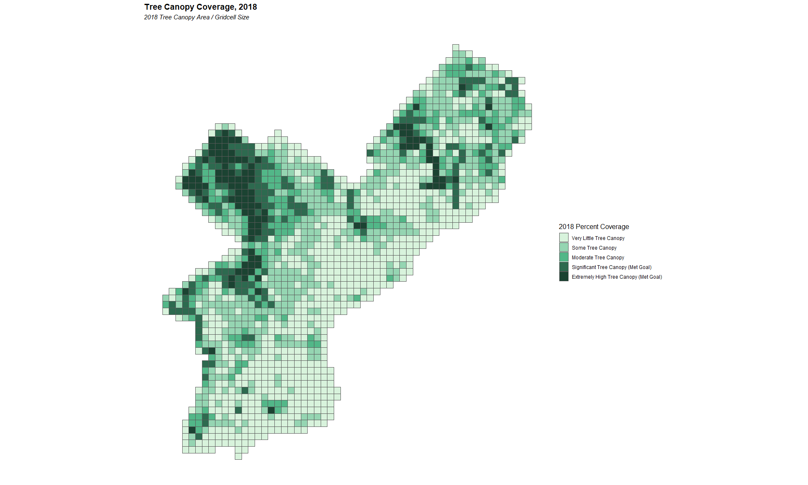<!-- -->

**Tree Canopy Change**  

```r
# grid.arrange(ncol=2,
#              
# ggplot()+ 
#   geom_sf(data = FinalFishnet, aes(fill = AreaGainCat))+ 
#   scale_fill_manual(values = palette7,
#                     name = "Area Gain (ft^2)")+
#   labs(title= "How Much Tree Canopy was Gained in Each Gridcell \n from 2008 - 2018?")+
#  theme(plot.title = element_text(size = 24, face = "bold", hjust = 0.5), 
#         legend.title = element_text(size =12), 
#         legend.text = element_text(size = 10)) + mapTheme(),
# 
# ggplot()+ 
#   geom_sf(data = FinalFishnet, aes(fill = AreaLossCat))+ 
#   scale_fill_manual(values = palette7,
#                     name = "Area Loss (f^2)")+
#   labs(title= "How Much Tree Canopy Was Lost in Each Gridcell \n From 2008 - 2018?")+
#   theme(plot.title = element_text( size = 24, face = "bold", hjust = 0.5), 
#         legend.title = element_text(size = 12), 
#         legend.text = element_text(size = 10)) + mapTheme()) 


grid.arrange(ncol=2,
             
ggplot()+ 
  geom_sf(data = FinalFishnet, aes(fill = pctLossCat))+ 
  scale_fill_manual(values = palette7,
                    name = "Percent Loss")+
  labs(title= "What was the Percent of Tree Canopy Loss in Each Grid Cell?", 
       subtitle = "Tree Canopy Lost From 2008 - 2018 / Total Tree Canopy Coverage in 2008")+
  theme(plot.title = element_text(hjust = 0.3), 
        plot.subtitle = element_text(hjust = 0.3)) + mapTheme(),
             
ggplot()+ 
  geom_sf(data = FinalFishnet, aes(fill = pctGainCat))+ 
  scale_fill_manual(values = palette7,
                    name = "Percent Gain")+
  labs(title= "What was the Percent of Tree Canopy Gain in Each Grid Cell?", 
       subtitle = "Tree Canopy Gained From 2008 - 2018 / Total Tree Canopy Coverage in 2018")+
  theme(plot.title = element_text(hjust = 0.3), 
        plot.subtitle = element_text(hjust = 0.3)) + mapTheme())  
```

<!-- -->


```r
FinalFishnet$PctChangeCat <- cut(FinalFishnet$pctChange, 
                       breaks = c(-Inf,  -30, -10, 0, 10, 20, Inf), 
                       labels = c("Significant Net Loss", "Moderate Net Loss", "Low Net Loss", "Low Net Gain", "Moderate Net Gain", "Significant Net Gain"), 
                       right = FALSE)


ggplot()+ 
               geom_sf(data = FinalFishnet, aes(fill = PctChangeCat))+ 
               scale_fill_manual(values = palette5,
                                 name = "Area Loss (f^2)")+
               labs(title= "How Much Tree Canopy Was Lost in Each Gridcell \n From 2008 - 2018?")+
               mapTheme()
```

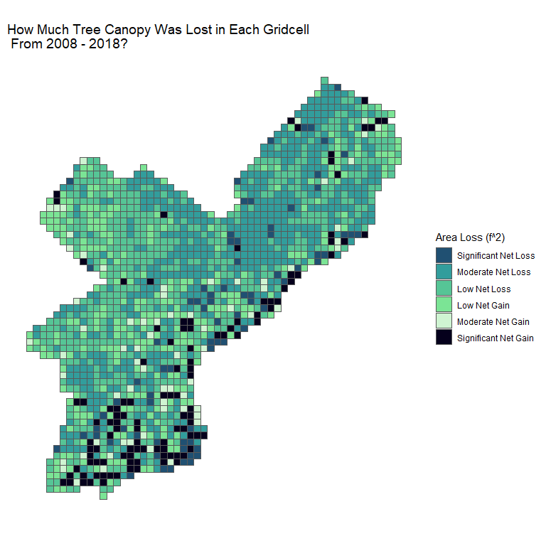<!-- -->

```r
ggplot()+ 
  geom_sf(data = FinalFishnet, aes(fill = PctChangeCat))+ 
  scale_fill_manual(values = palette8,
                    name = "Percent Change")+
  labs(title= " What is the Net Percent Gain or Loss from 2008- 2018?", 
       subtitle = "Percent Tree Canopy Gain - Percent Tree Canopy Loss") +
  theme(plot.title = element_text(hjust = 0.3), 
        legend.title = element_text(size = 12), 
        legend.text = element_text(size = 10)) + mapTheme()
```

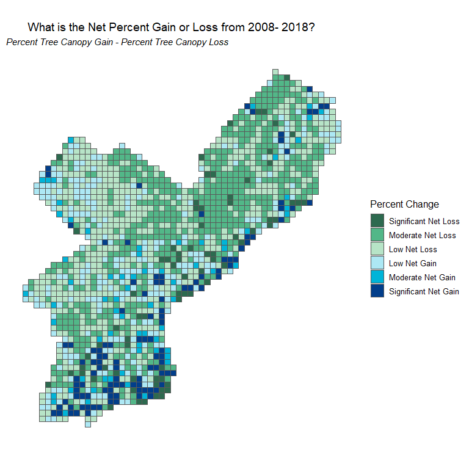<!-- -->


```r
grid.arrange(ncol=2,
             
ggplot(FinalFishnet, aes(x = pctGain, y = pctCoverage18))+
  geom_point()+ 
      scale_x_log10() + scale_y_log10() +
  labs(title = "Percent Tree Canopy Gain (2008 - 2018) vs. \n Percent Tree Canopy Coverage (2018)", 
       subtitle = "Aggregated by Fishnet") + 
  xlab("Percent of Tree Canopy Gained (2008 - 2018)") + 
  ylab("Percent of Tree Canopy Coverage of Each Fishnet Cell (2018)") + 
  theme(plot.title = element_text(hjust = 0.3, size = 12), plot.subtitle = element_text(hjust = 0.3, size = 8)) +
    plotTheme(), 

ggplot(FinalFishnet, aes(x = pctLoss, y = pctCoverage18))+
  geom_point()+ 
      scale_x_log10() + scale_y_log10() +
  labs(title = "Percent Tree Canopy Loss (2008 - 2018) vs. \n Percent Tree Canopy Coverage (2018) ", 
       subtitle = "Aggregated by Fishnet") + 
  xlab("Percent of Tree Canopy Lost (2008 - 2018)") + 
  ylab("Percent of Tree Canopy Coverage of Each Fishnet Cell (2018)") + 
  theme(plot.title = element_text(hjust = 0.3, size = 12), plot.subtitle = element_text(hjust = 0.3, size = 8)) +
  plotTheme()) 
```

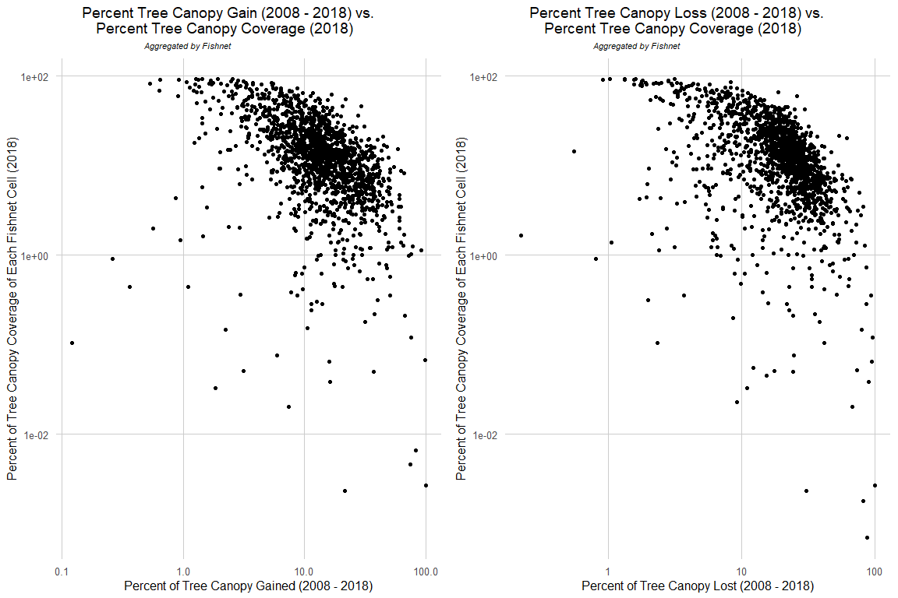<!-- -->

```r
pctChangeGraph = 
  FinalFishnet%>% 
  filter(pctChange < 100)

ggplot(pctChangeGraph, aes(x = pctChange, y = pctCoverage18))+
  geom_point()+ 
  labs(title = "Percent Change \n vs. Percent Tree Canopy Coverage (2018)", 
       subtilte = "Aggregated by Fishnet") + 
  xlab("Percent Change in Tree Canopy from 2008-2018 ") + 
  ylab("Percent of Tree Canopy Coverage of Each Grid Cell (2018)") + 
  theme(plot.title = element_text(hjust = 0.5, size = 15, face = "bold"), plot.subtitle = element_text(hjust = 0.5, size = 8)) +
  plotTheme()
```

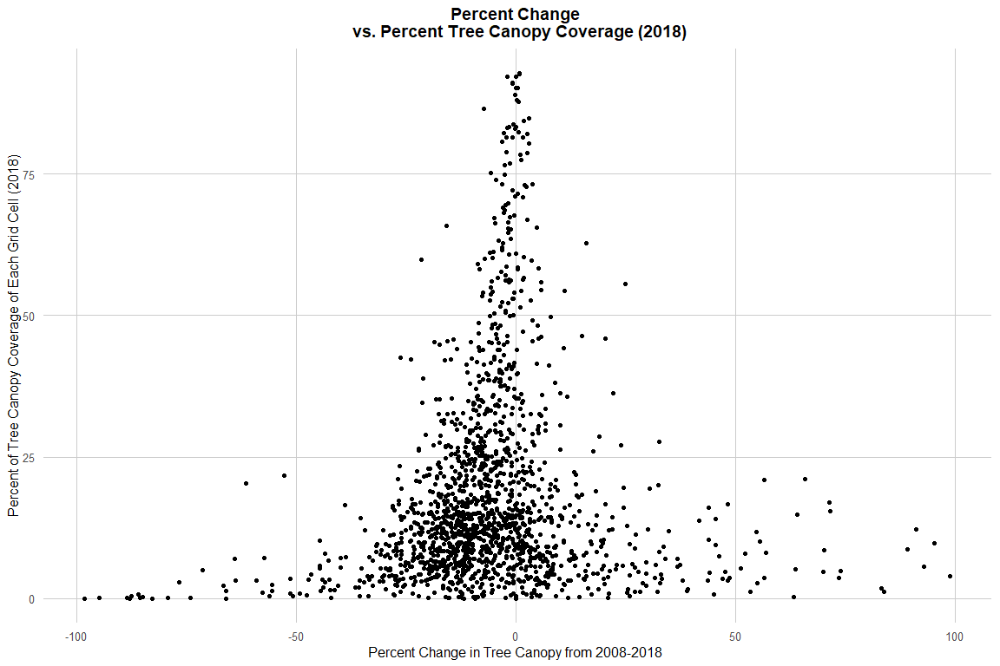<!-- -->


```r
fishnet_centroid <- FinalFishnet%>%
  st_centroid()

tractNames <- ACS %>%
  dplyr::select(GEOID) 

FinalFishnet1 <- fishnet_centroid %>%
  st_join(., tractNames) %>%
  st_drop_geometry() %>%
  left_join(FinalFishnet,.,by="uniqueID") %>%
  dplyr::select(GEOID) %>%
  na.omit() %>%
  mutate(uniqueID = as.numeric(rownames(.)))

# Make fishnet with ACS variables
ACS_net <-   
  FinalFishnet1 %>%
  st_drop_geometry() %>%
  group_by(uniqueID, GEOID) %>%
  summarize(count = n()) %>%
    full_join(FinalFishnet1) %>%
    st_sf() %>%
    na.omit() %>%
    ungroup() %>%
  st_centroid() %>% 
  dplyr::select(uniqueID) %>%
  st_join(., ACS) %>%
  st_drop_geometry() %>%
  left_join(.,FinalFishnet1) %>%
  st_as_sf()%>%
  st_drop_geometry()%>%
  mutate(uniqueID = as.character(uniqueID))

FinalFishnet <- 
  FinalFishnet%>%
  left_join(ACS_net)
```

**A Closer Look: 4 Neighborhoods' Tree Canopy Change**
Neighborhoods like Upper Roxborough, which have many trees, experienced less net change because much of their canopy remained untouched. Meanwhile, neighborhoods with less tree canopy such as Juniata Park experienced greater net change.

What about income? Higher income neighborhoods in Philadelphia generally have more tree canopy.However, looking at Fairhill and Graduate Hospital, the poorest and richest neighborhoods in Philadelphia, respectively, tree canopy change is more complex. Both neighborhoods are in the Center City region, and both experience a mix of gain, loss, and no change that appears to be in small pieces.


```r
library(magrittr)
library(dplyr)
#making basemap
 ll <- function(dat, proj4 = 4326){
   st_transform(dat, proj4)
 }

#Juniata Park
# JPBound <- Neighborhood %>%  
#   dplyr::filter(NAME=="JUNIATA_PARK")
# 
# JuniataPark <- st_intersection(st_make_valid(TreeCanopy), JPBound)
# 
# ggplot() +
#   geom_sf(data = JPBound, fill = "black") +
#   geom_sf(data = JuniataPark, aes(fill = CLASS_NAME), colour = "transparent") +
#   scale_fill_manual(values = paletteJ, name = "Canopy Change") +
#   labs(title = "Juniata Park Tree Canopy Change 2008-2018", subtitle = "Philadelphia, PA") +
#     mapTheme()
# 
# #Upper Roxborough
# URBound <- Neighborhood %>%  dplyr::filter(NAME=="UPPER_ROXBOROUGH")
# UpperRoxborough <- st_intersection(st_make_valid(TreeCanopy), URBound)
# 
# ggplot() +
#   geom_sf(data = URBound, fill = "black") +
#   geom_sf(data = UpperRoxborough, aes(fill = CLASS_NAME), colour = "transparent") +
#   scale_fill_manual(values = paletteJ, name = "Canopy Change") +
#   labs(title = "Upper Roxborough Tree Canopy Change 2008-2018", subtitle = "Philadelphia, PA") +
#     mapTheme()

#Fairhill
# FHBound <- Neighborhood %>%  dplyr::filter(NAME=="FAIRHILL")
# Fairhill <- st_intersection(st_make_valid(TreeCanopy), FHBound)
# 
# base_mapFH <- get_map(location =  unname(st_bbox(ll(st_buffer(st_centroid(Fairhill),1100)))),
#                     maptype = "satellite") #get a basemap
# 
# ggmap(base_mapFH, darken = c(0.3, "white")) + 
#   geom_sf(data = ll(FHBound), fill = "black", alpha = 0.3, inherit.aes = FALSE) +
#   geom_sf(data = ll(Fairhill), aes(fill = CLASS_NAME), colour = "transparent", inherit.aes = FALSE) +
#   scale_fill_manual(values = paletteJ, name = "Canopy Change") +
#   labs(title = "Fairhill Tree Canopy Change 2008-2018", subtitle = "Philadelphia, PA") +
#     mapTheme()
# 
# #GRad hospital
# GHBound <- Neighborhood %>%  dplyr::filter(NAME=="GRADUATE_HOSPITAL")
# GraduateHospital <- st_intersection(st_make_valid(TreeCanopy), GHBound)
# 
# base_mapGH <- get_map(location =  unname(st_bbox(ll(st_buffer(st_centroid(GraduateHospital),1100)))),
#                     maptype = "satellite") #get a basemap
# 
# ggmap(base_mapGH, darken = c(0.3, "white")) + 
#   geom_sf(data = ll(GHBound), fill = "black", alpha = 0.3, inherit.aes = FALSE) +
#   geom_sf(data = ll(GraduateHospital), aes(fill = CLASS_NAME), colour = "transparent", inherit.aes = FALSE) +
#   scale_fill_manual(values = paletteJ, name = "Canopy Change") +
#   labs(title = "Graduate Hospital Tree Canopy Change 2008-2018", subtitle = "Philadelphia, PA") +
#     mapTheme()
```


### 2. Which neighborhoods do not meet the 30% tree canopy coverage?   

```r
# Tree Loss by Neighborhood
TreeCanopyAllN<- 
  TreeCanopy%>%
  st_make_valid()%>%
  st_intersection(Neighborhood)

TreeCanopyAllN<- 
  TreeCanopyAllN%>%
  mutate(TreeArea = st_area(TreeCanopyAllN))%>%
  mutate(TreeArea = as.numeric(TreeArea))

TreeCanopyLossN <- 
  TreeCanopyAllN%>%
  filter(CLASS_NAME == "Loss")%>%
  group_by(NAME, NArea)%>%
  summarise(AreaLoss = sum(TreeArea))%>%
  mutate(pctLoss = AreaLoss / NArea)%>%
  mutate(pctLoss = as.numeric(pctLoss))%>%
  st_drop_geometry()

TreeCanopyLossN<- 
  Neighborhood%>%
  left_join(TreeCanopyLossN)


# Tree Gain 

TreeCanopyGainN <- 
  TreeCanopyAllN%>%
  filter(CLASS_NAME == "Gain")%>%
  group_by(NAME, NArea)%>%
  summarise(AreaGain = sum(TreeArea))%>%
  mutate(pctGain = AreaGain / NArea)%>%
  mutate(pctGain = as.numeric(pctGain))%>%
  st_drop_geometry()

TreeCanopyGainN<- 
  Neighborhood%>%
  left_join(TreeCanopyGainN)


TreeCanopyCoverageN18 <- 
  TreeCanopyAllN%>%
  filter(CLASS_NAME != "Loss")%>%
  group_by(NAME, NArea)%>%
  summarise(AreaCoverage = sum(TreeArea))%>%
  mutate(AreaCoverage = as.numeric(AreaCoverage))%>%
  mutate(pctCoverage = AreaCoverage / NArea * 100)


TreeCanopyLoss1N <- 
  TreeCanopyLossN%>%
  dplyr::select('NAME', 'AreaLoss')%>%
  st_drop_geometry()

TreeCanopyGain1N <- 
  TreeCanopyGainN%>%
  dplyr::select('NAME', 'AreaGain')%>%
  st_drop_geometry()

TreeCanopyCoverageN118 <- 
  TreeCanopyCoverageN18%>%
  dplyr::select('NAME', 'AreaCoverage', 'pctCoverage')%>%
  st_drop_geometry()


FinalNeighborhood <- 
  left_join(TreeCanopyLoss1N, TreeCanopyGain1N)%>%
  left_join(TreeCanopyCoverageN118)%>%
  mutate_all(~replace(., is.na(.), 0))%>%
  mutate(GainMinusLoss = AreaGain - AreaLoss)%>%
  dplyr::select(GainMinusLoss,
                AreaGain, AreaLoss, NAME, pctCoverage, AreaCoverage)

FinalNeighborhood<- 
  Neighborhood%>%
  left_join(FinalNeighborhood)%>%
  mutate(LossOrGain = ifelse(GainMinusLoss > 0, "Gain", "Loss"))%>%
  mutate(PctUnderGoal = 30 - pctCoverage)

#grid.arrange(ncol=2,

FinalNeighborhood$GoalCat <- cut(FinalNeighborhood$PctUnderGoal, 
                      breaks = c(-Inf, 0, 6, 12, 18, 24, 30), 
                       labels = c("Reached Goal!", "0-6 % Under Goal", "6-12% Under Goal", "12-18% Under Goal", "18-24% Under Goal", "24-30% Under Goal"), 
                       right = FALSE)

FinalNeighborhood$GainMinusLossCat <- cut(FinalNeighborhood$GainMinusLoss, 
                      breaks = c(-Inf, -10000000, -5000000, -2500000, 0, Inf), 
                       labels = c("Greater Than 1500000 Squared Feet lost", "1000000-1500000 Squared Feet Lost", "500000-1000000 Squared Feet Lost", "0-25000 Squared Feet Lost", "Tree Canopy Gain!"), 
                       right = FALSE)
```


```r
ggplot() +
  geom_sf(data = FinalNeighborhood, aes(fill = GoalCat), color = "white") +
  scale_fill_manual(values = GoalPalette, 
                    name = "Percent Away From Achieving 30% Goal")+
  labs(title = "How Far is Each Neighborhood Away From Meeting\n Philadelphia's 30% Tree Canopy Goal in Each Neighborhood?") +
  theme(plot.title = element_text(hjust = 0.5, size = 8), 
        legend.position = "bottom", 
        legend.title = element_blank())+
  mapTheme() 
```

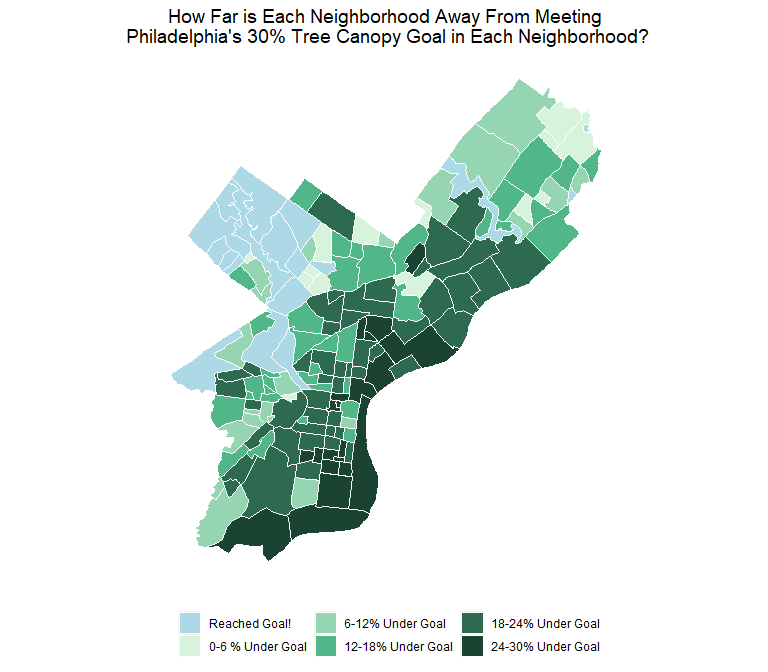<!-- -->

```r
ggplot() +
  geom_sf(data = FinalNeighborhood, aes(fill = GainMinusLossCat), color = "white") +
  scale_fill_manual(values = paletteLG, name = "Gain or Loss")+ 
  labs(title = "What is the Tree Canopy Net Gain or Loss \nin Each Neighborhood from 2008 - 2018?") +
  theme(plot.title = element_text(hjust = 0.5, size = 6))+
  mapTheme()
```

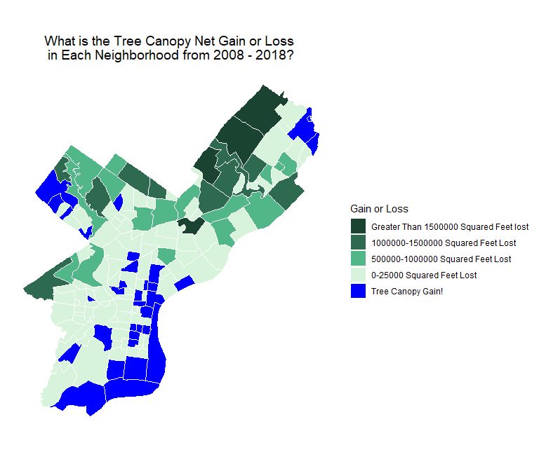<!-- -->

The demographic attribute most correlated with tree canopy coverage is income.

```r
correlation.long <-
  st_drop_geometry(FinalFishnet) %>%
     dplyr::select(population, medHHInc, housing_units, Rent, pctBach, pctWhite, pctNoVehicle, netChange) %>%
    gather(Variable, Value, -netChange)

correlation.cor <-
  correlation.long %>%
    group_by(Variable) %>%
    summarize(correlation = cor(Value, netChange, use = "complete.obs"))


correlation.long1 <-
  st_drop_geometry(FinalFishnet) %>%
     dplyr::select(population, medHHInc, housing_units, Rent, pctBach, pctWhite, pctNoVehicle, pctLoss) %>%
    gather(Variable, Value, -pctLoss)

correlation.cor1 <-
  correlation.long1 %>%
    group_by(Variable) %>%
    summarize(correlation = cor(Value, pctLoss, use = "complete.obs"))


correlation.long2 <-
  st_drop_geometry(FinalFishnet) %>%
     dplyr::select(population, medHHInc, housing_units, Rent, pctBach, pctWhite, pctNoVehicle, pctGain) %>%
    gather(Variable, Value, -pctGain)

correlation.cor2 <-
  correlation.long2 %>%
    group_by(Variable) %>%
    summarize(correlation = cor(Value, pctGain, use = "complete.obs"))


correlation.long3 <-
  st_drop_geometry(FinalFishnet) %>%
     dplyr::select(population, medHHInc, housing_units, Rent, pctBach, pctWhite, pctNoVehicle, pctCoverage18) %>%
    gather(Variable, Value, -pctCoverage18)

correlation.cor3 <-
  correlation.long3 %>%
    group_by(Variable) %>%
    summarize(correlation = cor(Value, pctCoverage18, use = "complete.obs"))

library(grid)
grid.arrange(ncol=2, top=textGrob("Fishnet Variables in Comparison to Local Demographics"),
             ggplot(correlation.long, aes(Value, netChange)) +
  geom_point(size = 0.1) +
    scale_x_log10() + scale_y_log10() +
  geom_text(data = correlation.cor, aes(label = paste("r =", round(correlation, 2))),
            x=-Inf, y=Inf, vjust = 1.5, hjust = -.1) +
  geom_smooth(method = "lm", se = FALSE, colour = "red") +
  facet_wrap(~Variable, ncol = 2, scales = "free") +
  labs(title = "Percent Tree Canopy Gained (2008 -2018) \n Minus Percent Tree Canopy Lost (2008 - 2018)") +
  plotTheme(), 
  
  ggplot(correlation.long1, aes(Value, pctLoss)) +
  geom_point(size = 0.1) +
    scale_x_log10() + scale_y_log10() +
  geom_text(data = correlation.cor1, aes(label = paste("r =", round(correlation, 2))),
            x=-Inf, y=Inf, vjust = 1.5, hjust = -.1) +
  geom_smooth(method = "lm", se = FALSE, colour = "red") +
  facet_wrap(~Variable, ncol = 2, scales = "free") +
  labs(title = "Percent Tree Canopy Lost From 2008 - 2018 ") +
  plotTheme(), 
  
  ggplot(correlation.long2, aes(Value, pctGain)) +
  geom_point(size = 0.1) +
    scale_x_log10() + scale_y_log10() +
    geom_text(data = correlation.cor2, aes(label = paste("r =", round(correlation, 2))),
            x=-Inf, y=Inf, vjust = 1.5, hjust = -.1) +
  geom_smooth(method = "lm", se = FALSE, colour = "red") +
  facet_wrap(~Variable, ncol = 2, scales = "free") +
  labs(title = "Percent Tree Canopy Gained From 2008 - 2018 ") +
  plotTheme(), 
  
  ggplot(correlation.long3, aes(Value, pctCoverage18)) +
  geom_point(size = 0.1) +
    scale_x_log10() + scale_y_log10() +
  geom_text(data = correlation.cor3, aes(label = paste("r =", round(correlation, 2))),
            x=-Inf, y=Inf, vjust = 1.5, hjust = -.1) +
  geom_smooth(method = "lm", se = FALSE, colour = "red") +
  facet_wrap(~Variable, ncol = 2, scales = "free") +
  labs(title = "Percent Tree Canopy Coverage (2018)") +
  plotTheme()) 
```

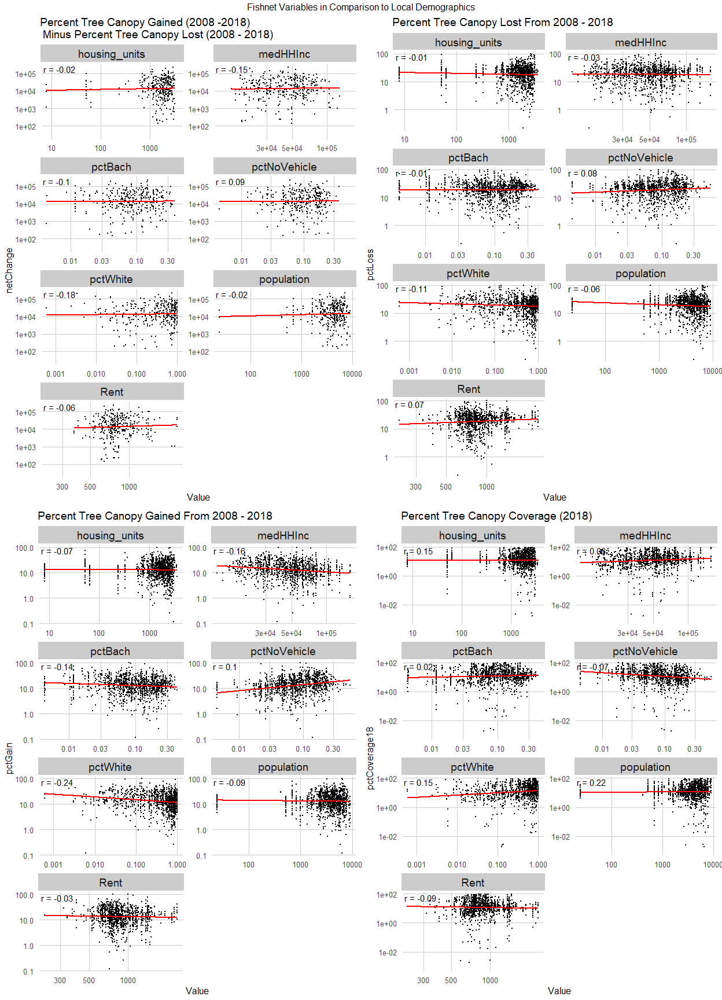<!-- -->


```r
# # race context
# race_context <- ACS %>%
#   dplyr::select(pctWhite) %>%
#   mutate(Race_Context = ifelse(pctWhite > .5, "Majority_White", "Majority_Non_White"))
# 
# ggplot() +
#   geom_sf(data = race_context, aes(fill = Race_Context)) +
#   scale_fill_viridis(option = "B", discrete = TRUE, name = "Race Context") +
#   labs(title = "Neighborhood Racial Context", subtitle = "Philadelphia, PA") +
#   mapTheme()
# 
# # income context
# income_context <- ACS %>%
#   dplyr::select(medHHInc) %>%
#   mutate(Income_Context = ifelse(medHHInc > 42614, "Higher", "Lower"))
#   
# ggplot() +
#   geom_sf(data = income_context, aes(fill = Income_Context)) +
#   scale_fill_viridis(option = "B", discrete = TRUE, name = "Income Context") +
#   labs(title = "Neighborhood Income Context", subtitle = "Philadelphia, PA") +
#   mapTheme()
```

### 3. What are the risk factors for tree canopy loss?   

```r
# Parcels make little difference, except if you are looking at total net change (looks like a normal distribution). Im commenting it out, but feel free to play around with the data. 

# 
# # Parcels 
# parcels <- 
# parcels %>%
#  mutate(ParcelArea = st_area(parcels))%>%
#  st_centroid()%>%
#  dplyr:: select(ParcelArea)
# 
# 
# FinalFishnet1 <- st_join(FinalFishnet, parcels)
# 
# FinalFishnet1<- 
# FinalFishnet1 %>%
#   st_drop_geometry()%>%
#   group_by(uniqueID)%>%
#   summarise(avgParcelSize = mean(ParcelArea))
# 
# 
# FinalFishnet1 <-
#   FinalFishnet%>%
#   left_join(FinalFishnet1)
# 
# FinalFishnet1<- 
#   FinalFishnet1%>% 
#   mutate(pctChange = (AreaCoverage18 - AreaCoverage08) / (AreaCoverage08) * 100)%>%
#   mutate(netChange = AreaGain - AreaLoss)%>%
#   mutate(avgParcelSize = as.numeric(avgParcelSize))
# 
# ggplot(Graph, aes(y = avgParcelSize, x = pctChange))+
#   geom_point()+ 
#   labs(title = "Percent Tree Canopy Loss (2008 - 2018) vs. \n Percent Tree Canopy Coverage (2018) ", 
#        subtilte = "Aggregated by Fishnet") + 
#   xlab("Percent of Tree Canopy Lost (2008 - 2018)") + 
#   ylab("Percent of Tree Canopy Coverage of Each Fishnet Cell (2018)") + 
#   theme(plot.title = element_text(hjust = 0.3, size = 12), plot.subtitle = element_text(hjust = 0.3, size = 8)) +
#   plotTheme()

# e311Trees <- 
#   st_read('C:/Users/Kyle McCarthy/Documents/Practicum/e311.csv')
#   
# e311Trees<- 
#   e311Trees%>%
#   dplyr:: select(service_name, lat, lon)%>% 
#   filter(service_name == "Tree Dangerous" | service_name == "Street Tree")%>% 
#   mutate(lon = as.numeric(lon), 
#          lat = as.numeric(lat))%>% 
#     na.omit()%>% 
#   st_as_sf(.,coords=c("lon","lat"),crs=4326)%>% 
#   st_transform('ESRI:102728')
#    
# 
# e311_net_tree <- 
#   e311Trees%>%
#   mutate(e311TreeCount = 1) %>% 
#   dplyr::select(e311TreeCount)%>%
#   aggregate(., FinalFishnet, sum) %>%
#   mutate(e311TreeCount = replace_na(e311TreeCount, 0))%>%
#   st_centroid()%>%
#   st_join(FinalFishnet, .)
# 
# 
#   
```


```r
const_spatial2 <-
  const_spatial %>%
  filter(permitdescription == 'RESIDENTIAL BUILDING PERMIT ' | permitdescription == 'COMMERCIAL BUILDING PERMIT')

# ggplot()+
#   geom_sf(data = Philadelphia) +
#   geom_sf(data = const_spatial2)

### Aggregate points to the neighborhood
## add a value of 1 to each crime, sum them with aggregate
const_net <- 
  dplyr::select(const_spatial2) %>% 
  mutate(countConst = 1) %>% 
  aggregate(., Neighborhood, sum) %>%
  mutate(countConst = replace_na(countConst, 0),
         neigh = Neighborhood$NAME)

             

const_net_fish <- 
  dplyr::select(const_spatial2) %>% 
  mutate(countConst = 1) %>% 
  aggregate(., fishnet, sum) %>%
  mutate(countConst = replace_na(countConst, 0),
         uniqueID = rownames(.))
             
             ggplot() +
                  geom_sf(data = const_net, aes(fill = countConst), color = NA) +
                  scale_fill_viridis() +
                  labs(title = "Count of Construction permits for the neighborhood") +
                  mapTheme()
```

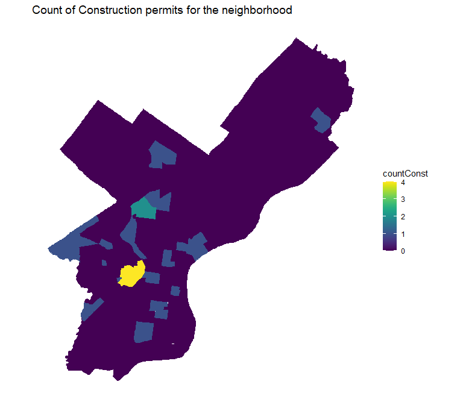<!-- -->


```r
#Filter maximum construction permits by neighborhood

const_max_neigh <-
  const_net %>%
  filter(countConst == max(countConst))

Max_neigh <- Neighborhood %>%
  filter(NAME == const_max_neigh$neigh)

const_neigh <- st_intersection(const_spatial2, Max_neigh)
  


Max_neigh_tree <- st_intersection(st_make_valid(TreeCanopy), Max_neigh)

base_mapGH <- get_map(location =  unname(st_bbox(ll(st_buffer(st_centroid(Max_neigh_tree),1100)))),
                    maptype = "satellite") #get a basemap

ggmap(base_mapGH, darken = c(0.3, "white")) + 
  geom_sf(data = ll(Max_neigh), fill = "black", alpha = 0.3, inherit.aes = FALSE) +
  geom_sf(data = ll(Max_neigh_tree), aes(fill = CLASS_NAME), colour = "transparent", inherit.aes = FALSE) +
  geom_sf(data = ll(const_neigh), inherit.aes = FALSE) +
  scale_fill_manual(values = paletteJ, name = "Canopy Change") +
  labs(title = "University City Tree Canopy Change 2008-2018 with construction permits", subtitle = "Philadelphia, PA") +
    mapTheme()
```

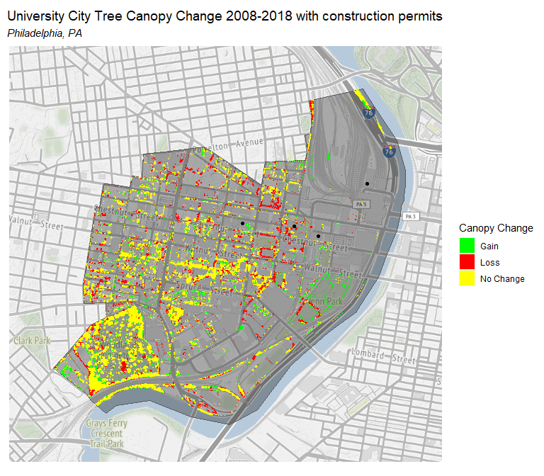<!-- -->


```r
#Juniata Park
# 
# const_JB <- st_intersection(const_spatial2, JPBound)
# 
# base_mapGH <- get_map(location =  unname(st_bbox(ll(st_buffer(st_centroid(JuniataPark),1100)))),
#                     maptype = "satellite") #get a basemap
# 
# ggmap(base_mapGH, darken = c(0.3, "white")) + 
#   geom_sf(data = ll(JPBound), fill = "black", alpha = 0.3, inherit.aes = FALSE) +
#   geom_sf(data = ll(JuniataPark), aes(fill = CLASS_NAME), colour = "transparent", inherit.aes = FALSE) +
#   geom_sf(data = ll(const_JB), inherit.aes = FALSE) +
#   scale_fill_manual(values = paletteJ, name = "Canopy Change") +
#   labs(title = "Juniata Park Tree Canopy Change 2008-2018 with construction permits", subtitle = "Philadelphia, PA") +
#     mapTheme()
# 
# #Upper Roxborough
# 
# const_UR <- st_intersection(const_spatial2, URBound)
# 
# base_mapGH <- get_map(location =  unname(st_bbox(ll(st_buffer(st_centroid(UpperRoxborough),1100)))),
#                     maptype = "satellite") #get a basemap
# 
# ggmap(base_mapGH, darken = c(0.3, "white")) + 
#   geom_sf(data = ll(URBound), fill = "black", alpha = 0.3, inherit.aes = FALSE) +
#   geom_sf(data = ll(UpperRoxborough), aes(fill = CLASS_NAME), colour = "transparent", inherit.aes = FALSE) +
#   geom_sf(data = ll(const_UR), inherit.aes = FALSE) +
#   scale_fill_manual(values = paletteJ, name = "Canopy Change") +
#   labs(title = "Upper Roxborough Tree Canopy Change 2008-2018 with construction permits", subtitle = "Philadelphia, PA") +
#     mapTheme()
# 
# 
# #Fairhill
# 
# const_FH <- st_intersection(const_spatial2, Fairhill)
# 
# base_mapGH <- get_map(location =  unname(st_bbox(ll(st_buffer(st_centroid(Fairhill),1100)))),
#                     maptype = "satellite") #get a basemap
# 
# ggmap(base_mapGH, darken = c(0.3, "white")) + 
#   geom_sf(data = ll(FHBound), fill = "black", alpha = 0.3, inherit.aes = FALSE) +
#   geom_sf(data = ll(Fairhill), aes(fill = CLASS_NAME), colour = "transparent", inherit.aes = FALSE) +
#   geom_sf(data = ll(const_FH), inherit.aes = FALSE) +
#   scale_fill_manual(values = paletteJ, name = "Canopy Change") +
#   labs(title = "FairHill Tree Canopy Change 2008-2018 with construction permits", subtitle = "Philadelphia, PA") +
#     mapTheme()
# 
# 
# #GRad hospital
# 
# const_GH <- st_intersection(const_spatial2, GraduateHospital)
# 
# base_mapGH <- get_map(location =  unname(st_bbox(ll(st_buffer(st_centroid(GraduateHospital),1100)))),
#                     maptype = "satellite") #get a basemap
# 
# ggmap(base_mapGH, darken = c(0.3, "white")) + 
#   geom_sf(data = ll(GHBound), fill = "black", alpha = 0.3, inherit.aes = FALSE) +
#   geom_sf(data = ll(GraduateHospital), aes(fill = CLASS_NAME), colour = "transparent", inherit.aes = FALSE) +
#   geom_sf(data = ll(const_GH), inherit.aes = FALSE) +
#   scale_fill_manual(values = paletteJ, name = "Canopy Change") +
#   labs(title = "Graduate Hospital Tree Canopy Change 2008-2018 with construction permits", subtitle = "Philadelphia, PA") +
#     mapTheme()
```


```r
# Analysis completed in ArcGIS -- Processing time to long in R. 500,000 Parcels and 614,000 Tree Canopy Polygons aggregated in this analysis. I plan on writing out what the code would be for reproducability purposes. 

LandUse1 <-
  st_read("C:/Users/Kyle McCarthy/Documents/Practicum/Data/LandUse/landu.csv")%>%
  #st_read("C:/Users/agarw/Documents/MUSA 801/Data/landu.csv")%>%
 # st_read("/Users/annaduan/Desktop/Y3S2/Practicum/Data/landu.csv") %>%
  #st_read("C:/Users/Prince/Desktop/Tree Canopy Data/landu.csv") %>%
  mutate(AreaGain = as.numeric(AreaGain),
         AreaLoss = as.numeric(AreaLoss),
         Coverage08 = as.numeric(Coverage08),
         Coverage18 = as.numeric(Coverage18))
 LandUse1 <- LandUse1%>% replace(is.na(LandUse1), 0)

LandUse<-
  LandUse1%>%
  group_by(Descriptio)%>%
  summarise(AreaGain = sum(AreaGain),
            AreaLoss = sum(AreaLoss),
            Coverage08 = sum(Coverage08),
            Coverage18 = sum(Coverage18))%>%
  mutate(pctLoss = as.numeric(AreaLoss / Coverage08),
         pctGain = as.numeric(AreaGain/ Coverage18),
         pctChange = (Coverage18 - Coverage08)/ (Coverage08) * 100,
         netChange = AreaGain - AreaLoss)

LandUseLong<-
  LandUse%>%
  mutate(AreaLoss = AreaLoss * -1)%>%
  dplyr::select(AreaGain, AreaLoss, Descriptio)%>%
  gather(variable, value, -c(Descriptio))%>%
  mutate(variable = ifelse(variable == "AreaGain", "Area Gain", "Area Loss"))

ggplot(LandUseLong, aes(fill = variable, y=Descriptio, x=value))+
  geom_bar(stat='identity', position = "stack", width = .5)+
  scale_fill_manual(values = landusepal,
                    name = "Area Gain or Loss")+
  labs(title = "Total Area Lost or Gained by Land Use Type")+
  xlab("        Total Area Lossed                Total Area Gained")+
  ylab("Land Use Type")
```

<!-- -->

```r
LandUseLong<-
  LandUse%>%
  mutate(pctLoss = pctLoss * -1)%>%
  dplyr::select(pctGain, pctLoss, Descriptio)%>%
  gather(variable, value, -c(Descriptio))%>%
  mutate(variable = ifelse(variable == "pctGain", "Percent Gained", "Percent Lost"))

ggplot(LandUseLong, aes(fill = variable, y=Descriptio, x=value))+
  geom_bar(stat='identity', position = "stack", width = .5)+
  scale_fill_manual(values = landusepal,
                    name = "Area Gain or Loss")+
  labs(title = "Relative Percent Lost or Relative Percent Gained")+
  xlab("Percentage of 2008 Trees Lost            Percentage of 2018 Trees Gained")+
  ylab("Land Use Type")+
  theme(plot.title = element_text(hjust = 0.5),
        axis.title.x = element_text(size = 9, face = "bold"))
```

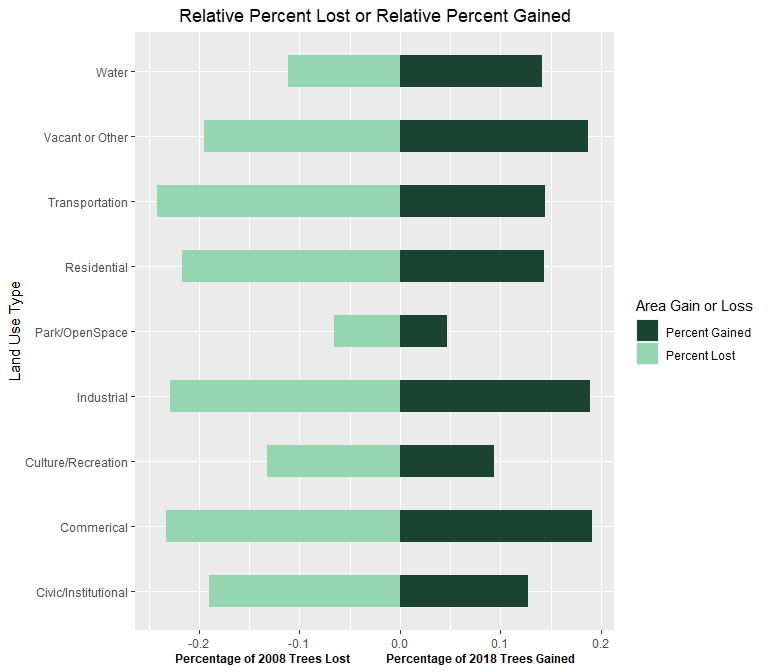<!-- -->


```r
LandUseLong<-
  LandUse%>%
  mutate(pctLoss = pctLoss * -1)%>%
  dplyr::select(netChange, pctChange, Descriptio)%>%
  gather(variable, value, -c(Descriptio))

grid.arrange(ncol= 1,

ggplot(LandUse, aes(y=Descriptio, x=netChange))+
  geom_bar(stat='identity', fill="forest green", width = .4)+
  labs(title = "Total Net Change",
       subtitle = "Area Gain - Area Loss")+
  xlab("Land Use Type")+
  ylab("Total Net Change")+
  theme(axis.text.x = element_text(angle = 90, vjust = 0.5, hjust=1)),

ggplot(LandUse, aes(y=Descriptio, x=pctChange))+
  geom_bar(stat='identity', fill="forest green", width = .4)+
  labs(title = "Percent Change",
       subtitle = "('18 Tree Canopy Coverage - '08 Tree Canopy Coverage) / ('18 Tree Canopy Coverage) * 100 ")+
  xlab("Percent Net Change")+
  ylab("Land Use Type")+
  theme(axis.text.x = element_text(angle = 90, vjust = 0.5, hjust=1)))
```

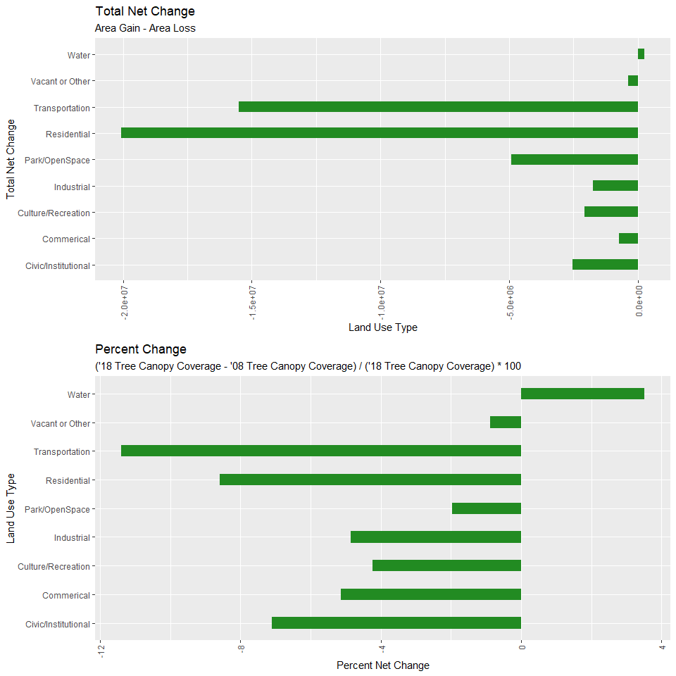<!-- -->


```r
LandUse2 <-
  LandUse1%>%
  filter(Descriptio == "Residential")%>%
  group_by(C_DIG2DESC)%>%
  summarise(AreaGain = sum(AreaGain),
            AreaLoss = sum(AreaLoss),
            Coverage08 = sum(Coverage08),
            Coverage18 = sum(Coverage18))%>%
  mutate(pctChange = (Coverage18 - Coverage08)/ (Coverage08) * 100,
         netChange = AreaGain - AreaLoss)


  grid.arrange(ncol= 1,

ggplot(LandUse2, aes(y=C_DIG2DESC, x=netChange))+
  geom_bar(stat='identity', fill="forest green", width = 0.4)+
  labs(title = "Total Tree Canopy Net Change in Residential Land Use Parcels",
       subtitle = "Area Gain - Area Loss")+
  ylab("Residential Land Use Type")+
  xlab("Total Net Change")+
  theme(axis.text.x = element_text(angle = 90, vjust = 0.5, hjust=1)),

ggplot(LandUse2, aes(y=C_DIG2DESC, x=pctChange))+
  geom_bar(stat='identity', fill="forest green", width = 0.4)+
  labs(title = "Percent Change in Residential Land Use Parcels",
       subtitle = "('18 Tree Canopy Coverage - '08 Tree Canopy Coverage) / ('18 Tree Canopy Coverage) * 100 ")+
  ylab("Residential Land Use Type")+
  xlab("Percent Tree Canopy Change")+
  theme(axis.text.x = element_text(angle = 90, vjust = 0.5, hjust=1)))
```

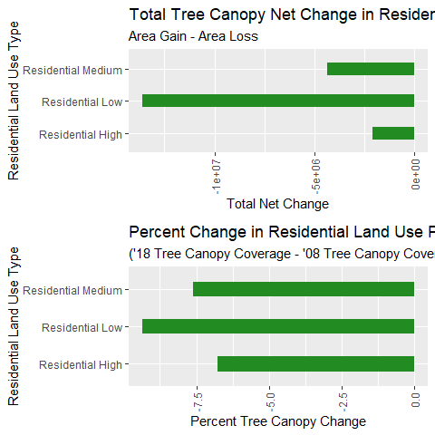<!-- -->


```r
# LandUseAg<- 
#   LandUse1%>%
#   filter(Descriptio == "Residential" | Descriptio == "Transportation") %>% 
#   group_by(Descriptio)%>%
#   summarise()
# 
# LandUseAg<- 
#   LandUseAg%>%
#   st_transform('ESRI:102728')
#   
# 
# LandUseFishnet <- 
#   FinalFishnet %>%
#   st_make_valid()%>%
#   st_intersection(LandUseAg)
```

### 4. How do current patterns of tree canopy coverage and loss reflect disinvestment as a result of redlining and older planning practices?  

```r
TreeCanopyAllHOLC <-
TreeCanopy%>%
st_make_valid() %>%
st_intersection(HOLC)

TreeCanopyAllHOLC <-
  TreeCanopyAllHOLC %>%
  mutate(TreeArea = st_area(TreeCanopyAllHOLC))%>%
  mutate(TreeArea = as.numeric(TreeArea))

TreeCanopyLossHOLC <- 
  TreeCanopyAllHOLC%>%
  filter(CLASS_NAME == "Loss")%>%
  group_by(area_description_data, HOLCArea)%>%
  summarise(AreaLoss = sum(TreeArea))%>%
  mutate(pctLoss = AreaLoss / HOLCArea)%>%
  mutate(pctLoss = as.numeric(pctLoss))%>%
  st_drop_geometry()

TreeCanopyLossHOLC<- 
  HOLC%>%
  left_join(TreeCanopyLossHOLC)


# ggplot() +
#   geom_sf(data = Philadelphia, colour = "gray90", fill = "gray90") +
#     geom_sf(data = Loss, colour = "black", fill = "transparent") +
#   geom_sf(data = HOLC, aes(fill = holc_grade), alpha = 0.6, colour = "gray90") +
#   scale_fill_manual(values = paletteHolc) +
#   labs(title = "Tree Canopy Loss and Redlining", subtitle = "Philadelphia, PA") +
#   mapTheme()

TreeCanopyLossHOLC %>%
 # group_by(holc_grade) %>%
ggplot()+
  geom_histogram(aes(pctLoss), binwidth = 1, fill = "red")+
  labs(title="Tree Canopy Loss by HOLC Grade from 2008-2018",
  subtitle="Philadelphia, PA",
       x="HOLC Rating", 
       y="% Loss")+
  facet_wrap(~holc_grade, nrow = 1)+
  plotTheme()
```

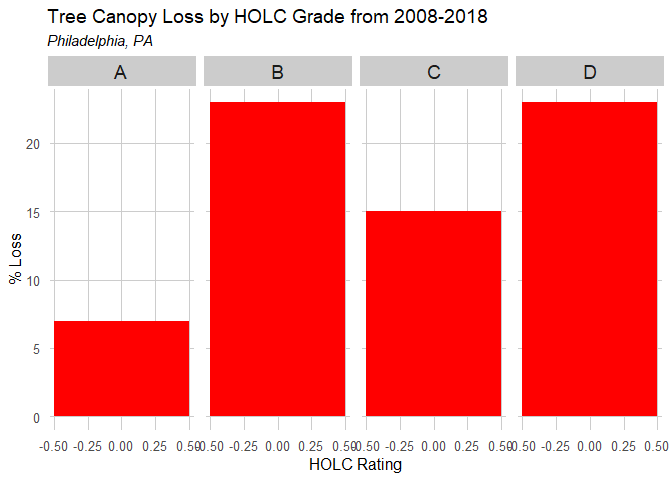<!-- -->

## Team Roles


