[Return to MUSA 801 Projects Page](https://pennmusa.github.io/MUSA_801.io/)  
This project was completed for the MUSA/Smart Cities Practicum course (MUSA 801) instructed by Ken Steif, Michael Fichman, and Matthew Harris. We are grateful to our instructors for their continued support and feedback as well as their flexibility and understanding in the face of a global pandemic. We also thank Dexter Locke and Lara Roman from the United States Forest Service for their generosity with their time and their eagerness to provide feedback on our project and share their expertise. Finally, we would like to acknowledge our classmates this semester for their feedback on our project and for inspiring us with their work.  

# Introduction  
This document is intended to help other researchers replicate a study of tree canopy loss linked to spatial risk factors. We present three primary outcomes: an analysis of the spatial attributes of tree canopy loss, a model to predict future tree canopy loss risk, and a policy tool that visualizes future tree canopy loss under various construction scenarios. We include hyperlinks throughout our document for reproducibility. Our full code base can be accessed on Github [here](https://github.com/palakagr/tree-canopy-loss). 

We hope that this document and our web application can help tree planting agencies, tree advocates, and the interested public understand the forces contributing to tree canopy loss in Philadelphia and envision different future scenarios for our tree canopy.  

  
  


# Motivation 
  
**Between 2008 and 2018, Philadelphia experienced a net loss of [more than 1000 football fields’ worth](https://treephilly.org/wp-content/uploads/2019/12/Tree-Canopy-Assessment-Report-Philadelphia-2018.pdf) of tree canopy.**  

Most of the tree canopy loss occurred in historically disenfranchised communities. In response, the City of Philadelphia has set essential milestones for conserving and increasing the current tree canopy in the city. In this analysis, we model tree canopy loss in Philadelphia and identify risk factors. We additionally assess the city’s progress on the goals and how this varies across neighborhoods.  


    
     
**Why does the tree canopy matter?**  

Tree canopy is defined as an area of land which, viewed from a bird's eye view, is covered by trees. Trees offer essential benefits to cities, including mitigating the urban heat island effect, absorbing stormwater runoff, a habitat for wildlife, aesthetics, and recreation. In addition, trees are a preventative public health measure that improves mental health, increases social interaction and activity, and reduces crime, violence, and stress. A 2020 study published in The Lancet found that if Philadelphia reaches 30% tree canopy in all of its neighborhoods, the city would see [403 fewer premature deaths](https://www.fs.fed.us/nrs/pubs/jrnl/2020/nrs_2020_kondo_001.pdf) per year. However, despite the importance of trees to the city's health, appearance, and ecology, trees are regularly removed for reasons ranging from construction to homeowners' personal preference.     

   
  
    
**Philadelphia's tree canopy goals** 

30% Tree Canopy in each neighborhood by 2025       
  
* Under a previous mayoral administration, the city of Philadelphia set a [goal](https://treephilly.org/about/) of achieving 30% tree canopy coverage in all neighborhoods by 2025. Currently, the citywide average is [20%](https://treephilly.org/wp-content/uploads/2019/12/Tree-Canopy-Assessment-Report-Philadelphia-2018.pdf), although this is highly uneven. More affluent neighborhoods in the northwest with many parks and large lawns have much higher tree canopy than industrial neighborhoods in South and North Philadelphia. The neighborhoods with lower canopy coverage tend to be historically disenfranchised, lower-income, and predominantly communities of color. This is an environmental justice problem. Neighborhoods like Philadelphia’s Hunting Park have a much lower ratio of the tree canopy to impervious surfaces than the citywide average, resulting in [higher temperatures](https://whyy.org/articles/racism-left-hunting-park-overheated-neighbors-are-making-a-cooler-future/) during summertime heat waves and inferior air quality.  
  
1 acre of tree canopy within a 10 minute walk for all residents   
  
* 13% of Philadelphia's residents are considered under-served by green space, meaning that they live more than a 10-minute walk away from at least 1 acre of green space. The city has set a goal of ensuring that all residents are no more than 10 minutes away from at least 1 acre of green space by 2035. To this end, the city prioritizes adding green space in historically disenfranchised neighborhoods, schools, and recreation centers.   

  
# Data and Methods  
In this analysis, we use the following data:

<style>
div.blue { background-color:#e6f0ff; border-radius: 5px; padding: 10px;}
</style>
<div class = "blue">
**Independent variable:**  
* Tree Canopy LiDAR data consisting of canopy polygons marked as loss, gain, or no change from 2008-2018     [OpenDataPhilly](https://www.opendataphilly.org/dataset/ppr-tree-canopy)    

**Neighborhood social attributes:**   
* 2018 [American Community Survey data](https://api.census.gov/data/2018/acs/acs5/variables.html) from the U.S. Census Bureau   

**Neighborhoood level risk factors:**    
* Construction [OpenDataPhilly](https://www.opendataphilly.org)  
* Parcels   
* Streets   
* Tree-related 311 requests   
* Hydrology    
* Zoning   
* Health outcomes [Centers for Disease Control](https://www.cdc.gov/places/about/index.html)
</div>  
  
## Unit of analysis: the fishnet cell
Below, we visualize the study area for this analysis. We use fishnet grid cells as our unit of analysis to take advantage of high-resolution spatial data such as 311 service requests. Philadelphia is represented by fishnet cells of 1615 feet, roughly the size of a city block. Around 16% of Philadelphia's total area consists of [conservation easements](https://www.conservationeasement.us/what-is-a-conservation-easement/), hydrology, and parks. We omit fishnet cells which consist of more than 20% of these categories because they are protected and therefore are not vulnerable to the same external processes that cause tree canopy change (e.g. construction or street tree removal). All in all, we have 1411 fishnet cells representing Philadelphia.  


# Exploratory Analysis   

Our analysis is guided by the following questions:  
<style>
div.blue { background-color:#e6f0ff; border-radius: 5px; padding: 20px;}
</style>
<div class = "blue">
1. What does Philadelphia's tree canopy look like today?    
  
2. How close are neighborhoods to achieving the 30% goal?    
  
3. How does tree canopy change vary by demographic context?    
  
4. How do current patterns of tree canopy change reflect disinvestment as a result of redlining and older planning practices?    
  
5. What other factors are associated with tree canopy change?   
</div>

## What does Philadelphia's tree canopy look like today? 
  
### Philadelphia's 2018 Canopy 
Philadelphia's tree canopy dataset has almost 700,000 polygons labeled as loss, gain, and no change between 2008 and 2018.  

  
Our first data wrangling task is to aggregate this data to the fishnet level. Now, we see that Northwest, West, and Northeast Philadelphia have the most tree canopy. In North Philadelphia, South Philadelphia, and Center City, the tree canopy coverage is more sparse.    


  
### Tree Canopy Change
Surprisingly, tree canopy loss and gain exhibit similar spatial patterns. Percent loss is the tree canopy lost from 2008 to 2018 divided by the total tree canopy area in 2008. Percent gain is the tree canopy lost from 2008 to 2018 divided by the total tree canopy area in 2018. Both percent gain and loss are highest in a few neighborhoods in South Philadelphia and in the northeast. While this seems counter-intuitive, this is because these neighborhoods have the least tree canopy. Therefore each individual tree gained or lost has a greater overall impact.

```r
v <- ggmap(base_map) +
  geom_sf(data = ll(FinalFishnet), colour = "transparent", aes(fill = pctLoss), inherit.aes = FALSE)+
 # scale_fill_manual(values = palette7,name = "Percent Loss")+
  labs(title= "Tree Canopy Loss 2008-2018", 
       subtitle = "Philadelphia, PA")+
  theme(plot.title = element_text(size = 30, face = "bold"), 
        legend.title = element_text(size = 12)) +  mapTheme()

Z <- ggmap(base_map) +
  geom_sf(data = ll(FinalFishnet),  colour = "transparent", aes(fill = pctGain), inherit.aes = FALSE)+ 
 # scale_fill_manual(values = palette7,name = "Percent Gain")+
  labs(title= "Tree Canopy Gain 2008-2018", 
       subtitle = "Philadelphia, PA")+
  theme(plot.title = element_text(size = 30, face = "bold"), 
        legend.title = element_text(size = 12)) +  mapTheme()


v + scale_fill_distiller(palette = "YlOrRd", direction = 1, name = "% Lost")
```

<!-- -->

```r
Z + scale_fill_distiller(palette = "YlGr", direction = 1, name = "% Gained")
```

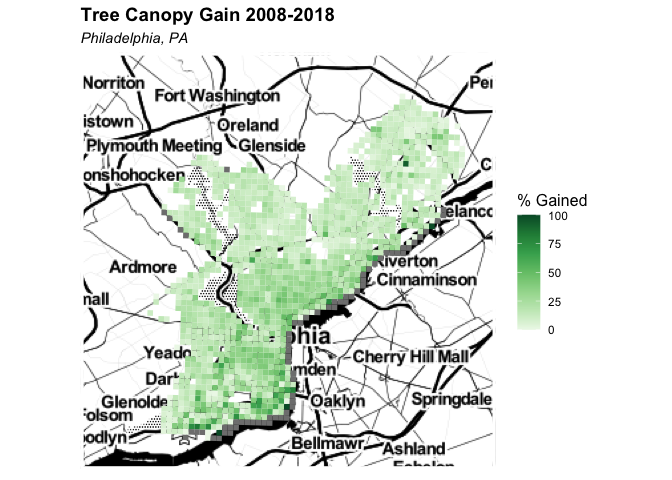<!-- -->


```r
FinalFishnet$PctChangeCat <- cut(FinalFishnet$pctChange, 
                       breaks = c(-Inf,  -30, -10, 0, 10, 20, Inf), 
                       labels = c("Substantial Net Loss", "Moderate Net Loss", "Low Net Loss", "Low Net Gain", "Moderate Net Gain", "Substantial Net Gain"), 
                       right = FALSE)
```
When we plot the percent tree canopy and percent tree canopy gain, loss, and change for each fishnet cell, we see a very low correlation. However, we found that a log-transformation creates a greater negative correlation. This suggests that fishnet cells with more trees experience less percentage change.  

```r
gain <- ggplot(FinalFishnet %>% filter(pctCoverage18 > 0.01 & pctGain > 1), aes(x = pctGain, y = pctCoverage18))+
    stat_density2d(aes(fill = ..level..), geom = "polygon", bins = 20) +
  scale_fill_gradient(low="light green", high="magenta", name="Distribution") +
    geom_smooth(method = "lm", se = FALSE, colour = "black") +
 # geom_point(colour = "black", alpha = 0.3, size = 4)+ 
      scale_x_log10() + scale_y_log10() +
  labs(title = "Gain vs. 2018 Tree Canopy (%)", 
       subtitle = "Density of fishnet cells") + 
  xlab("Canopy Gain (%)") + 
  ylab("2018 Tree Canopy (%)") + 
  theme(plot.title = element_text(size = 30, face = "bold"), 
        legend.title = element_text(size = 12),
        legend.position = "none") +
    plotTheme()

loss <- ggplot(FinalFishnet %>% filter(pctCoverage18 > 0.01 & pctGain > 1), aes(x = pctLoss, y = pctCoverage18))+
    stat_density2d(aes(fill = ..level..), geom = "polygon", bins = 20) +
  scale_fill_gradient(low="light green", high="magenta", name="Distribution") +
    geom_smooth(method = "lm", se = FALSE, colour = "black") +
 # geom_point(colour = "black", alpha = 0.3, size = 4)+ 
      scale_x_log10() + scale_y_log10() +
  labs(title = "Loss vs. 2018 Tree Canopy (%)", 
       subtitle = "Density of fishnet cells") + 
  xlab("Canopy Loss (%)") + 
  ylab("2018 Tree Canopy (%)") + 
  theme(plot.title = element_text(size = 30, face = "bold"), 
        legend.title = element_text(size = 12),
        legend.position = "none") +
    plotTheme()

pctChangeGraph <- 
  FinalFishnet%>% 
  filter(pctChange < 100)

change <- ggplot(pctChangeGraph, aes(x = pctChange, y = pctCoverage18))+
  stat_density2d(aes(fill = ..level..), geom = "polygon", bins = 20) +
  scale_fill_gradient(low="light green", high="magenta", name="Distribution") +
   # geom_smooth(method = "glm", se = FALSE, colour = "black") +
 # geom_point(colour = "black", alpha = 0.3, size = 4)+ 
  labs(title = "Change vs. 2018 Tree Canopy (%)",
       subtitle = "Density of fishnet cells") + 
  xlab("Tree Canopy Change (%)") + 
  ylab("2018 Tree Canopy (%)") + 
  theme(plot.title = element_text(size = 30, face = "bold"), 
        legend.title = element_text(size = 12),
        legend.position = "none") +
    plotTheme()


grid.arrange(gain, loss, change, top = "Tree Canopy Change and Existing Tree Canopy", ncol = 2)
```

<!-- -->
     
     
     
Citywide, the majority of fishnet cells experienced a low net loss. A similar amount of cells experienced either substantial loss or gain.

```r
b <- ggmap(base_map) +
  geom_sf(data = ll(FinalFishnet), inherit.aes = FALSE, colour = "transparent", aes(fill = PctChangeCat))+ 
  labs(title= "Tree Canopy Net Change 2008-2018", 
       subtitle = "Percent Tree Canopy Gain - Percent Tree Canopy Loss") +
  theme(plot.title = element_text(size = 30, face = "bold"), 
        legend.title = element_text(size = 12)) +  mapTheme()

b + scale_fill_brewer(palette = "PiYG", name = "Tree Canopy Change", direction = 1, aesthetics = c("colour", "fill"), guide = guide_legend(reverse = TRUE))
```

<!-- -->

## How close are neighborhoods to achieving the 30% goal? 

```r
# Tree Loss by Neighborhood
TreeCanopyAllN<- 
  TreeCanopy%>%
  st_make_valid()%>%
  st_intersection(Neighborhood)

TreeCanopyAllN<- 
  TreeCanopyAllN%>%
  mutate(TreeArea = st_area(TreeCanopyAllN))%>%
  mutate(TreeArea = as.numeric(TreeArea))

TreeCanopyLossN <- 
  TreeCanopyAllN%>%
  filter(CLASS_NAME == "Loss")%>%
  group_by(NAME, NArea)%>%
  summarise(AreaLoss = sum(TreeArea))%>%
  mutate(pctLoss = AreaLoss / NArea)%>%
  mutate(pctLoss = as.numeric(pctLoss))%>%
  st_drop_geometry()

TreeCanopyLossN<- 
  Neighborhood%>%
  left_join(TreeCanopyLossN)


# Tree Gain 

TreeCanopyGainN <- 
  TreeCanopyAllN%>%
  filter(CLASS_NAME == "Gain")%>%
  group_by(NAME, NArea)%>%
  summarise(AreaGain = sum(TreeArea))%>%
  mutate(pctGain = AreaGain / NArea)%>%
  mutate(pctGain = as.numeric(pctGain))%>%
  st_drop_geometry()

TreeCanopyGainN<- 
  Neighborhood%>%
  left_join(TreeCanopyGainN)


TreeCanopyCoverageN18 <- 
  TreeCanopyAllN%>%
  filter(CLASS_NAME != "Loss")%>%
  group_by(NAME, NArea)%>%
  summarise(AreaCoverage = sum(TreeArea))%>%
  mutate(AreaCoverage = as.numeric(AreaCoverage))%>%
  mutate(pctCoverage = AreaCoverage / NArea * 100)


TreeCanopyLoss1N <- 
  TreeCanopyLossN%>%
  dplyr::select('NAME', 'AreaLoss')%>%
  st_drop_geometry()

TreeCanopyGain1N <- 
  TreeCanopyGainN%>%
  dplyr::select('NAME', 'AreaGain')%>%
  st_drop_geometry()

TreeCanopyCoverageN118 <- 
  TreeCanopyCoverageN18%>%
  dplyr::select('NAME', 'AreaCoverage', 'pctCoverage')%>%
  st_drop_geometry()


FinalNeighborhood <- 
  left_join(TreeCanopyLoss1N, TreeCanopyGain1N)%>%
  left_join(TreeCanopyCoverageN118)%>%
  mutate_all(~replace(., is.na(.), 0))%>%
  mutate(GainMinusLoss = AreaGain - AreaLoss)%>%
  dplyr::select(GainMinusLoss,
                AreaGain, AreaLoss, NAME, pctCoverage, AreaCoverage)

FinalNeighborhood<- 
  Neighborhood%>%
  left_join(FinalNeighborhood)%>%
  mutate(LossOrGain = ifelse(GainMinusLoss > 0, "Gain", "Loss"))%>%
  mutate(PctUnderGoal = 30 - pctCoverage)

#grid.arrange(ncol=2,

FinalNeighborhood$GoalCat <- cut(FinalNeighborhood$PctUnderGoal, 
                      breaks = c(-Inf, 0, 6, 12, 18, 24, 30), 
                       labels = c("Reached Goal", "0-6% Under", "6-12% Under", "12-18% Under", "18-24% Under", "24-30% Under"), 
                       right = FALSE)

FinalNeighborhood$GainMinusLossCat <- cut(FinalNeighborhood$GainMinusLoss, 
                      breaks = c(-Inf, -4000000, -395242, -15647, 0, 500000, Inf), 
                       labels = c("Extreme Loss", "Substantial Loss", "Moderate Loss", "Low Loss", "Gain", "Substantial Gain"),
                       right = FALSE)
```

The neighborhoods furthest from 30% tree canopy are in South Philadelphia and parts of Center City. These neighborhoods are all along the Delaware River. The neighborhoods which meet this goal are largely in Northwest Philadelphia.   

```r
goalProg <- ggmap(base_map) +
  geom_sf(data = ll(FinalNeighborhood), aes(fill = GoalCat), color = "white", inherit.aes = FALSE) +
  labs(title = "30% Canopy Goal by Neighborhood, 2018",
       subtitle = "Philadelphia, PA") +
  theme(plot.title = element_text(size = 30, face = "bold"), 
        legend.title = element_text(size = 12)) +  mapTheme() +
  scale_fill_brewer(palette = "PiYG", name = "Distance from 30% Canopy", direction = -1, aesthetics = c("colour", "fill"), guide = guide_legend(reverse = TRUE))
goalProg 
```

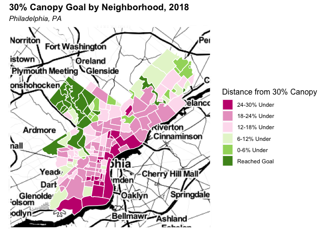<!-- -->
  
Most neighborhoods experienced a net loss in tree canopy. Interestingly, most tree canopy gains were experienced in South Philadelphia and Center City, in neighborhoods that have low existing canopy today.      


```r
netChange <- ggmap(base_map) +
  geom_sf(data = ll(FinalNeighborhood), aes(fill = GainMinusLossCat), inherit.aes = FALSE, color = "white") +
  labs(title = "Tree Canopy Net Change by Neighborhood, 2008-2018",
       subtitle = "Philadelphia, PA") +
  theme(plot.title = element_text(size = 30, face = "bold"), 
        legend.title = element_text(size = 12)) +  mapTheme()+ 
  scale_fill_brewer(palette = "PiYG", name = "Tree Canopy Change", direction = 1, aesthetics = c("colour", "fill"), guide = guide_legend(reverse = TRUE))

netChange
```

<!-- -->


### A closer look: neighborhood-level tree canopy change   
To better understand tree canopy change patterns, we randomly select one neighborhood which has reached the 30% goal (Upper Roxborough) and one which is substantially below it (Richmond) to analyze in greater detail.     

```r
paletteChange <- c("green", "orange", "purple")

base_map2 <- get_stamenmap(c(left = -75.34937, bottom = 39.84524, right = -74.92109, top = 40.17457),
                           maptype = "terrain")

#reference map
refmap <- ggmap(base_map2) +
  geom_sf(data = ll(Neighborhood), fill = "black", colour = "white", inherit.aes = FALSE) +
  geom_sf(data = ll(RMBound), colour = "white", fill = "green", inherit.aes = FALSE) +
    geom_sf(data = ll(URBound), colour = "white", fill = "green", inherit.aes = FALSE) +
  labs(title = "Richmond and Upper Roxborough Neighborhoods",
       subtitle = "Philadelphia, PA") +
  theme(plot.title = element_text(size = 30, face = "bold"), 
        legend.title = element_text(size = 12)) +  mapTheme()
 
RM <- ggmap(RMbase_map) +
   geom_sf(data = ll(RMBound), fill = "black", inherit.aes = FALSE) +
   geom_sf(data = ll(Richmond), aes(fill = CLASS_NAME), colour = "transparent", inherit.aes = FALSE) +
   scale_fill_manual(values = paletteChange, name = "Canopy Change") +
   labs(title = "Richmond", subtitle = "Philadelphia, PA") +
  theme(plot.title = element_text(size = 30, face = "bold"), 
        legend.title = element_text(size = 12)) +  mapTheme()
 
#Upper Roxborough
UR <- ggmap(URbase_map) +
   geom_sf(data = ll(URBound), fill = "black", inherit.aes = FALSE) +
   geom_sf(data = ll(UpperRoxborough), aes(fill = CLASS_NAME), colour = "transparent", inherit.aes = FALSE) +
   scale_fill_manual(values = paletteChange, name = "Canopy Change") +
   labs(title = "Upper Roxborough", subtitle = "Philadelphia, PA") +
  theme(plot.title = element_text(size = 30, face = "bold"), 
        legend.title = element_text(size = 12)) +  mapTheme()

refmap
```

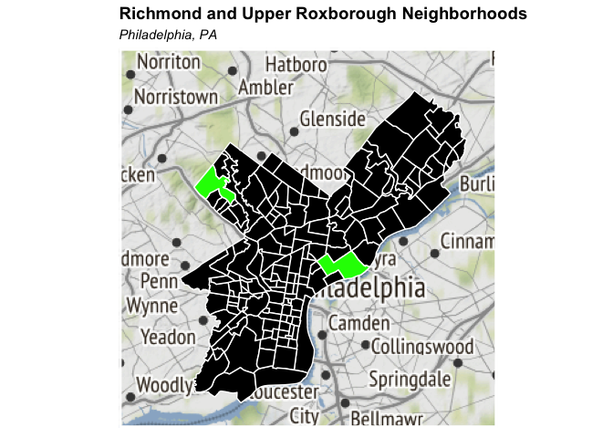<!-- -->

In both neighborhoods, the bulk of the tree canopy did not change between 2008 and 2018. However, when we look closer, we see that tree canopy loss and gain are much more clustered in Upper Roxborough, which meets the goal. Here, it appears that some of the loss is related to tree removal along an entire street or throughout a property, whereas, in Richmond, tree canopy change has been more piecemeal and scattered. This suggests land use and streets as potential risk factor variables related to tree canopy loss.      


```r
grid.arrange(ncol = 2, UR, RM, top = "Neighborhood Level Tree Canopy Change 2008 - 2018")
```

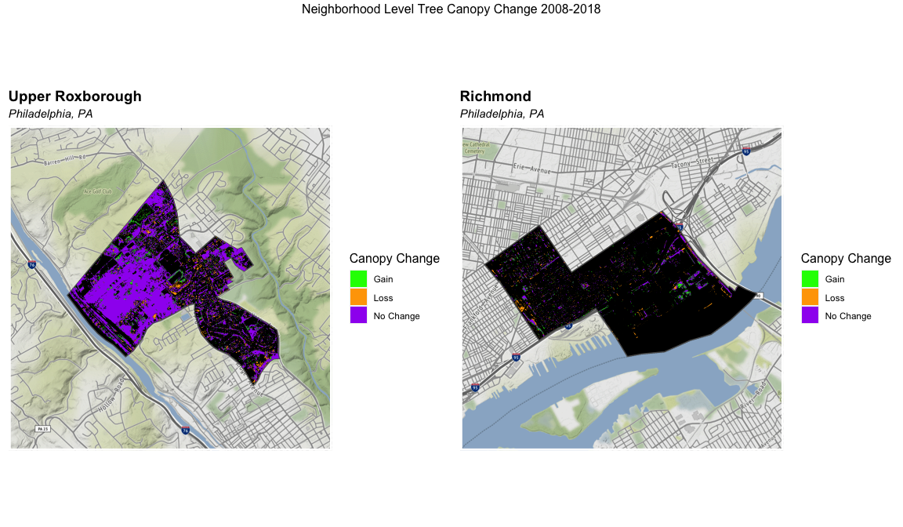<!-- -->

  
## How does tree canopy change vary by demographic context?   
Tree canopy loss, like other urban environmental issues, has deep equity implications. Low-income communities and communities of color are more likely to be in places with [less tree canopy](https://www.nytimes.com/interactive/2020/08/24/climate/racism-redlining-cities-global-warming.html). Therefore, we explore demographic variables' correlation with tree canopy gain, loss, net change, and coverage. We use data from the U.S. Census Bureau's 2018 American Community Survey, which is provided at the census tract level.

```r
ACS_select <- ACS %>%
  dplyr::select(-GEOID, -italian, -year) %>%
  rename(median_income = medHHInc,
         rent = Rent,
         percent_bachelors_degree = pctBach,
         percent_white = pctWhite,
         percent_no_vehicle = pctNoVehicle)

ACS.long <-
   gather(ACS_select, Variable, value, -geometry)

#make list of unique variables
vars <- unique(ACS.long$Variable)
mapList <- list()

#map risk factors
for(i in vars){
  mapList[[i]] <- 
    ggplot() +
      geom_sf(data = filter(ACS.long, Variable == i), aes(fill=value), colour=NA) +
  scale_fill_distiller(palette = "PuRd", name = "Value", direction = 1, aesthetics = c("colour", "fill"), guide = guide_legend(reverse = TRUE)) +
      labs(title=i) +
  theme(plot.title = element_text(size = 30, face = "bold"), 
        legend.title = element_text(size = 12)) +  mapTheme()
  }

do.call(grid.arrange,c(mapList, ncol = 3, top = "2018 Demographic Variables by Census Tract"))
```

<!-- -->

Once we aggregate this data to the fishnet level, we can visualize its correlation with tree canopy change and existing canopy. Surprisingly, demographic variables have little correlation with any tree canopy variables.  

```r
fishnet_centroid <- FinalFishnet%>%
  st_centroid()

tractNames <- ACS %>%
  dplyr::select(GEOID) 

FinalFishnet1 <- fishnet_centroid %>%
  st_join(., tractNames) %>%
  st_drop_geometry() %>%
  left_join(FinalFishnet,.,by="uniqueID") %>%
  dplyr::select(GEOID) %>%
  mutate(uniqueID = as.numeric(rownames(.)))

# Make fishnet with ACS variables
ACS_net <-   
  FinalFishnet1 %>%
  st_drop_geometry() %>%
  group_by(uniqueID, GEOID) %>%
  summarize(count = n()) %>%
    full_join(FinalFishnet1) %>%
    st_sf() %>%
    na.omit() %>%
    ungroup() %>%
  st_centroid() %>% 
  dplyr::select(uniqueID) %>%
  st_join(., ACS) %>%
  st_drop_geometry() %>%
  left_join(.,FinalFishnet1) %>%
  st_as_sf()%>%
  st_drop_geometry()%>%
  mutate(uniqueID = as.character(uniqueID))

FinalFishnet <- 
  FinalFishnet%>%
  left_join(ACS_net)
```


```r
library(grid)

#NET CHANGE
correlation.long <-
  st_drop_geometry(FinalFishnet) %>%
     dplyr::select(population, medHHInc, housing_units, Rent, pctBach, pctWhite, pctNoVehicle, netChange) %>%
    gather(Variable, Value, -netChange)

correlation.cor <-
  correlation.long %>%
    group_by(Variable) %>%
    summarize(correlation = cor(Value, netChange, use = "complete.obs"))

# LOSS
correlation.long1 <-
  st_drop_geometry(FinalFishnet) %>%
     dplyr::select(population, medHHInc, housing_units, Rent, pctBach, pctWhite, pctNoVehicle, pctLoss) %>%
    gather(Variable, Value, -pctLoss)

correlation.cor1 <-
  correlation.long1 %>%
    group_by(Variable) %>%
    summarize(correlation = cor(Value, pctLoss, use = "complete.obs"))

# GAIN
correlation.long2 <-
  st_drop_geometry(FinalFishnet) %>%
     dplyr::select(population, medHHInc, housing_units, Rent, pctBach, pctWhite, pctNoVehicle, pctGain) %>%
    gather(Variable, Value, -pctGain)

correlation.cor2 <-
  correlation.long2 %>%
    group_by(Variable) %>%
    summarize(correlation = cor(Value, pctGain, use = "complete.obs"))

#COVERAGE
correlation.long3 <-
  st_drop_geometry(FinalFishnet) %>%
     dplyr::select(population, medHHInc, housing_units, Rent, pctBach, pctWhite, pctNoVehicle, pctCoverage18) %>%
    gather(Variable, Value, -pctCoverage18)

correlation.cor3 <-
  correlation.long3 %>%
    group_by(Variable) %>%
    summarize(correlation = cor(Value, pctCoverage18, use = "complete.obs"))


#plots
netChange <- ggplot(correlation.long, aes(Value, netChange)) +
    geom_point(colour = "black", alpha = 0.3, size = .5) +
  geom_text(data = correlation.cor, aes(label = paste("r =", round(correlation, 2))),
            x=-Inf, y=Inf, vjust = 1.5, hjust = -.1) +
  geom_smooth(method = "lm", se = FALSE, colour = "purple") +
  facet_wrap(~Variable, ncol = 2, scales = "free") +
  labs(title = "Net Tree Canopy Change") +
  plotTheme()
  
pctLoss <- ggplot(correlation.long1, aes(Value, pctLoss)) +
  geom_point(colour = "black", alpha = 0.3, size = .5) +
  geom_text(data = correlation.cor1, aes(label = paste("r =", round(correlation, 2))),
            x=-Inf, y=Inf, vjust = 1.5, hjust = -.1) +
  geom_smooth(method = "lm", se = FALSE, colour = "magenta") +
  facet_wrap(~Variable, ncol = 2, scales = "free") +
  labs(title = "Tree Canopy Loss") +
  plotTheme()
  
pctGain <- ggplot(correlation.long2, aes(Value, pctGain)) +
#stat_density2d(aes(fill = ..level..), geom = "polygon", bins = 20) +
 # scale_fill_gradient(low="light green", high="magenta", name="Distribution") +
    geom_point(colour = "black", alpha = 0.3, size = .5) +
    geom_text(data = correlation.cor2, aes(label = paste("r =", round(correlation, 2))),
            x=-Inf, y=Inf, vjust = 1.5, hjust = -.1) +
  geom_smooth(method = "lm", se = FALSE, colour = "green") +
  facet_wrap(~Variable, ncol = 2, scales = "free") +
  labs(title = "Tree Canopy Gain") +
   plotTheme()

  current <- ggplot(correlation.long3, aes(Value, pctCoverage18)) +
  geom_point(colour = "black", alpha = 0.3, size = .5) +
  geom_text(data = correlation.cor3, aes(label = paste("r =", round(correlation, 2))),
            x=-Inf, y=Inf, vjust = 1.5, hjust = -.1) +
  geom_smooth(method = "lm", se = FALSE, colour = "forest green") +
  facet_wrap(~Variable, ncol = 2, scales = "free") +
  labs(title = "Current Tree Canopy") +
  plotTheme()


grid.arrange(ncol=2, top=textGrob("Neighborhood Attributes and Tree Canopy 2008-2018"),netChange,pctGain, pctLoss, current) 
```

<!-- -->

## How do current patterns of tree canopy change reflect disinvestment as a result of redlining and older planning practices?  
Next, we examine redlining boundaries from the Homeowner’s Loan Corporation (HOLC). As trees take decades to grow, historical planning decisions can determine the spatial configuration of today's tree canopy.  In 1937, HOLC created “redlining” maps that rated neighborhoods’ desirability in four categories. It rated neighborhoods with residents of color as the least desirable (D) and majority-white neighborhoods as the most desirable (A). As a result, the low-ranked neighborhoods experienced disinvestment.    


The plots below illustrate a correlation between tree canopy loss and HOLC ratings. Fishnet cells in highly-rated areas experienced less percentage loss between 2008 and 2018, and they had more tree canopy to begin with.

```r
# library(grid)
# grid.arrange(holcLoss, holcCanopy, top = "1937 HOLC Rating and Tree Canopy", ncol = 2)
```
  

## What other factors are associated with tree canopy change?   
Based on our analysis of the spatial distribution of tree canopy loss, we consider a few more variables for potential features: land use, hydrology, parcel size, street poles, construction, and health outcomes. 


### Land use  
As previously mentioned, land-use appears to be correlated with tree canopy. A [2018 report](https://treephilly.org/wp-content/uploads/2019/12/Tree-Canopy-Assessment-Report-Philadelphia-2018.pdf) showed that most trees were removed next to streets and on residential property. This proves true in our analysis: the top two land-use types that experienced tree canopy change are residential and transportation.   


Within residential land use parcels, low density residential land experienced the most change.    
  


### Health outcomes
We also check for a correlation between tree canopy loss and negative health outcomes. Contrary to our expectations, tree canopy loss has a weak correlation with asthma, leisure time used for physical activity, obesity, stroke, and self-reported physical and mental health.    
  

```r
 publichealth <- 
   read.socrata("https://chronicdata.cdc.gov/resource/yjkw-uj5s.json") %>%
   filter(countyname == "Philadelphia") 
 
# Joining by GEOID to get geometry
 phillyhealth <- 
   merge(x = publichealth, y = ACS, by.y = "GEOID", by.x = "tractfips", all.x = TRUE)%>%
   st_as_sf()%>%
   mutate(tractarea = st_area(geometry)) %>%
   mutate(tractarea = as.numeric(tractarea))
 
 treecanopy_census <- 
  TreeCanopy%>%
  st_make_valid() %>%
  st_intersection(phillyhealth)
 
treecanopy_census<- 
  treecanopy_census%>%
  mutate(TreeArea = st_area(treecanopy_census))%>%
  mutate(TreeArea = as.numeric(TreeArea))

 # ggplot() +
 #   geom_sf(data = treecanopy_census, aes(fill = casthma_crudeprev))+
 #   plotTheme()
 # 
 
# Tree Canopy Loss

TreeCanopyLoss_census <- 
  treecanopy_census%>%
  filter(CLASS_NAME == "Loss")%>%
  group_by(tractfips,tractarea)%>%
  summarise(AreaLoss = sum(TreeArea))%>%
  mutate(pctLoss = AreaLoss/tractarea) %>%
  st_drop_geometry()

TreeCanopyGain_census <- 
  treecanopy_census%>%
  filter(CLASS_NAME == "Gain")%>%
  group_by(tractfips,tractarea)%>%
  summarise(AreaLoss = sum(TreeArea))%>%
  mutate(pctGain = AreaLoss/tractarea) %>%
  st_drop_geometry()

TreeCanopyNoC_census <- 
  treecanopy_census%>%
  filter(CLASS_NAME == "No Change")%>%
  group_by(tractfips,tractarea)%>%
  summarise(AreaLoss = sum(TreeArea))%>%
  mutate(pctNoC = AreaLoss/tractarea) %>%
  st_drop_geometry()

phillyhealth <-
  merge(x = TreeCanopyLoss_census, y = phillyhealth, by = "tractfips", all = TRUE)

phillyhealth <-
  merge(x = TreeCanopyGain_census, y = phillyhealth, by = "tractfips", all = TRUE)
  
phillyhealth <-
  merge(x = TreeCanopyNoC_census, y = phillyhealth, by = "tractfips", all = TRUE) 
```

```r
phillyhealth <- phillyhealth %>%
  dplyr::select(tractfips,casthma_crudeprev,AreaLoss.x,pctGain,pctLoss,geometry,stroke_crudeprev,phlth_crudeprev, obesity_crudeprev,mhlth_crudeprev,lpa_crudeprev)%>%
  mutate(LogPctLoss = log10(pctLoss),
         LogPctGain = log10(pctGain)) %>%
  rename(Asthma = casthma_crudeprev,
         Leisure_time = lpa_crudeprev,
         Mental_health = mhlth_crudeprev,
         Obesity = obesity_crudeprev,
         Physical_health = phlth_crudeprev,
         Stroke = stroke_crudeprev) 


correlation.long4 <-
  phillyhealth%>%
     dplyr::select(Asthma, Physical_health,Stroke,
                Obesity,Mental_health,Leisure_time, pctLoss) %>%
    gather(Variable, Value, -pctLoss) %>%
  mutate(Value = as.numeric(Value))

correlation.cor4 <-
  correlation.long4 %>%
    group_by(Variable) %>%
    summarize(correlation = cor(Value, pctLoss, use = "complete.obs"))

ggplot(correlation.long4, aes(Value, pctLoss)) +
  # stat_density2d(aes(fill = ..level..), geom = "polygon", bins = 20) +
  # scale_fill_gradient(low="light green", high="magenta", name="Distribution") +
 #   scale_x_log10() + scale_y_log10() +
      geom_point(colour = "black", alpha = 0.3, size = .5) +
  geom_text(data = correlation.cor4, aes(label = paste("r =", round(correlation, 2))),
            x=-Inf, y=Inf, vjust = 1.5, hjust = -.1) +
  geom_smooth(method = "lm", se = FALSE, colour = "magenta") +
  facet_wrap(~Variable, ncol = 2, scales = "free") +
  labs(title = "Tree Canopy Loss and Census Tract Health Outcomes") +
  plotTheme()
```

<!-- -->


```r
function(measureFrom,measureTo,k) {
  measureFrom_Matrix <-
    as.matrix(measureFrom)
  measureTo_Matrix <-
    as.matrix(measureTo)
  nn <-   
    get.knnx(measureTo, measureFrom, k)$nn.dist
  output <-
    as.data.frame(nn) %>%
    rownames_to_column(var = "thisPoint") %>%
    gather(points, point_distance, V1:ncol(.)) %>%
    arrange(as.numeric(thisPoint)) %>%
    group_by(thisPoint) %>%
    summarize(pointDistance = mean(point_distance)) %>%
    arrange(as.numeric(thisPoint)) %>% 
    dplyr::select(-thisPoint) %>%
    pull()
  
  return(output)  
}

st_c <- st_coordinates

# Construction nearest neighbor
constfilter <- 
  const%>% filter(permitdescription == "NEW CONSTRUCTION PERMIT")
  

TreeCanopyCentroids <- 
  TreeCanopy%>% 
  mutate(Construction_nn1 = nn_function(st_c(st_centroid(.)), st_c(const), 1)) %>%
  dplyr::select(Construction_nn1, geometry, CLASS_NAME)


TreeCanopyCentroids1<- 
  TreeCanopyCentroids%>%
  st_drop_geometry()%>%
  group_by(CLASS_NAME)%>%
  summarise(avg_nnConst = mean(Construction_nn1))

# ggplot(TreeCanopyCentroids1, aes(y=avg_nnConst, x=CLASS_NAME))+
#   geom_bar(stat='identity', fill="forest green", width = 0.4)+
#   labs(title = "Construction Nearest Neighbor and Canopy Change")+
#   ylab("Distance to nearest construction (ft)")+
#   xlab("Tree Canopy Change")+
#   theme(axis.text.x = element_text(angle = 90, vjust = 0.5, hjust=1))

FinalFishnet <- 
  FinalFishnet%>% 
  st_transform('ESRI:102728')
  

FinalFishnet2 <- 
  st_join(FinalFishnet, TreeCanopyCentroids)%>%
  st_drop_geometry()%>%
  group_by(uniqueID)%>%
  summarise(avg_nnConst = mean(Construction_nn1))

FinalFishnet2 <- FinalFishnet2%>% 
  left_join(FinalFishnet, .)

FinalFishnet <- FinalFishnet2
#

# ggplot(FinalFishnet, aes(y = LogPctLoss , x = avg_nnConst))+
#   geom_point()+ 
#   labs(title = "Canopy Loss and Construction", 
#        subtilte = "Aggregated by Fishnet") + 
#   xlab("Construction distance") + 
#   ylab("Log Canopy Loss") + 
#   theme(plot.title = element_text(hjust = 0.5, size = 15, face = "bold"), plot.subtitle = element_text(hjust = 0.5, size = 8)) +
#   plotTheme()
```

```r
poles <- st_read('http://data.phl.opendata.arcgis.com/datasets/9059a7546b6a4d658bef9ce9c84e4b03_0.geojson') %>% 
st_transform('ESRI:102728')%>% 
st_centroid()

poles_nn1 <- 
  TreeCanopy%>% 
  mutate(Poles_nn1 = nn_function(st_c(st_centroid(.)), st_c(poles), 10))
  
TreeCanopyCentroids <- st_join(FinalFishnet, poles_nn1)

TreeCanopyCentroids1<- 
  TreeCanopyCentroids%>% 
  st_drop_geometry()%>%
  group_by(uniqueID)%>%
  summarise(avg_nnPole = mean(Poles_nn1))

FinalFishnet<-
  TreeCanopyCentroids1%>% 
  left_join(FinalFishnet, .)%>% 
  mutate(LogPole = log10(avg_nnPole), 
  LogPctGain = log10(pctGain))
```

Finally, we visualize the spatial density of additional selected risk factors below.  

  
  
# Random Forest Modeling
### Pairwise correlations  
To select variables for our predictive model, we visualize correlations between our numeric risk factors. This helps us ensure that our variables are not correlated with one another.   
  

```r
corrplotvars <- FinalFishnet %>%
   dplyr::select(ConservationPct, pctLoss, pctGain, pctCoverage08, LogPctLoss, LogPctGain, population, medHHInc, housing_units, Rent, pctBach, pctWhite, pctNoVehicle, HydrologyArea, LogAvgParcelSize, e311Count, countConst, pctRes, pctTrans) %>%
  rename(transportation_landuse = pctTrans,
         residential_landuse = pctRes,
         construction_permits = countConst,
         service_requests311 = e311Count,
         parcel_size = LogAvgParcelSize,
         hydrology = HydrologyArea,
         no_vehicle_household = pctNoVehicle,
         white_residents = pctWhite,
         bachelors_degrees = pctBach,
         rent = Rent,
         median_income = medHHInc,
         canopy_gain = LogPctGain,
         canopy_loss = LogPctLoss,
         tree_canopy = pctCoverage08,
         percent_gain = pctGain,
         percent_loss = pctLoss)

numericVars <-
  select_if(st_drop_geometry(corrplotvars), is.numeric) %>% na.omit()

ggcorrplot(
  round(cor(numericVars), 1),
  p.mat = cor_pmat(numericVars),
  colors = c("pink", "purple","blue"),
  type="upper",
  insig = "blank", 
  outline.color = "white") +  
    labs(title = "Numeric Variables Correlation Plot") +
    theme(plot.title = element_text(size = 30, face = "bold"), 
        legend.title = element_text(size = 12)) +
  plotTheme()
```

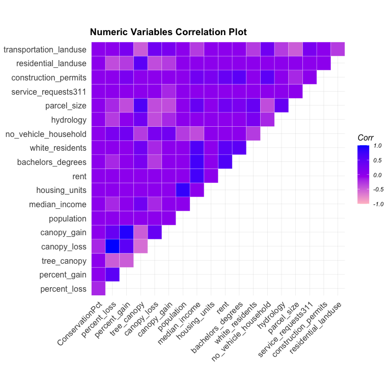<!-- -->

**Based on this plot, we select the following variables to use in our model:**       
  
<style>
div.blue { background-color:#e6f0ff; border-radius: 5px; padding: 20px;}
</style>
<div class = "blue">
* Percent tree canopy coverage 2018    
* Parcel size (Log average)    
* Construction distance (Average nearest neighbor)  
* Poles (Log)   
* Neighborhood name
* Construction permits (Count)  
* 311 Requests (Log)  
* Percent residential land use (Log)  
* Percent transportation land use (Log)  
* HOLC redlining grade    
* Hydrology (%)  
</div>  
  
    
The random forest predicts the probability of tree canopy loss occurring in a given grid cell from 0 to 1. To run our model, we randomly split the data into a test set and a training set. Our training set is the data we "train" our model on. Based on the training set, our model predicts if substantial tree canopy loss occurred in each grid within the test set. There are four potential outcomes to the model: 

```r
neigh_net <- st_intersection(fishnet_centroid, Neighborhood) %>%
   dplyr::select(uniqueID, NAME)
   

FinalFishnet <-
   neigh_net %>%
   st_drop_geometry() %>%
   left_join(FinalFishnet, .)%>%
   mutate(NAME = replace_na(NAME, "unclassified"))

FinalFishnet5 <-
  FinalFishnet %>%
  mutate(LogPctLoss = log(pctLoss),
         LogPctGain = log(pctGain),
         LogPctChange = log(pctChange),
         LogPctTrans = log(pctTrans))

# test <- FinalFishnet %>%
#   select(holc_grade)

FinalFishnet5$avg_nnConst <- ifelse(is.na(FinalFishnet5$avg_nnConst),0, FinalFishnet5$avg_nnConst)
FinalFishnet5$avg_nnPole <- ifelse(is.na(FinalFishnet5$avg_nnPole),0, FinalFishnet5$avg_nnPole)
FinalFishnet5$pctWhite <- ifelse(is.na(FinalFishnet5$pctWhite),0, FinalFishnet5$pctWhite)
FinalFishnet5$pctBach <- ifelse(is.na(FinalFishnet5$pctBach),0, FinalFishnet5$pctBach)
FinalFishnet5$population <- ifelse(is.na(FinalFishnet5$population),0, FinalFishnet5$population)
FinalFishnet5$italian <- ifelse(is.na(FinalFishnet5$italian),0, FinalFishnet5$italian)
FinalFishnet5$medHHInc <- ifelse(is.na(FinalFishnet5$medHHInc),0, FinalFishnet5$medHHInc)
FinalFishnet5$e311Count <- ifelse(is.na(FinalFishnet5$e311Count),0, FinalFishnet5$e311Count)
FinalFishnet5$pctTransRes <- ifelse(is.na(FinalFishnet5$pctTransRes),0, FinalFishnet5$pctTransRes)
FinalFishnet5$pctRes <- ifelse(is.na(FinalFishnet5$pctRes),0, FinalFishnet5$pctRes)
FinalFishnet5$pctTrans <- ifelse(is.na(FinalFishnet5$pctTrans),0, FinalFishnet5$pctTrans)
FinalFishnet5$LogAvgParcelSize <- ifelse(is.na(FinalFishnet5$LogAvgParcelSize),0, FinalFishnet5$LogAvgParcelSize)
FinalFishnet5$LogPctChange <- ifelse(is.na(FinalFishnet5$LogPctChange),0, FinalFishnet5$LogPctChange)
FinalFishnet5$Loge311Count <- ifelse(is.na(FinalFishnet5$Loge311Count),0, FinalFishnet5$Loge311Count)
FinalFishnet5$LogPctRes <- ifelse(is.na(FinalFishnet5$LogPctRes),0, FinalFishnet5$LogPctRes)
FinalFishnet5$LogPctRes <- ifelse(is.infinite(FinalFishnet5$LogPctRes),0, FinalFishnet5$LogPctRes)
FinalFishnet5$LogPctTrans <- ifelse(is.na(FinalFishnet5$LogPctTrans),0, FinalFishnet5$LogPctTrans)
FinalFishnet5$LogPctTrans <- ifelse(is.infinite(FinalFishnet5$LogPctTrans),0, FinalFishnet5$LogPctTrans)
FinalFishnet5$LogPctResTrans <- ifelse(is.infinite(FinalFishnet5$LogPctResTrans),0, FinalFishnet5$LogPctResTrans)
FinalFishnet5$LogPctResTrans <- ifelse(is.na(FinalFishnet5$LogPctResTrans),0, FinalFishnet5$LogPctResTrans)
FinalFishnet5$LogPctLoss <- ifelse(is.infinite(FinalFishnet5$LogPctLoss),0, FinalFishnet5$LogPctLoss)
FinalFishnet5$LogPctGain <- ifelse(is.infinite(FinalFishnet5$LogPctGain),0, FinalFishnet5$LogPctGain)
FinalFishnet5$LogPctChange <- ifelse(is.infinite(FinalFishnet5$LogPctChange),0, FinalFishnet5$LogPctChange)
FinalFishnet5$countConst <- ifelse(is.na(FinalFishnet5$countConst),0, FinalFishnet5$countConst)
FinalFishnet5$Variable <- ifelse((FinalFishnet5$netChange > 0), 1, 0)
FinalFishnet5$HydrologyPct <- ifelse(is.na(FinalFishnet5$HydrologyPct),0, FinalFishnet5$HydrologyPct)
FinalFishnet5$pctLoss <- ifelse(is.na(FinalFishnet5$pctLoss),0, FinalFishnet5$pctLoss)
FinalFishnet5$LogPole <- ifelse(is.na(FinalFishnet5$LogPole),0, FinalFishnet5$LogPole)
FinalFishnet5$LogPole <- ifelse(is.infinite(FinalFishnet5$LogPole),0, FinalFishnet5$LogPole)
  
FinalFishnet5 <-
  FinalFishnet5 %>%
  dplyr::select(uniqueID, pctCoverage18, LogAvgParcelSize,Loge311Count, LogPctRes, avg_nnConst,avg_nnPole, pctLoss, holc_grade, NAME,
                                    countConst, pctWhite, pctBach, e311Count, Loge311Count, pctTransRes, pctRes, HydrologyPct,
                                    pctTrans, LogPctResTrans, population, italian, medHHInc, Variable, pctCoverage08Cat, LogPctTrans, LogPole)

# hist(FinalFishnet5$pctLoss,xlab="Percent Loss",
#      breaks=50, col="purple", main = "Histogram of Percent Loss ")

FinalFishnet5$Variable <- ifelse(FinalFishnet5$pctLoss > 25,1, 0)


# RANDOM FOREST MODEL
set.seed(1214)
trainIndex <- createDataPartition(
                                  y = FinalFishnet5$holc_grade,
                                  p = 0.60, 
                                  list = FALSE)

finalTrain <- FinalFishnet5[ trainIndex,] %>% st_drop_geometry()
finalTest  <- FinalFishnet5[-trainIndex,] %>% st_drop_geometry()
finalTest2  <- FinalFishnet5[-trainIndex,] 


rf <- randomForest(
  finalTrain$Variable ~ .,
  data=finalTrain %>% 
                     dplyr::select(pctCoverage18, LogAvgParcelSize, avg_nnConst,LogPctTrans, LogPole, NAME,
                                    countConst, Loge311Count,pctTrans, LogPctRes, holc_grade, HydrologyPct)
)

#pred2 = data.frame(predict(rf, newdata=finalTest))

#cm = table(finalTest$Variable, pred2)

## Prediction
testProbs2 <- data.frame(Outcome = as.factor(finalTest$Variable),
                        Probs = predict(rf, finalTest, type= "response"))
```
<style>
div.blue { background-color:#e6f0ff; border-radius: 5px; padding: 10px;}
</style>
<div class = "blue">
1. **True Positive** - Substantial tree canopy loss was predicted and observed in grid cell

2. **True negative** - Substantial tree canopy loss was not predicted and not observed in grid cell

3. **False Positive** - Substantial tree canopy loss was predicted but not observed in grid cell

4. **False Negative** - Substantial tree canopy loss was not predicted but was observed in grid cell 
</div>   
  
To validate our model, we choose a probability threshold above which the model predicts future substantial tree canopy loss in a cell. Next, we plotted confusion metric rates at different thresholds to find an optimal threshold. For our use case, we want to maximize true positives and minimize false negatives in order to best allocate tree planting resources. Using the plot below which shows confusion metrics for thresholds from 0 to 1, we select 25% probability as our threshold. At this threshold, the true positive rate is high and the false negative rate is relatively low. A lower threshold would increase the true positive rate and decrease the false negatives, but this would be at the cost of increasing false positives. In our use case, this would mean that tree planting resources are wrongly allocated to areas that don't need them as much.  

```r
# ROC Curve
## This us a goodness of fit measure, 1 would be a perfect fit, .5 is a coin toss
auc(testProbs2$Outcome, testProbs2$Probs)

## optimizing threshold
iterateThresholds <- function(data, observedClass, predictedProbs, group) {
  observedClass <- enquo(observedClass)
  predictedProbs <- enquo(predictedProbs)
  group <- enquo(group)
  x = .01
  all_prediction <- data.frame()
  
  if (missing(group)) {
  
    while (x <= 1) {
    this_prediction <- data.frame()
    
    this_prediction <-
      data %>%
      mutate(predclass = ifelse(!!predictedProbs > x, 1,0)) %>%
      count(predclass, !!observedClass) %>%
      summarize(Count_TN = sum(n[predclass==0 & !!observedClass==0]),
                Count_TP = sum(n[predclass==1 & !!observedClass==1]),
                Count_FN = sum(n[predclass==0 & !!observedClass==1]),
                Count_FP = sum(n[predclass==1 & !!observedClass==0]),
                Rate_TP = Count_TP / (Count_TP + Count_FN),
                Rate_FP = Count_FP / (Count_FP + Count_TN),
                Rate_FN = Count_FN / (Count_FN + Count_TP),
                Rate_TN = Count_TN / (Count_TN + Count_FP),
                Accuracy = (Count_TP + Count_TN) / 
                           (Count_TP + Count_TN + Count_FN + Count_FP)) %>%
      mutate(Threshold = round(x,2))
    
    all_prediction <- rbind(all_prediction,this_prediction)
    x <- x + .01
  }
  return(all_prediction)
  }
  else if (!missing(group)) { 
   while (x <= 1) {
    this_prediction <- data.frame()
    
    this_prediction <-
      data %>%
      mutate(predclass = ifelse(!!predictedProbs > x, 1,0)) %>%
      group_by(!!group) %>%
      count(predclass, !!observedClass) %>%
      summarize(Count_TN = sum(n[predclass==0 & !!observedClass==0]),
                Count_TP = sum(n[predclass==1 & !!observedClass==1]),
                Count_FN = sum(n[predclass==0 & !!observedClass==1]),
                Count_FP = sum(n[predclass==1 & !!observedClass==0]),
                Rate_TP = Count_TP / (Count_TP + Count_FN),
                Rate_FP = Count_FP / (Count_FP + Count_TN),
                Rate_FN = Count_FN / (Count_FN + Count_TP),
                Rate_TN = Count_TN / (Count_TN + Count_FP),
                Accuracy = (Count_TP + Count_TN) / 
                           (Count_TP + Count_TN + Count_FN + Count_FP)) %>%
      mutate(Threshold = round(x,2))
    
    all_prediction <- rbind(all_prediction,this_prediction)
    x <- x + .01
  }
  return(all_prediction)
  }
}

whichThreshold <- 
  iterateThresholds(
     data=testProbs2, observedClass = Outcome, predictedProbs = Probs)

whichThreshold <- 
  whichThreshold %>%
    dplyr::select(starts_with("Rate"), Threshold) %>%
    gather(Variable, Rate, Rate_TN,Rate_TP,Rate_FN,Rate_FP) 

# curvePlot <- whichThreshold %>%
#   ggplot(.,aes(Threshold,Rate,colour = Variable)) +
#   geom_point() +
#   scale_colour_manual(values = c("magenta", "lavender", "turquoise", "light green")) +    
#   labs(title = "Confusion Metric Rates at Different Thresholds",
#        y = "Count") +
#   theme(plot.title = element_text(size = 30, face = "bold"), 
#         legend.title = element_text(size = 12)) +
#   plotTheme() +
#   guides(colour=guide_legend(title = "Confusion Metric")) 
# 
# curvePlot
```
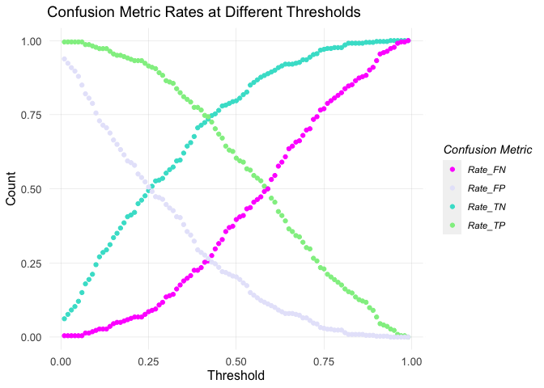  

The receiver operating characteristic (ROC) curve visualizes trade-offs for different thresholds. As true positives in the model increase, the number of false positives also increases. For our goal of allocating tree planting resources, we are more interested in correctly allocating resources (true positive) than decreasing cases where we wrongly allocate resources (false positive). We also want to reduce false negatives, as we want the limited resources to be distributed to neighborhoods at the highest risk of tree canopy loss.  

In the ROC curve below, the an area under the curve (AUC) ranges from 0 to 1. An AUC of 0.5 is called a "coin toss," meaning that the true positive and false positive rates are equal. An AUC of 1 means that the model is over-fitted, with all true negatives and no false positives. We have an AUC of about 0.82, indicating high model usefulness for resource allocation. 

```r
ggplot(testProbs2, aes(d = as.numeric(testProbs2$Outcome), m = Probs)) +
  geom_roc(n.cuts = 50, labels = FALSE, colour = "magenta") +
  style_roc(theme = theme_grey) +
  geom_abline(slope = 1, intercept = 0, size = 1.5, color = 'black') +
  labs(title = "ROC Curve") +
      theme(plot.title = element_text(size = 30, face = "bold"), 
        legend.title = element_text(size = 12)) +
  plotTheme()
```

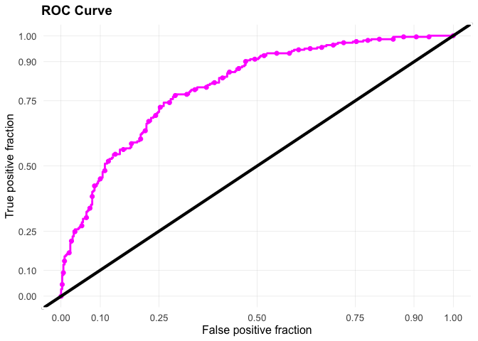<!-- -->


# Results and Construction Scenarios

```r
FinalFishnet5$countConst1 <- FinalFishnet5$countConst * 0.50      #75 less
FinalFishnet5$countConst2 <- FinalFishnet5$countConst * 0.75       #50 less
FinalFishnet5$countConst3 <- FinalFishnet5$countConst * 1.25      #50 more
FinalFishnet5$countConst4 <- FinalFishnet5$countConst * 1.5       #100 more


FinalFishnet5$avg_nnConst1 <- FinalFishnet5$avg_nnConst * 1.5 

FinalFishnet5$avg_nnConst2 <- FinalFishnet5$avg_nnConst * 1.25

FinalFishnet5$avg_nnConst3 <- FinalFishnet5$avg_nnConst * .75

FinalFishnet5$avg_nnConst4 <- FinalFishnet5$avg_nnConst * .5


set.seed(77) 

##SCENARIO 1: 50 less
rf1 <- randomForest(
  FinalFishnet5$Variable ~ .,
  data=st_drop_geometry(FinalFishnet5) %>% 
                     dplyr::select(pctCoverage18, LogAvgParcelSize, avg_nnConst1,LogPctTrans, LogPole, NAME,
                                    countConst1, Loge311Count,pctTrans, LogPctRes, holc_grade, HydrologyPct))
testProbs_const1 <- data.frame(Outcome = as.factor(FinalFishnet5$Variable),       ## Prediction
                        Probs = predict(rf1, FinalFishnet5, type= "response"))
testProbs_const1 <- testProbs_const1 %>% mutate(Risk_Cat=
                                            case_when(Probs <=.2 ~ "Very Low",
                                                   Probs > 0.2 & Probs < .4 ~ "Low",    
                                                   Probs >= 0.4 & Probs < .6 ~ "Moderate",
                                                   Probs >=.6 & Probs < .80 ~ "High",
                                                   Probs >=.80 ~ "Severe"))
testProbs_const1$Risk_Cat <- factor(testProbs_const1$Risk_Cat, levels = c("Very Low", "Low", "Moderate", "High", "Severe"))
FinalFishnet2$uniqueID <- seq.int(nrow(FinalFishnet5))
testProbs_const1$uniqueID <- seq.int(nrow(FinalFishnet5))
construction1 <- left_join(FinalFishnet2, testProbs_const1)
construction1 <- construction1 %>%
  mutate(Scenario = "const_50less") %>%
  dplyr::select (Outcome,Probs,Risk_Cat,geometry,Scenario)


##SCENARIO 2: 50 less
rf2 <- randomForest(
  FinalFishnet5$Variable ~ .,
  data=st_drop_geometry(FinalFishnet5) %>% 
                     dplyr::select(pctCoverage18, LogAvgParcelSize, avg_nnConst2,LogPctTrans, LogPole, NAME,
                                    countConst2, Loge311Count,pctTrans, LogPctRes, holc_grade, HydrologyPct))
testProbs_const2 <- data.frame(Outcome = as.factor(FinalFishnet5$Variable),             #prediction   
                        Probs = predict(rf2, FinalFishnet5, type= "response"))
testProbs_const2 <- testProbs_const2 %>% mutate(Risk_Cat=
                                            case_when(Probs <=.2 ~ "Very Low",
                                                   Probs > 0.2 & Probs < .4 ~ "Low",    
                                                   Probs >= 0.4 & Probs < .6 ~ "Moderate",
                                                   Probs >=.6 & Probs < .80 ~ "High",
                                                   Probs >=.8 ~ "Severe"))
testProbs_const2$Risk_Cat <- factor(testProbs_const2$Risk_Cat, levels = c("Very Low", "Low", "Moderate", "High", "Severe"))
FinalFishnet2$uniqueID <- seq.int(nrow(FinalFishnet5))
testProbs_const2$uniqueID <- seq.int(nrow(FinalFishnet5))
construction2 <- left_join(FinalFishnet2, testProbs_const2)
construction2 <- construction2 %>%
  mutate(Scenario = "const_25less") %>%
  dplyr::select (Outcome,Probs,Risk_Cat,geometry,Scenario)


##SCENARIO 3: 50 more
rf3 <- randomForest(
  FinalFishnet5$Variable ~ .,
  data=st_drop_geometry(FinalFishnet5) %>% 
                     dplyr::select(pctCoverage18, LogAvgParcelSize, avg_nnConst3,LogPctTrans, LogPole, NAME,
                                    countConst3, Loge311Count,pctTrans, LogPctRes, holc_grade, HydrologyPct))
testProbs_const3 <- data.frame(Outcome = as.factor(FinalFishnet5$Variable),      # Prediction
                        Probs = predict(rf3, FinalFishnet5, type= "response"))
testProbs_const3 <- testProbs_const3 %>% mutate(Risk_Cat=
                                            case_when(Probs <=.2 ~ "Very Low",
                                                   Probs > 0.2 & Probs < .4 ~ "Low",    
                                                   Probs >= 0.4 & Probs < .6 ~ "Moderate",
                                                   Probs >=.6 & Probs < .80 ~ "High",
                                                   Probs >=.8 ~ "Severe"))
testProbs_const3$Risk_Cat <- factor(testProbs_const3$Risk_Cat, levels = c("Very Low", "Low", "Moderate", "High", "Severe"))
FinalFishnet2$uniqueID <- seq.int(nrow(FinalFishnet5))
testProbs_const3$uniqueID <- seq.int(nrow(FinalFishnet5))
construction3 <- left_join(FinalFishnet2, testProbs_const3)
construction3 <- construction3 %>%
  mutate(Scenario = "const_25more") %>%
  dplyr::select (Outcome,Probs,Risk_Cat,geometry,Scenario)


##SCENARIO 4: 100 more
rf4 <- randomForest(
  FinalFishnet5$Variable ~ .,
  data=st_drop_geometry(FinalFishnet5) %>% 
                     dplyr::select(pctCoverage18, LogAvgParcelSize, avg_nnConst4,LogPctTrans, LogPole, NAME,
                                    countConst4, Loge311Count,pctTrans, LogPctRes, holc_grade, HydrologyPct))
testProbs_const4 <- data.frame(Outcome = as.factor(FinalFishnet5$Variable),     #Prediction
                        Probs = predict(rf4, FinalFishnet5, type= "response"))
testProbs_const4 <- testProbs_const4 %>% mutate(Risk_Cat=
                                            case_when(Probs <=.2 ~ "Very Low",
                                                   Probs > 0.2 & Probs < .4 ~ "Low",    
                                                   Probs >= 0.4 & Probs < .6 ~ "Moderate",
                                                   Probs >=.6 & Probs < .80 ~ "High",
                                                   Probs >=.8 ~ "Severe"))
testProbs_const4$Risk_Cat <- factor(testProbs_const4$Risk_Cat, levels = c("Very Low", "Low", "Moderate", "High", "Severe"))
FinalFishnet2$uniqueID <- seq.int(nrow(FinalFishnet5))
testProbs_const4$uniqueID <- seq.int(nrow(FinalFishnet5))
construction4 <- left_join(FinalFishnet2, testProbs_const4)
construction4 <- construction4 %>%
  mutate(Scenario = "const_50more") %>%
  dplyr::select (Outcome,Probs,Risk_Cat,geometry,Scenario)


##SCENARIO 5: original (current construction levels)
rf5 <- randomForest(
  FinalFishnet5$Variable ~ .,
  data=st_drop_geometry(FinalFishnet5) %>% 
                     dplyr::select(pctCoverage18, LogAvgParcelSize, avg_nnConst,LogPctTrans, LogPole, NAME,
                                    countConst, Loge311Count,pctTrans, LogPctRes, holc_grade, HydrologyPct))  
testProbs_const5 <- data.frame(Outcome = as.factor(FinalFishnet5$Variable),        #Prediction
                        Probs = predict(rf5, FinalFishnet5, type= "response"))
testProbs_const5 <- testProbs_const5 %>% mutate(Risk_Cat=
                                            case_when(Probs <=.2 ~ "Very Low",
                                                   Probs > 0.2 & Probs < .4 ~ "Low",    
                                                   Probs >= 0.4 & Probs < .6 ~ "Moderate",
                                                   Probs >=.6 & Probs < .80 ~ "High",
                                                   Probs >=.8 ~ "Severe"))
testProbs_const5$Risk_Cat <- factor(testProbs_const5$Risk_Cat, levels = c("Very Low", "Low", "Moderate", "High", "Severe"))
FinalFishnet2$uniqueID <- seq.int(nrow(FinalFishnet5))
testProbs_const5$uniqueID <- seq.int(nrow(FinalFishnet5))
construction5 <- left_join(FinalFishnet2, testProbs_const5)
construction5 <- construction5 %>%
  mutate(Scenario = "const_original") %>%
  dplyr::select (Outcome,Probs,Risk_Cat,geometry,Scenario)


const_scenarios <- rbind(construction1, construction2, construction3, construction4, construction5)


#SCENARIO 1
less25 <- ggmap(base_map) +
  geom_sf(data = ll(fishnet), fill = "white", inherit.aes = FALSE)+
  geom_sf(data=ll(construction1), aes(fill=Risk_Cat), color="transparent", inherit.aes = FALSE)+
  labs(title="50% Lower")+
  theme(plot.title = element_text(size = 30, face = "bold"), 
        legend.title = element_text(size = 12)) +  mapTheme() +
  # scale_fill_brewer(palette = "PiYG", name = "Risk Score", direction = -1, aesthetics = c("colour", "fill"))
  scale_fill_brewer(palette = "PuRd", name = "Value", direction = 1, aesthetics = c("colour", "fill"), guide = guide_legend(reverse = TRUE))


less50 <- ggmap(base_map) +
  geom_sf(data = ll(fishnet), fill = "white", inherit.aes = FALSE)+
  geom_sf(data=ll(construction2), aes(fill=Risk_Cat), color="transparent", inherit.aes = FALSE)+
  labs(title="25% Lower")+
  theme(plot.title = element_text(size = 30, face = "bold"), 
        legend.title = element_text(size = 12)) +  mapTheme() +
 # scale_fill_brewer(palette = "PiYG", name = "Risk Score", direction = -1, aesthetics = c("colour", "fill"))
  scale_fill_brewer(palette = "PuRd", name = "Value", direction = 1, aesthetics = c("colour", "fill"), guide = guide_legend(reverse = TRUE))

more25 <- ggmap(base_map) +
  geom_sf(data = ll(fishnet), fill = "white", inherit.aes = FALSE)+
  geom_sf(data= ll(construction3), aes(fill=Risk_Cat), color="transparent", inherit.aes = FALSE)+
  labs(title="25% Higher")+
  theme(plot.title = element_text(size = 30, face = "bold"), 
        legend.title = element_text(size = 12)) +  mapTheme() +
  #scale_fill_brewer(palette = "PiYG", name = "Risk Score", direction = -1, aesthetics = c("colour", "fill"))
  scale_fill_brewer(palette = "PuRd", name = "Value", direction = 1, aesthetics = c("colour", "fill"), guide = guide_legend(reverse = TRUE))

more50 <- ggmap(base_map) +
  geom_sf(data = ll(fishnet), fill = "white", inherit.aes = FALSE)+
  geom_sf(data= ll(construction4), aes(fill=Risk_Cat), color="transparent", inherit.aes = FALSE)+
  labs(title="50% Higher")+
  theme(plot.title = element_text(size = 30, face = "bold"), 
        legend.title = element_text(size = 12)) +  mapTheme() +
  #scale_fill_brewer(palette = "PiYG", name = "Risk Score", direction = -1, aesthetics = c("colour", "fill"))
  scale_fill_brewer(palette = "PuRd", name = "Value", direction = 1, aesthetics = c("colour", "fill"), guide = guide_legend(reverse = TRUE))


original <- ggmap(base_map) +
  geom_sf(data = ll(fishnet), fill = "white", colour = "transparent", inherit.aes = FALSE)+
  geom_sf(data= ll(construction5), aes(fill=Risk_Cat), color="transparent", inherit.aes = FALSE)+
  labs(title="Original")+
  theme(plot.title = element_text(size = 30, face = "bold"), 
        legend.title = element_text(size = 12)) +  mapTheme() +
 # scale_fill_brewer(palette = "PiYG", name = "Risk Score", direction = -1, aesthetics = c("colour", "fill"))
  scale_fill_brewer(palette = "PuRd", name = "Predicted Risk", direction = 1, aesthetics = c("colour", "fill"), guide = guide_legend(reverse = TRUE))

predictionPlot <- ggmap(base_map) +
  geom_sf(data = ll(fishnet), fill = "white", colour = "transparent", inherit.aes = FALSE)+
  geom_sf(data= ll(construction5), aes(fill=Risk_Cat), color="transparent", inherit.aes = FALSE)+
  labs(title="Predicted Risk of Substantial Canopy Loss")+
  theme(plot.title = element_text(size = 30, face = "bold"), 
        legend.title = element_text(size = 12)) +  mapTheme() +
 # scale_fill_brewer(palette = "PiYG", name = "Risk Score", direction = -1, aesthetics = c("colour", "fill"))
  scale_fill_brewer(palette = "PuRd", name = "Random Forest Predicted Risk", direction = 1, aesthetics = c("colour", "fill"), guide = guide_legend(reverse = TRUE))

mylegend<-g_legend(original)
```

Below, we visualize the results of our model. The model predicts the highest risk of loss in South, North, and Northeast Philadelphia. Specifically, the areas at highest risk of loss are around the Point Breeze neighborhood in South Philadelphia, Kensington in the Northeast, and Rhawnhurst in the Northwest.  

```r
predictionPlot
```

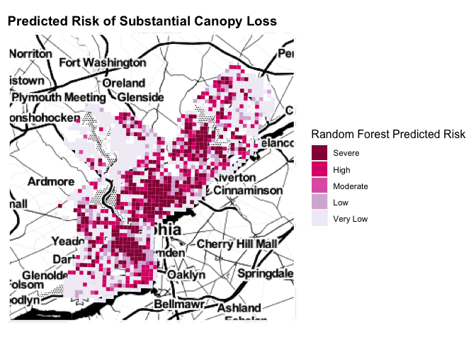<!-- -->

Next, we visualize alternative scenarios for Philadelphia's risk of substantial tree canopy loss. Because construction is a major risk factor for tree canopy loss, we create 4 possible scenarios for future tree canopy loss:  
<style>
div.blue { background-color:#e6f0ff; border-radius: 5px; padding: 10px;}
</style>
<div class = "blue">
* 25% decrease in completed construction permits    
* 50% decrease in completed construction permits       
* 25% increase in completed construction permits       
* 50% increase in completed construction permits      
</div>    


```r
grid.arrange(arrangeGrob(less50 + theme(legend.position="none"), less25 + theme(legend.position="none"), original + theme(legend.position="none"), more25 + theme(legend.position="none"), more50 + theme(legend.position="none"), ncol = 2, top = "Canopy Change Under 4 Construction Scenarios", mylegend))
```

<!-- -->

Although the difference between scenario outcomes is slight, generally, as construction rates increase, the risk for substantial tree canopy loss also increases. Likewise, as construction rates decrease, risk for tree canopy loss generally decreases. Below, we visualize these four scenarios along with the prediction based on our current construction levels. For more detailed and high resolution data about citywide tree canopy loss under each scenario, please refer to our web application in Section 8.    


# Validation 
## How accurate is our model? 

The plots below show the distribution of tree canopy loss predictions. We would prefer to over-predict tree canopy loss than to under-predict. In other words, we would prefer to serve a region where tree planting initiatives are not needed rather than disregard a region in dire need of tree planting initiatives. Below, we visualize this concept. In the figure, the two blue boxes represent correct predictions, whereas the two orange boxes represent incorrect predictions. In the top right box, for example, our model predicts substantial loss, but we observe low loss (false positive). In the bottom right box, our model predicts substantial loss and we observe substantial loss (true positive). We can see that our model is relatively accurate. For a total of 562 grid cells, it correctly predicts risk of substantial canopy loss in 391, giving us an accuracy of 0.7 out of 1.

Sensitivity is the model's true positive rate, or the rate at which it correctly predicts substantial tree canopy loss. Specificity is the model's true negative rate, or the rate at which it correctly predicts low tree canopy loss. Both metrics have a maximum value of 1, and our model performs well, with a sensitivity of 0.81 (81%) and a specificity of 0.62 (62%). 


```r
testProbs2$predClass  = ifelse(testProbs2$Probs > 0.35 , 1,0)

confusion <- caret::confusionMatrix(reference = as.factor(testProbs2$Outcome),
                        data = as.factor(testProbs2$predClass),
                        positive = "1")


 draw_confusion_matrix <- function(cm) {

   layout(matrix(c(1,1,2)))
   par(mar=c(2,2,2,2))
   plot(c(100, 345), c(300, 450), type = "n", xlab="", ylab="", xaxt='n', yaxt='n')
   title('CONFUSION MATRIX', cex.main=2)

   # create the matrix
   rect(150, 430, 240, 370, col='#3F97D0')
   text(195, 435, 'Low Loss', cex=1.2)
   rect(250, 430, 340, 370, col='#F7AD50')
   text(295, 435, 'Substantial Loss', cex=1.2)
   text(125, 370, 'Predicted', cex=1.3, srt=90, font=2)
   text(245, 450, 'Actual', cex=1.3, font=2)
   rect(150, 305, 240, 365, col='#F7AD50')
   rect(250, 305, 340, 365, col='#3F97D0')
   text(140, 400, 'Low Loss', cex=1.2, srt=90)
   text(140, 335, 'Substantial Loss', cex=1.2, srt=90)

   # add in the cm results
   res <- as.numeric(cm$table)
   text(195, 400, res[1], cex=1.6, font=2, col='white')
   text(195, 335, res[2], cex=1.6, font=2, col='white')
   text(295, 400, res[3], cex=1.6, font=2, col='white')
   text(295, 335, res[4], cex=1.6, font=2, col='white')

   # add in the specifics
   plot(c(100, 0), c(100, 0), type = "n", xlab="", ylab="", main = "DETAILS", xaxt='n', yaxt='n')
   text(10, 85, names(cm$byClass[1]), cex=1.2, font=2)
   text(10, 70, round(as.numeric(cm$byClass[1]), 3), cex=1.2)
   text(30, 85, names(cm$byClass[2]), cex=1.2, font=2)
   text(30, 70, round(as.numeric(cm$byClass[2]), 3), cex=1.2)
   text(50, 85, names(cm$byClass[5]), cex=1.2, font=2)
   text(50, 70, round(as.numeric(cm$byClass[5]), 3), cex=1.2)
   text(70, 85, names(cm$byClass[6]), cex=1.2, font=2)
   text(70, 70, round(as.numeric(cm$byClass[6]), 3), cex=1.2)
   text(90, 85, names(cm$byClass[7]), cex=1.2, font=2)
   text(90, 70, round(as.numeric(cm$byClass[7]), 3), cex=1.2)

   # add in the accuracy information
   text(30, 35, names(cm$overall[1]), cex=1.5, font=2)
   text(30, 20, round(as.numeric(cm$overall[1]), 3), cex=1.4)
   text(70, 35, names(cm$overall[2]), cex=1.5, font=2)
   text(70, 20, round(as.numeric(cm$overall[2]), 3), cex=1.4)
 }

draw_confusion_matrix(confusion)
```

<!-- -->

Below, we plot the spatial distribution of our model's confusion metrics. We see that error is higher in South and Northeast Philadelphia as there is a higher density of false negatives and false positives.  


```r
#paletteA <- c("magenta",  "purple", "blue", "green")
# 
# confusionMap <- ggmap(base_map) +
#   geom_sf(data = ll(FinalFishnet), fill = "white", colour = "transparent", inherit.aes = FALSE)+
#   #geom_sf(data = ll(try), aes(fill = result), colour = "transparent", inherit.aes = FALSE)+
#   labs(title = "Mapped Correlation Matrix")+
#   scale_fill_manual(values = paletteA, name = "Model Metric",
#                   guide = guide_legend(reverse = TRUE))+
#   theme(plot.title = element_text(size = 30, face = "bold"), 
#         legend.title = element_text(size = 12)) +  mapTheme()

# confusionMap
```
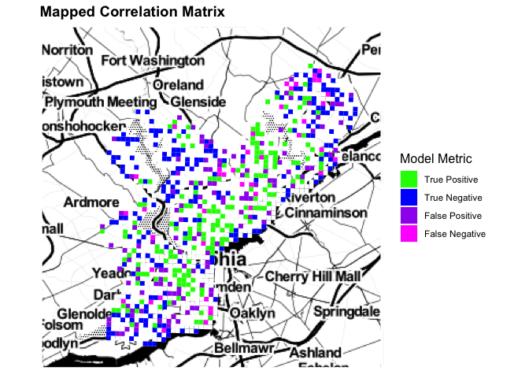  


## How generalizable is our model?

To further judge our model's performance, we need to understand its generalisability. That is, we want to know how the model performs across different groups of fishnet cells. To do this, we cross validate our data with 100 k-folds, meaning that we split the data into 100 random groups and test the model on each group to see if its performance is consistent. In the plot below, we see a new metric: kappa. This metric is the difference between observed accuracy and expected accuracy (occurring by random chance). Our cross validation results are clustered closely around the mean (of all 100 groups). This indicates that our model has high generalisability.  


## How well does our model predict across space?
To test our model's generalisability across space, we conduct a spatial leave-one-group-out (LOGO) cross validation. Here, we test generalisablity across neighborhoods by iteratively testing the model, leaving one neighborhood out each time. Below, we see that the result of LOGO cross validation is similar to our model's original prediction, meaning that our model performs consistently across neighborhoods and is fit for use in allocating limited tree planting resources across Philadelphia.


```r
# Model Validation
crossValidate <- function(dataset, id, dependentVariable, indVariables) {
  
  allPredictions <- data.frame()
  cvID_list <- unique(dataset[[id]])
  
  for (i in cvID_list) {
    
    thisFold <- i
    cat("This hold out fold is", thisFold, "\n")
    
    fold.train <- filter(dataset, dataset[[id]] != thisFold) %>% as.data.frame() %>% 
      dplyr::select(id, geometry, indVariables, dependentVariable)
    fold.test  <- filter(dataset, dataset[[id]] == thisFold) %>% as.data.frame() %>% 
      dplyr::select(id, geometry, indVariables, dependentVariable)
    
    regression <-
      glm(Variable2 ~ ., family = "binomial", 
          data = fold.train %>% 
            dplyr::select(-geometry, -id))
    
    thisPrediction <- 
      mutate(fold.test, Prediction = predict(regression, fold.test, type = "response"))
    
    allPredictions <-
      rbind(allPredictions, thisPrediction)
    
  }
  return(st_sf(allPredictions))
}


reg.vars <- c("Variable2", "pctCoverage18", "LogAvgParcelSize", "avg_nnConst","avg_nnPole", "NAME",
              "countConst", "Loge311Count", "pctTrans", "LogPctRes", "holc_grade", "HydrologyPct")


reg.spatialCV <- crossValidate(
  dataset = FinalFishnet5,
  id = "NAME",
  dependentVariable = "Variable2",
  indVariables = reg.vars) 

reg.spatialcv <-
  reg.spatialCV %>%
  dplyr::select(cvID = NAME, Variable2, Prediction, geometry)

logoPlot <- ggmap(base_map) +
  geom_sf(data = ll(reg.spatialcv), aes(fill = Prediction), color = "transparent", inherit.aes=FALSE)+
  geom_sf(data = ll(FinalFishnet5), fill = "transparent", color = "transparent", size=.5, inherit.aes=FALSE)+
  labs(title="Leave One Group Out Cross Validation")+
  scale_fill_distiller(palette = "PuRd", direction = 1, name = "LOGO Predicted Risk") +
  theme(plot.title = element_text(size = 30, face = "bold"), 
        legend.title = element_text(size = 12)) +  mapTheme()

logoPlot
```

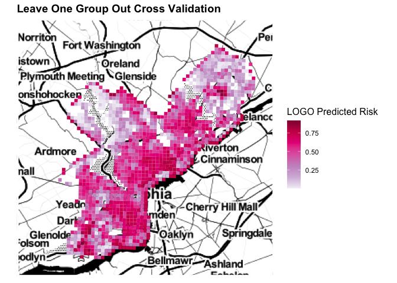<!-- -->

```r
predictionPlot
```

<!-- -->


# Planning Tool: Canopy View  

Using this information, we created a predictive planning tool that displays predictions for future tree canopy loss under five construction scenarios. The general population and tree planting agencies can use our tool to understand the potential impact of construction on tree canopy and optimally allocate tree planting resources.  
  
    
  
     
       
         
           
       
**The web application has 3 distinct features:**    
  
    
      
      

**1. View the current state of the tree canopy in Philadelphia**    
Users can view 10 distinct tree canopy statistics by clicking on our interactive drop-down menus. Users can view these statistics in either neighborhood or grid cell (150m x 150m) form. This feature allows the user to understand the current state of the tree canopy in a given area. Click on a neighborhood or grid cell to view all statistics for that location!       
  
  
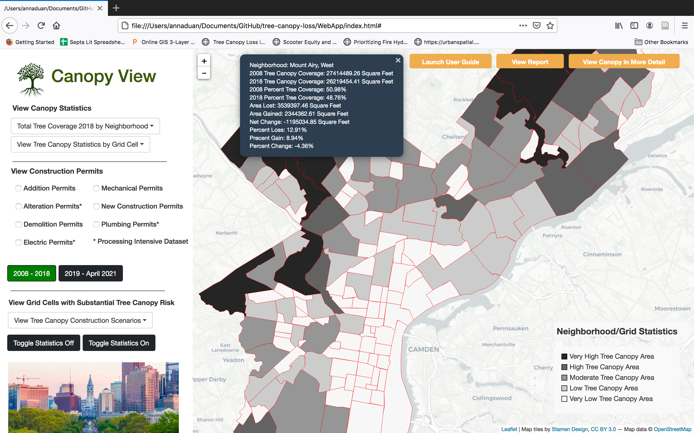   
      
      
**2. View where construction permits are located**      
By overlaying completed construction permits with our tree canopy statistics/ tree canopy loss risk predictions, users will notice that construction is very much related to tree canopy loss. Users can toggle the statistics or predictions on and off to view exactly where construction has occurred. Tree planters should prioritize streets with high construction rates located in high-risk tree canopy loss regions. Users can either view construction permits from 2008-2018 or 2019- April 2021. Note: The more construction permit categories selected, the slower the web application will be due to the large size of the construction data.   
  
  
  
    
      
**3. View areas that are at high risk for substantial tree canopy loss**   
Each grid cell is assigned a "probability score", which is the probability that the given grid cell will experience substantial tree canopy loss in the future. Substantial tree canopy loss is defined as a grid cell losing 25% of their tree canopy loss over a ten year period. Click on the grid cell to view the probability score of a location! The results are based on a model predicting where tree loss will most likely occur based on attributes associated with regions with significant tree loss. Users can view the substantial tree canopy loss risk in different construction scenarios. You will notice through our interactive bar graph that as construction permits increase, the risk of tree canopy also generally increases.  
  
  
  
  
    
      
      

# Going Forward  

We recommend that tree planting initiatives target South and Northeast Philadelphia since our model predicted a high risk of substantial tree canopy loss in these areas.  

Many of the areas where we predicted substantial risk also have high construction rates. Construction is highly correlated with tree canopy loss in a given region. As construction rates increase, the risk of substantial canopy loss increases as well. In the future, tree-planting organizations may consider targeting their tree-planting efforts in regions experiencing high construction rates. As discussed, when construction or demolition occurs on a property, trees are often removed to meet the construction goals. Unfortunately, city trees do not plant themselves. The majority of the time, tree canopy gain only occurs if someone actively plants a tree. Consequently, for tree canopy 'net gain' to occur in a given community, tree planting initiatives must keep pace with the rate of construction. Understanding where construction is happening will be very beneficial to future tree planting initiatives. 

Although construction is a significant factor, construction is not the only variable significantly affecting tree canopy loss. Many low-income communities still endure the effects of unjust policies from past generations. Areas with fewer trees are often associated with former redlining boundaries. Additionally, we found that grid cells with fewer trees are more likely to experience high percentages of gain or loss. Although counter-intuitive, this phenomenon results from having fewer trees to begin with, meaning that every change that occurs in the tree canopy makes a more significant difference in the overall tree canopy coverage. Other factors affecting tree canopy loss include land-use type, distance to water bodies, and 311 calls. 

We hope that the model serves as a tool to encourage tree planting initiatives in regions where tree canopy is most lacking. Our model accuracy is around 70%, and metrics indicate that it generalizes well. Previously, Philadelphia has set a goal to reach 30% tree canopy coverage in each neighborhood. Despite this goal, most neighborhoods experienced a net loss in tree canopy from 2008-2018. This indicates that tree planting organizations are not keeping up with the current rate of tree canopy loss. By allocating tree planting resources to regions with a combination of substantial tree loss risk and high construction rates, we believe that our model can help Philadelphia grow and protect tree canopy across its neighborhoods.


