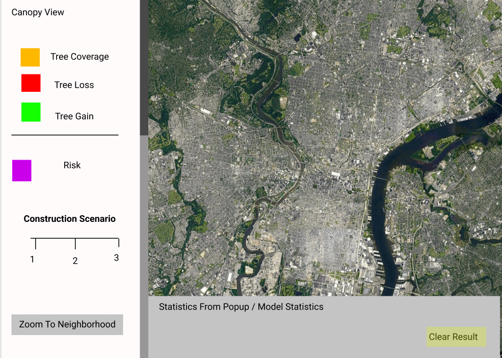

# Final Project Proposal

## Project/ Question:

Our Project is to explore the relationship for tree canopy loss and construction through a web application. Throughout the MUSA practicum, we have created a model to predict regions of Philadelphia most vulnerable to tree canopy loss. A significant predictor in our model relates to the number of construction permits between 2008 and 2018 in a fixed spatial area (A grid cell). Our proposal is to create a scenario based web application that displays our model results if construction were to continue at business as usual, if construction were to increase, or if construction were to decrease. By clicking on each of the options, the user can view each scenario. We would also like to give the user the options to overlay the past tree canopy loss from 2008 and 2018

## Data 

The data we will be working with include the Philadelphia tree canopy loss dataset, along with our model results. It is possibly that we may want to utilize the neighborhood dataset as well. The tree canopy loss dataset is unfortunately very large and may pose a difficuly ( 600,000 polygons). We plan on converting these to centroids. Vector tiles are an option as well, but these polygons are already so small that we may be able to get the same point accross converting to points. If this is stil too large, we may considering converting this file into an image and then overlaying it. If you think this dataset will be too large, we are happy to chat!

## Technologies Used

- bootstrap : for design 
- leaflet : displaying data ; may use functionalities such as allowing the user to zoom in on a zip code. 
- Ajax: calling data, different scenarios 
- JQUERRY : Would like to display statistics on screen about associated statistics with each fishnet gridcell

## Design 

We think we are going to use the sidebar design. However, we may like anotehr bar at the bottom of the screen to display statstics about the associated model and any statstics related to the fishnet gridcell the user is viewing 

## Missing Pieces 

I would ike to explor Mapbox more and compare leaflet to determine which mapping software we should use. I would also like to explore more design oriented technology --- maybe go more in depth with bootstrap for this proejct. Although I am not sure how it would be relevant to the project at the moment, I might also like to display a histogram or a graph on the side. Possibly representing the tree loss in each neighborhood under each construction scenario. 
